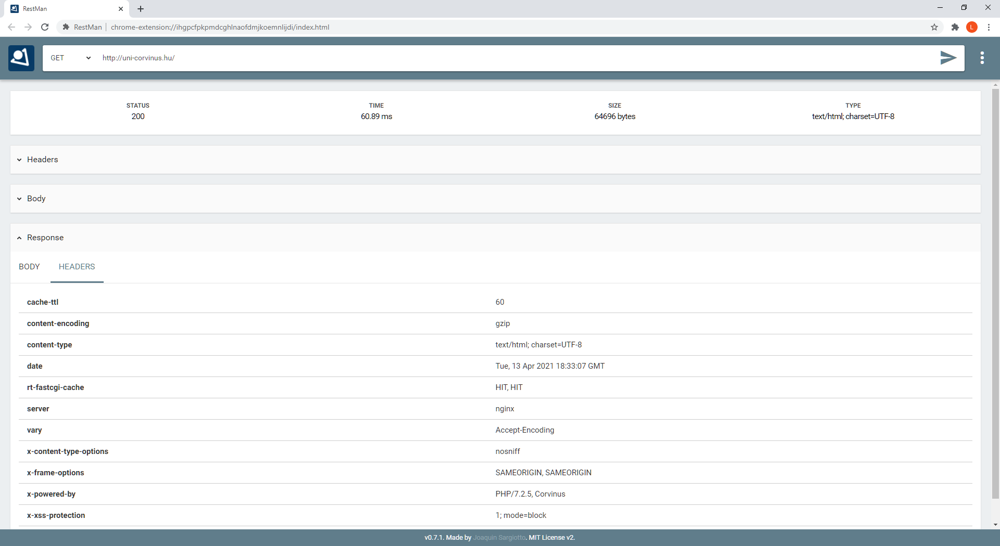

# HTTP és a REST - háttéranyag

Ez a dokumentum a megértést szolgálja.

## A HTTP protokoll

A HTTP egy elosztott kliens-szerver struktúrára építő protokoll melynek alapja a kérés-válasz kommunikációs struktúra. A TCP/IP modell alkalmazási rétegén található, a szállításhoz használt protokoll általában a TCP, de lehet UDP is, bár ez böngésző alkalmazások esetén nem használható. A HTTP meghatározó tulajdonsága az állapotnélküliség ([idempotencia](https://hu.wikipedia.org/wiki/Idempotencia#Informatikai_jelent%C3%A9se)), ugyanis minden kérés teljesen független az őt megelőzőktől. Szokás a világháló protokolljának is nevezni -- a web működése erre alapul. Két fő objektum használatával működik, van egy HTTP kérés valamint egy erre érkező válasz. 

Egy **HTTP kérés (HTTP request)** a következő három elemből tevődik össze:
1) parancs, 
2) kérés fejléc (request header) és az 
3) üzenet test (message body) -- opcionális, lehet üres is 

A **parancs** tartalmazza a kérés típusát, ez lehet `GET`, `POST`, `HEAD`, `OPTIONS`, `PUT`, `DELETE`, `TRACE` valamint `CONNECT`. 

|Ige|jelentés|
|-|-
|`GET`|A megadott erőforrás letöltését kezdeményezi. Ez messze a leggyakrabban használt metódus.
|`HEAD`|Ugyanazt adja vissza, mint a GET, csak magát az üzenettestet hagyja ki a válaszból. Segítségével például megtudható, hogy egy erőforrás utolsó letöltése óta változott-e.
|`POST`|Feldolgozandó adatot küld fel a szerverre. Például  HTML űrlap tartalmát. Az adatot a message body tartalmazza.
|`PUT`|Feltölti a megadott erőforrást.
|`DELETE`|Törli a megadott erőforrást.
|`TRACE`|Visszaküldi a kapott kérést. Ez akkor hasznos, ha a kliens oldal arra kíváncsi, hogy a köztes hálózati eszközök változtatnak-e, illetve mit változtatnak a kérésen. 
|`OPTIONS`|Visszaadja a szerver által támogatott HTTP metódusok listáját.
|`CONNECT`| Átalakítja a kérést transzparens TCP/IP tunnellé. Ezt a metódust jellemzően  SSL  kommunikáció megvalósításához használják.

A **HTTP fejléc (header)** rész a kérés paraméterezhetőségéért felel, itt különböző kulcs érték párok állíthatók be melyekkel pontosítható, hogy mit is vár el a kérést küldő fél. Az Wikipédián van egy jó összefoglaló a [HTTP fejléc kulcsairól](https://en.wikipedia.org/wiki/List_of_HTTP_header_fields) érdekességként. A fejlécben az `user-agent string` kulcsban közli a böngésző a szerverrel a saját azonosítóját. Sajnos történelmi okokból ezt meglehetősen nehéz értelmezi, egy vicces leírást [itt](https://webaim.org/blog/user-agent-string-history/) olvashattok. 

Az **üzenet (request body)** egy opcionális rész mely az elküldendő adatokat tartalmazhatja. 

A **válasz (response)** hasonlóan épül fel: ebben található egy információs blokk, ezt követi a válasz fejléc (header) majd pedig az üzenet rész. Az információs rész a kérés teljesítéséről ad tájékoztatást míg a válasz header és az üzenet rész a kérésnél már leírtakkal megegyező funkciókat töltenek be.

A protokoll fontos részét képezik az információs részében található státuszkódok. Minden válasz pontosan egy darab ilyen kóddal rendelkezik attól függően, hogy milyen eredményt ért el a kérés feldolgozása. Ezek a kódok 5 különböző csoportba rendezhetők: 

- `1xx` - a szerver fogadta a kérést, információs kódok
- `2xx` - a szerver sikeresen fogadta, feldolgozta a kérést
- `3xx` - a szerver fogadta a kérést, de további műveletek szükségesek a végrehajtásához
- `4xx` - kliens hiba, a kérés valamilyen okból kifolyólag nem megfelelő
- `5xx` - szerver hiba, a szerver nem volt képes végrehajtani a kérést

Minden csoportban találhatóak a protokoll által előre definiált kódok, melyeket használni kell, de adott a lehetőség újak meghatározására is. Ilyen gyakran előforduló kód például a 200, mely sikeres kérés teljesítést jelent, 404 amit abban az esetben kap a kliens ha a keresett erőforrás nem található és az 500-as kód, mely belső szerver hibáról ad tájékoztatást.

Aki kíváncsi a teljes listára aranyos, kutyás tálalásban az [itt](https://httpstatusdogs.com) megnézheti.

## REST és REST API

A **REST (Representational State Transfer)** egy szoftverarchitektúra mely kifejezetten elosztott struktúrájú szoftverek kommunikációjához lett tervezve. A kifejezést Roy Fielding mutatta be a disszertációjában, melyet 2000-ben írt. A szakirodalom általában a HTTP protokollal együtt használja, így az a benyomás alakulhat ki, hogy egy REST architektúrájú szoftver kizárólag csak HTTP segítségével működhet, holott bármilyen más kommunikációs protokoll is használható abban az esetben ha az is alkalmas egy ilyen struktúra kialakításához. 

Egy REST alkalmazás működése során kihasználja a HTTP protokollban definiált státuszkódokat melyek segítségével közölhető a válasz üzenetben a kérés teljesítésének az eredménye. A kérések **URI-k (Uniform Resource Identifier)** használatával valósulnak meg és a kérés típusok a HTTP metódusok alapján kerülnek elkülönítésre. Az elfogadott irányelvek szerint egy vagy több erőforrás kérése `GET`, erőforrás létrehozása `POST`, létező erőforrás módosítása `PUT/PATCH`, törlése pedig a `DELETE` metódussal történik. A `PUT` és a `PATCH` kérések közötti különbség, hogy amíg `PUT` hívás esetén az egész módosítandó objektumot át kell adni a kérést feldolgozó szoftver számára, addig `PATCH` esetben elegendő az eredeti objektumból azokat a tulajdonságok új értékét elküldeni melyek módosítása kerülnek. A legtöbb alkalmazásfejlesztési keretrendszer erre a logikára épít, illetve ez az általánosan támogatott megközelítés, így ettől eltérni csak különleges esetekben szokás. 

Az URI-k tervezésénél fontos kritérium, hogy könnyen felismerhető legyen, hogy az adott útvonal milyen funkciót lát el. A szakirodalom sokféle megközelítést alkalmaz de, általánosságban a `kiszolgáló/erőforrás(ok)/azonosító` kialakítást szokás követni. 

Az **API (Application Programming Interface)** megnevezés egy olyan alkalmazás interfészt takar melyen keresztül kívülről kommunikálni lehet a szoftverrel, utasításokat adni neki anélkül, hogy a belső működésről rendelkezne információval az utasítást indító fél. Mindig az interfész működéséhez és elvárásaihoz kell alkalmazkodni és úgy kell kialakítani az ezzel kommunikáló rendszert, hogy az megfeleljen az interfész kommunikációs szabályainak. Nevéből adódóan a REST API egy olyan interfész mely az előzőekben bemutatott REST tervezési mintára épít. Minden URI egy külön **API végpont**ot reprezentál, illetve eltérő feladat végrehajtására lett tervezve. Általában erőforrás csoportok köré lehet őket csoportosítani. Egy teoretikus példa a hajós feladatnál maradva valahogy így nézne ki:

|||
|-|-|
|`GET https://testurl.hu/kerdesek` | az összes kérdés objektum listázása `GET` metódussal
|`GET https://testurl.hu/kerdesek/22` | megadott azonosítóval rendelkező kérdés objektum lekérése `GET` metódussal
| `POST https://testurl.hu/kerdesek` | új kérdés objektum létrehozása `POST` metódussal
| `PATCH https://testurl.hu/kerdesek/22` | megadott azonosítóval rendelkező kérdés objektum módosítása `PATCH` metódussal. (Pl. helyes válasz megváltoztatása.)
| `DELETE https://testurl.hu/kerdesek/22` | megadott azonosítóval rendelkező kérdés objektum törlése `DELETE` metódussal

Ebben a példában az kérdések erőforrás köré lettek tervezve a végpontok amik eleget tesznek a **CRUD (Create, Read, Update, Delete)** műveleti elvárásoknak, hiszen mind a négy alapművelet végrehajtható a segítségükkel. A HTTP üzenetekben továbbított és fogadott adatok (jelen példában az kérdés objektumok) az üzenet törzs (body) részében találhatóak, és REST API esetén jellemzően egy elterjedt, illetve jól értelmezhető szabvány formátumban szokás leírni azokat. Ilyen szabvány lehet például az XML vagy a JSON. A JSON formátummal már találkoztatok.

Aki szeretne egy gyors példát látni a `GET`-re és paraméterekre vicceket olvasva, [ezen](https://jokeapi.dev) az oldalon legörgetve megteheti.

## HTTP forgalom követése

Érdemes telepíteni a [RestMan](https://chrome.google.com/webstore/detail/restman/ihgpcfpkpmdcghlnaofdmjkoemnlijdi) bővítményt Chrome alá, mert segítségével könnyű vadászni a hibákat! 

[HTTP kérés vizsgálata Chrome Dev Tools alatt](Http1.m4v)

Az alábbi screenshot az uni-corvinus.hu szerver `GET` kérésre adott válaszát mutatja RestMan-nal nézve. Az információs rész (STATUS 200, stb) alatt ellenőrizhető a válasz header-je és a body is:

Aki szeretne jobban elmélyedni az REST API-ok világában, annak érdemes lehet letölteni a [PostMan](https://www.postman.com)-t.

