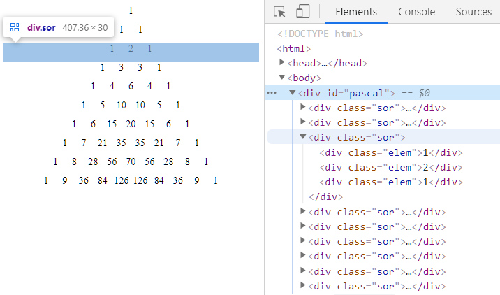

# JS alapok & DOM manipuláció

A gyakorlat célja előkészíteni a következő heti feladatot, amikor már a szerverről olvassuk be a kérdéseket, és jelenítjük meg az előző gyakorlaton készített layout-ban.

## JS alapok - összefoglaló

[JS alapok](https://kzgzdiag426.blob.core.windows.net/szoft2/jsbasics.m4v) -- videó a JavaScript nyelv alapjairól. 

Néhány példa a videóból:

Függvény létrehozására három módszer:
``` js
function f1(név) {console.log(`Hello ${név}!`);}
f1("Joe")

var f2 = function(név) {console.log(`Hello ${név}!`);}
f2("Jack")

var f3 = (n) => {console.log(`Hello ${n}!`);}
f1("Jane")
```

`for` ciklus:
``` js
for(var i=0;i<10;i++) {console.log(i+1)}
```

Két megoldás faktoriális számításra:
``` js
var faktoriális = function (n) {
    let er = 1;
    for (let i = 2; i <= n; i++) {
        er = er * i;
    }
    return er;
}

var faktoriálisR = (n) => {
    if (n === 0 || n === 1) {
        return 1;
    } else {
        return n * faktoriálisR(n - 1)
    }
}
```


## DOM elemek kezelése

A következőkben a mintapéldák mind az alábbi egyszerű HTML kódra vonatkoznak. 
``` html
<!DOCTYPE html>
<html>
<head>
    <meta charset="utf-8" />
    <title></title>
    <style>
        .szép{
            background-color: fuchsia;
            color: white
        }
    </style>
</head>
<body>
    <div id="mind1">Eredeti szöveg</div>
</body>
</html>
```
### Egyetlen DOM elem kiválasztása

``` js
document.getElementById("mind1").innerText = "Hello";
```

``` js
document.getElementById("mind1").innerHTML = "<h1>Hello</h1>";
```
``` js
var piszkálandóElem = document.getElementById("mind1")
piszkálandóElem.innerText = "Módisított szöveg"
```
### Osztály hozzárendelése és eltávolítása kódból

``` js
document.getElementById("mind1").classList.add("szép")
```
``` js
document.getElementById("mind1").classList.remove("szép")
```

### Új elem létrehozása kódból

``` js
var újLink = document.createElement("a")
újLink.href = "https://www.uni-corvinus.hu/";
újLink.innerText = "Visit Corvinus!";

document.getElementById("mind1").innerHTML = ''; //Ürítés
document.getElementById("mind1").appendChild(újLink);
```
Az `innerHtml` üres stringre történő állítása első ránézésre "gányolásnak" tűnik, de ez a jó gyakorlat. 


Bővebb olvasnivaló a témában: https://www.w3schools.com/js/js_htmldom.asp

## Események hozzárendelése DOM elemekhez kódból

``` js
document.getElementById("mind1").click = function () {
    document.getElementById("mind1").classList.toggle("szép")
}
```
Írhatjuk külön függvénybe is az eseménykiszolgálót:
```js
katt = function () {
    document.getElementById("mind1").classList.toggle("szép")
}

document.getElementById("mind1").onclick = katt;
```

Finomság érdeklődőknek: a `this` ahhoz DOM elemhez tartozó objektum, melyen a kattintás történt:

``` js
document.getElementById("mind1").onclick = function () {
    this.classList.toggle("szép")
}
```

## A window.onload esemény

Ez az esemény akkor következik be, amikor az oldal teljesen betöltődött, és a HTML kódban leírt összes DOM elem a helyére került. Használatával elkerülhető, hogy még azelőtt hivatkozzunk egy DOM elemre, mielőtt betöltődött volna. 

``` js
window.onload = function () {
    console.log("Oldal betöltve...");
    }
```

## Feladat - Pascal háromszög

A múlt órai Git repóban dolgozunk tovább, itt hozzátok létre az új `.html` és a többi  állományt! A leadás is Git-ben lesz.

Készítsetek egy `jsgyak.html` és egy `jsgyak.js` állományt a `wwwroot`-ba. Ezen oldjátok meg a feladatot, ezt ellenőrizzük majd a Git-en. A feladatokat csináld ugyanabba a `jsgyak.html`-be!

(+/-) Számok kiíratása egymás melletti `div`-ekbe. 
 - Hozz létre egy `div` típusú elementet, majd benne 10 másikat JS-ből!
 - A `div`-ek egymás mellé rendezéséhez CSS is kellhet.
 - Minél nagyobb a szám, annál sötétebb legyen a háttere!


(+/-) Készíts Pascal háromszöget!

A feladat a  [Pascal-háromszög](https://hu.wikipedia.org/wiki/Pascal-h%C3%A1romsz%C3%B6g)  első néhány sorának kirakása `div`-ekből.



A Pascal háromszögben szereplő binomiális együtthatók kifejezhetők a faktoriálissal, a faktoriális számító függvény fent van a videókban:


**Tippek:**

A videóban van példa a faktoriálisra. Csináld meg JS-ben a függvényt, ami a faktoriálist számítja!

Ha nem akarod, hogy mindig a swagger legyen a kezdőlap, akkor `properties/launchsettings.json`-ban írd át a `launchUrl` tulajdonságokat.

Hozz létre egy `div`-et a HTML-ben, ide kerülnek majd a sorok. (A sorokba meg az elemek.)
``` html
 <div id="pascal"></div>
```
Stílusokat is érdemes csinálni, ami majd elrendezi az elemeket. 

``` css
#pascal {
    //Az elemek legyenek benne oszlopan
}

.sor {
    //Az elemek legyenek benne sorban
}

.elem {
    //legyen 30x30 px
}
```
Az egészet az oldal betöltődéséhez érdemes kötni:

``` js
window.onload = () => {
    console.log("betöltődött")
}
```

Ezután mehet a két egymásba ágyazott ciklus:

``` js
for (var sor = 0; sor < 10; sor++) {
    //új div létrehozása az új sornak
    //új div osztálylistájához add hozzá a "sor"-t
    //új div-et add hozzá a "pascal" gyermekeihez
    for (var oszlop = 0; oszlop <= sor; oszlop++) {
	    //új div létrehozása az új elemnek
	    //új elem div osztálylistájához add hozzá az "elem"-et
	    //teszteléshet .innerHTML = `${sor}:${oszlop}`
	    //legyen az innerHTML a megfelelő szám
        //új elem div-et vedd fel a sor elemei közé
    }
}
```

A többit rátok bízom :) Kérdezzetek a gyakorlatokan bátran!
