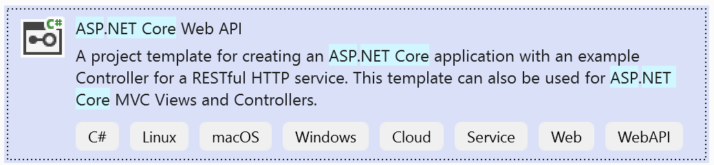
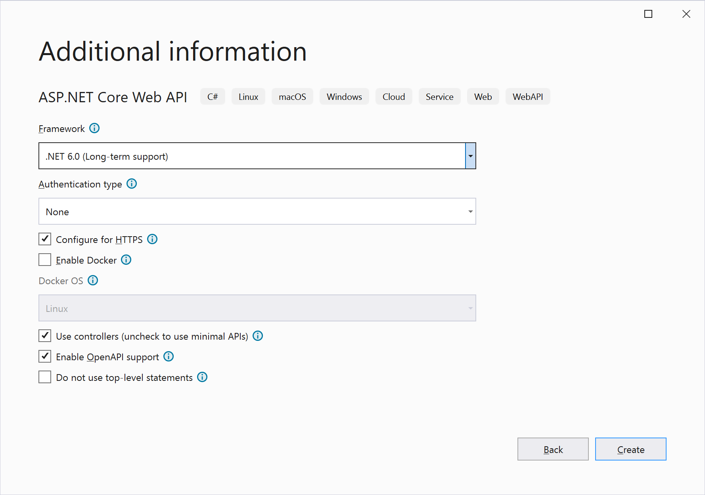
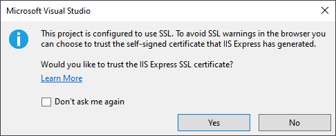
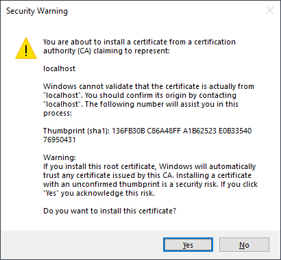
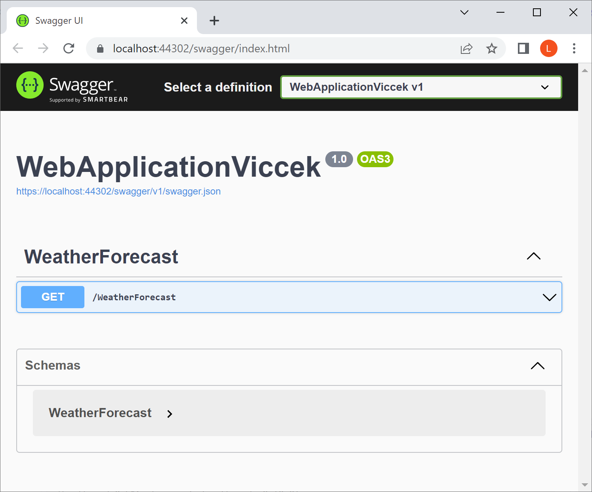
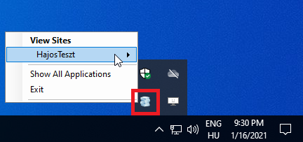
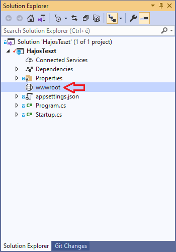
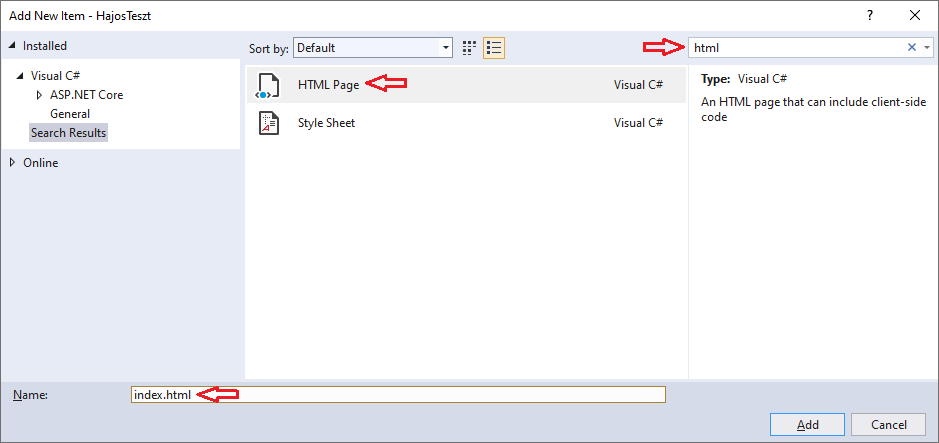
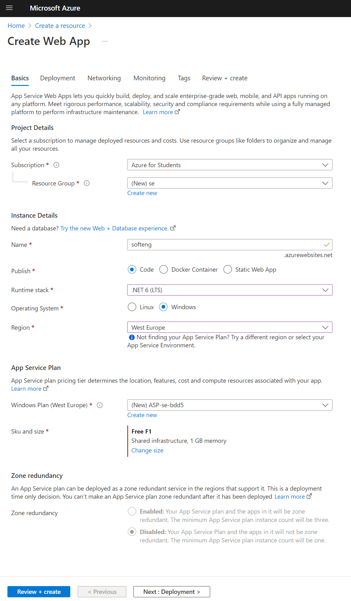
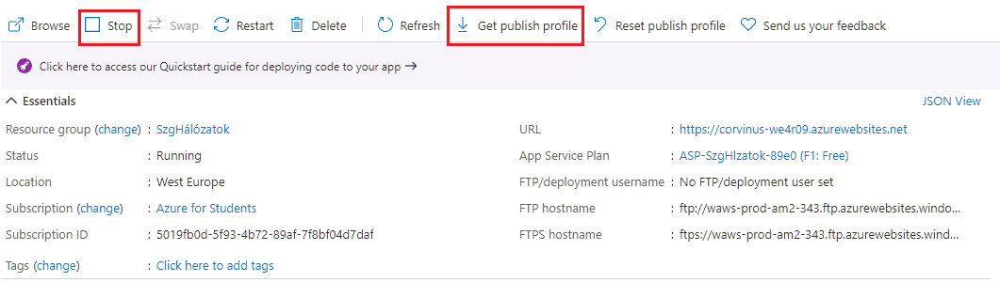

# ASP .NET projekt létrehozása és hibakeresése; deployment Azure felhőbe


Ebben az útmutatóban a következőkről lesz szó:

- Hogyan kell ASP .NET alkalmazást létrehozni
- Hogyan kell lokális szerveren futtatni és tesztelni a webalkalmazásunkat
- Miként lehet rávenni a projektet, hogy statikus HTML tartalmat jelenítsen meg
- Hogyan lehet a webalkalmazást közzétenni Azure-ban
- Hogyan kell a kódon végrehajtott módosításokat rögzíteni Git-ben


## Új ASP .NET projekt létrehozása 

(+/-) Hozd létre az új projektet. Fontos a megfelelő sablon használata, több hasonló nevű van. 




A beállításokon nem kell sokat változtatni:



> [!Note]
>
> Használhattok .NET 7-et!

Az "Enable OpenAPI support" tesztelési lehetőséget biztosít az API Contrtollerekez. Ez lesz a "Swagger", amivel később találkoztok.


## Az első futtatás

Az elkészült webalkalmazást az alábbi gombbal lehet lokálisan futtatni. Az sablon alapján létrehozott projektünk is megjelenít tartalmat, ennek részleteíről később :)


Első indításkor megkérdezi a Visual Studio, hogy akarjuk-e https alatt tesztelni a webalkalmazást http helyett. Ez azért nagyon fontos, mert egy http protokollal megnyitott oldalban a böngésző nem fog betölteni https-el hivatkozott tartalmakat. Ha külső tartalmakat is hivatkozunk, akkor https nélkül gyakorlatilag lehetetlenné válik a tesztelés. A https használatához egy hitelesítési tanúsítványt kell telepíteni a gépünkre, amit az IIS megbízhatóként fogad el. A https-ről és a hite lesítési tanúsítványokról később még lesz szó. Engedjük meg neki -- Yes, Yes:






Ha minden jól megy, fut a webalkalmazás, és  elérhető böngészőből -- igaz, nem pont az, amire számítunk: 



Érdemes megjegyezni, hogy amikor futtatjuk a webalkalmazásunkat, a Visual Sutdio a háttérben elindítja az IIS Express-t ami a saját, tesztelési célú webszervere. Ez időnként be tud akadni (tényleg ritkán), de ilyenkor a tálcáról jobb egérrel ki lehet lépni belőle. Újabb futtatásnál újraindul. 

> Az IIS Internet Information Services a Microsoft által a készített bővíthető webszerver, mely a Server és a Professional változatokkal is elérhető. Az IIS Express a Visual Studio-val kerül telepítésre, és csak tesztelési célokat szolgál.



Az alapértelmezett böngészőt érdemes átállítani Chrome-ra, mert az összes képernyőkép ezzel készült. A VS **nem** a Windows beállítások között  megadott alapértelmezett böngészőt nyitja meg, hanem a debug gomb melletti legördülőben megadott böngészőt használja.  

## Saját statikus tartalom létrehozása

### Az `index.html` létrehozása

A sablon alapján létrehozott projektünk még nem tud fájlokat megosztani.

A statikus tartalmak megjelenítéséhez célszerű  egy `wwwroot` nevű mappát létrehozni a projektben. A pontos mappanév fontos, más ikont is kap:



A `wwwroot` mappán jobb egérgomb után megjelenő helyimenüben `Add` / `Add New Item` menüben hozz létre egy `index.html` nevű HTML oldalt! Érdemes használni a keresőt, mert sokféle elem közül lehet itt választani.



Ezután alkossunk meg a HTML fájlt, valahogy így:

``` html
<!DOCTYPE html>
<html>
<head>
    <meta charset="utf-8" />
    <title></title>
</head>
<body>
    Hello World!
</body>
</html>
```

### A `program.cs` módosítása, statikus fájlok kiszolgálásának engedélyezése

`program.cs` tartalma, minden más törölhető:

```csharp
var builder = WebApplication.CreateBuilder(args);

var app = builder.Build();

app.UseHttpsRedirection();

app.UseDefaultFiles();
app.UseStaticFiles();

app.Run();
```


- `app.UseHttpsRedirection();`  -- ha valaki `http://` URL-t ad meg, automatikusan átirányít a biztonságos `https://`-re. Mint arról már volt szó, egy http protokollal megnyitott oldalban a böngésző nem fog betölteni https-el hivatkozott tartalmakat. 
- `app.UseDefaultFiles();`  -- innentől pl. a https://cim.hu/ alatt a https://cim.hu/index.html oldalt szolgáltatja. 
- `app.UseStaticFiles();` -- elérhetővé teszi a `wwwroot` mappába helyezett statikus fájlokat. 

**A sorrend fontos!** 


> Tipp: nem érdemes a HTML, CSS és JS fájlok minden módosítása után leállítani és újraindítani a projektet. Elég `Ctrl-S`-el menteni a megváltozott fájlt, majd `F5`-el frissíteni az oldalt a böngészőben. A böngészőben pedig az `F12` megnyomása után (Developer tools) érdemes kikapcsolni a gyorsítótárat. Ez a beállítás csak akkor érvényes, ha meg vannak nyitva a böngésző fejlesztőeszközei. 


## Webalkalmazás közzététele Azure-ban

### Azure WebApp létrehozása

Hozzatok létre egy WebApp erőforrást:




Néhány gondolat:

- .NET 7 nem választható. Válaszd a 6-ost, és majd ha elékészült az erőforrás, a beállítások között át lehet állítani 7-esre.
- A telepítési lépések között engedélyezd a "basic authentication"-t. Ennélkül nem megy a következő lépésben taglalt, "PublishProfile"-en keresztül történő automatizált feltöltés, hiszen itt nincs lehetőség kétfaktoros aurntikációra. 


## Publish Proflie megszerzése

A Publish Profile egy XML dokumentum, mely tartalmaz minden információt, ami a webalkalmazás feltöltéséhez -- közzétételéhez -- szükséges. 

Keressétek meg az Azure-os Web App létrehozása után lementett  Publish Proflie-t (`corvinus-neptun.PublishSettings` nevű fájl), vagy nyissátok meg a [portal.azure.com](https://portal.azure.com)-ot, és töltsétek le újra! Amíg fut a Web App, nem engedi letölteni. Letöltés után indítsátok újra!



Miután Visual Studio-ban megnyitottuk a közzétételre (publish) szánt alkalmazást, válasszuk a `Build` / `Publish` menüpontot, majd a kis kék `New`  gombot. Ezután lehet kiválasztani az `Import Profile` lehetőséget, mely után ki lehet tallózni az előző lépésben lementett Publish Profile-t. 

A gyakorlatban több közzétételi opció is szokott lenni egy projekthez: mielőtt kitennénk "élesbe" vagy "production" környezetbe, egy "staging" vagy teszt környezetben szokás kipróbálni. 

## Publish Proflie importálása

A Visual Studio `Build`/`Publish` menüpontja alatt importáld a Publish Profile-t, majd a `Publish` gombra kattintva tedd közzé Azure-ban a webalkalmazásod.
