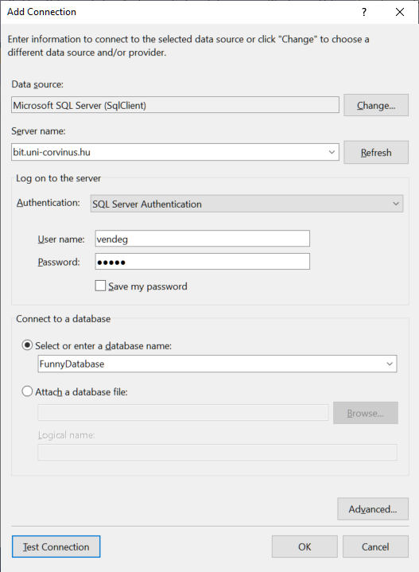
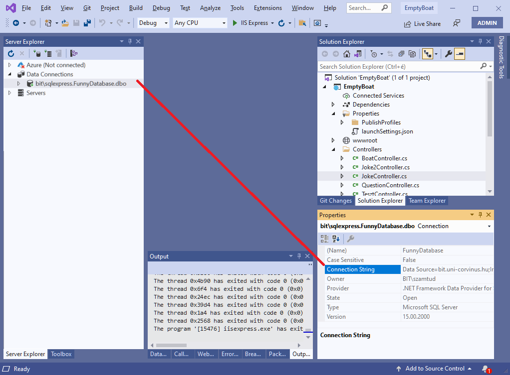
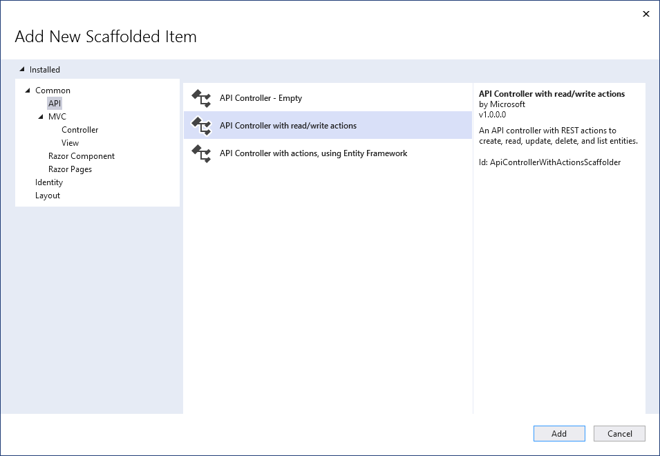
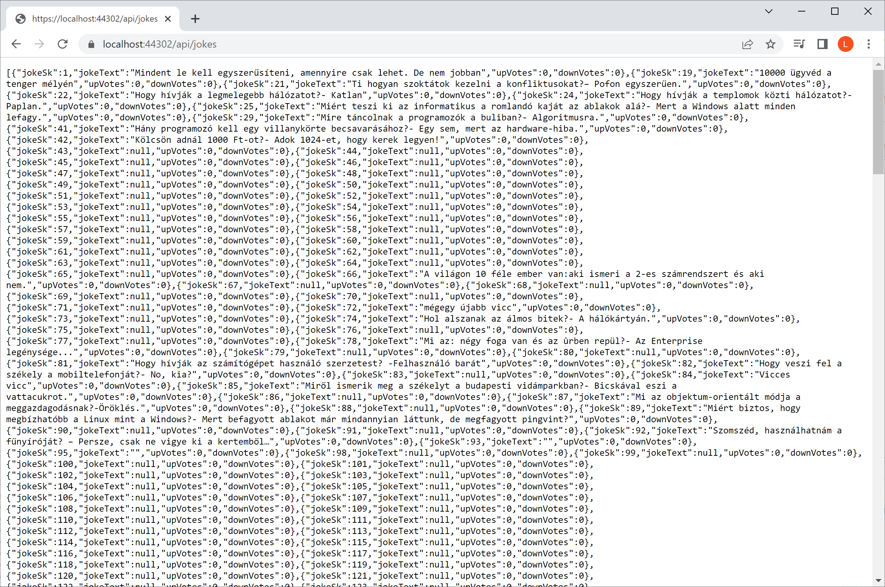
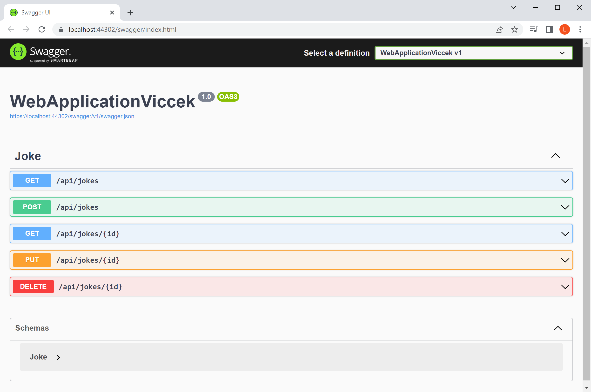
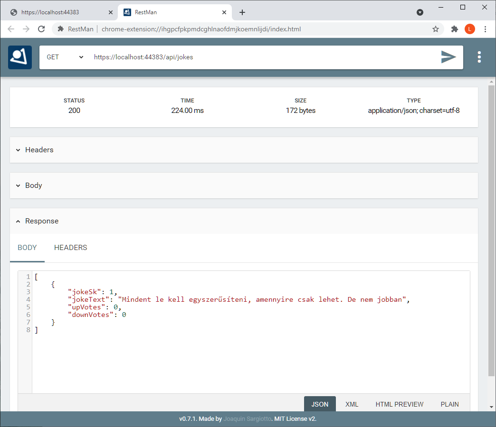
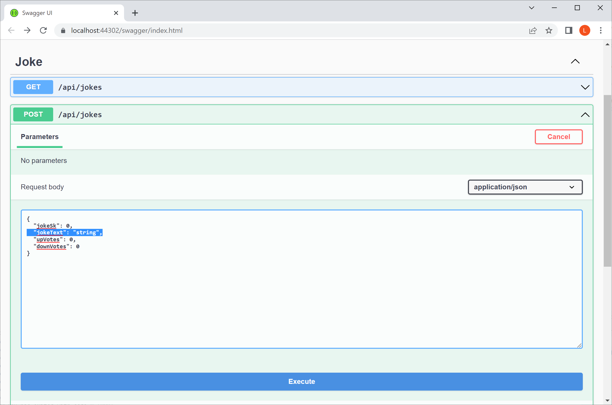
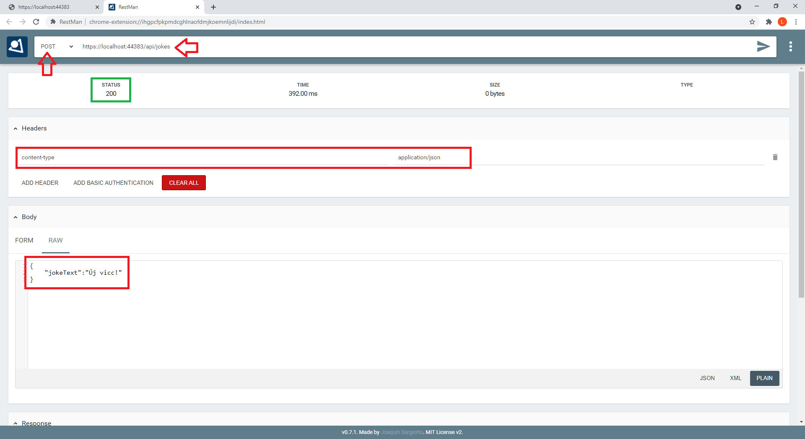

# CRUD műveletek

A **CRUD(e)** (angolul nyers) a négy alapvető adatbázis művelet  (**C**reate, **R**ead, **U**pdate, **De**lete) kezdőbetűiből képzett akroníma. 

A gyakorlaton egy olyan egyszerű példán megyünk végég, melyben adatbázisba lehet írni weboldalon kitöltött űrlap adatait. Az oldalon keresztül egy adatbázistáblába lehet vicceket felvinni, illetve listázni a vicceket.

Egy háromrétegű alkalmazásra nézünk egy egyszerű példát:
- egy SQL adattábált érünk el
- ASP .NET Core köztes réteg által biztosított API végpontokon keresztül
- böngészőben futó JavaScript kódból

## Új HTML oldal

Hozz létre egy új HTML oldalt, mondjuk `jokes.html` néven a meglévő projektedben. Ezen a gyakorlaton nem csinálunk külön `.js` fájlt, hanem a HTML oldalban helyezzük el a `<script>` tag-et. Az oldalban legyen egy `<div>` a vicceknek, illetve egy `<input>` és egy `<button>` az új vicc felvitelére:

``` html
<!DOCTYPE html>
<html>
<head>
    <meta charset="utf-8" />
    <title></title>
</head>
<body>
    <div>
        <div id="jokeList"></div>
        <div>
            <input id="jokeText" type="text" placeholder="Csak PC vicc" />
        </div>
        <button id="addButton">Új vicc felvétele</button>
    </div>
    <script>
    </script>
</body>
</html>
```

(+/-) Készen van HTML váz.

## Adatbázis sémájának leképezése

(+/-) Az adatbázis felfedezése

Központi adatbázisból dolgozunk, mert így szórakoztatóbb, másrészt többeteknek nincs már Azure kreditje. Az adatbázist érdemes *SQL Server Management Studio*-val felfedezni!

**Az SQL adatbázis csak VPN alól érhető el. Ergo ha a projektet közzéteszed Azure-ba, az ott futó szerver oldali kód nem fogja látni. Ez most csak tesztelésre jó így.**

|              | |
|-             |-|
|Szerver       |bit.uni-corvinus.hu 
|Felhasználónév|vendeg
|Jelszó        |12345
|Adatbázis     |FunnyDatabase



A *connectin string* megszerezhező a *Properties* panelből, csak a jelszót kell majd behelyettesíteni.



```
Data Source=bit.uni-corvinus.hu;Initial Catalog=FunnyDatabase;User ID=vendeg;Password=***********
```

(+/-) Séma leképezése C# osztályokba

Mint ahogy arról már szó volt egy korábbi gyakorlaton (*Csatlakozás SQL adatbázishoz*), .NET Core alatt nem áll rendelkezésre grafikus eszköz és varázsló az adatbázis sémája alapját leképező C# osztályok előállítására. Ezt is a *Packege Manager Console*-ból kell megoldani parancssorból. (Tools / NuGet Package Manager / Package Manager Console )

```powershell
Install-Package Microsoft.EntityFrameworkCore.SqlServer
Install-Package Microsoft.EntityFrameworkCore.Tools
```

Általánosan:
``` powershell
Scaffold-DbContext "[Connection String]" Microsoft.EntityFrameworkCore.SqlServer -OutputDir [Mappa]
```

Esetünkben:
``` powershell
Scaffold-DbContext "Data Source=bit.uni-corvinus.hu;Initial Catalog=FunnyDatabase;User ID=vendeg;Password=12345;Encrypt=False" Microsoft.EntityFrameworkCore.SqlServer -OutputDir JokeModels
```

Ennek eredményeképp a *Solution Epolorer*-ben születik egy  `JokeModels` mappa, benne az egy viccet leíró `Joke` osztállyal, valamint az adatbázis elérésére szolgáló `FunnyDatabaseContext` osztállyal.

## API Controller létrehozása

Hozz létre API Controller-t mondjuk `JokeController` néven, de most használd ki, hogy a CRUDE műveletek támogatására kész kódmintát kínál a Visual Studio!  `Controllers` mappán jobb egér, majd:



Érdemes megnézni a kapott kódot, miden CRUDE műveletnek készült egy-egy metódus:

``` csharp
using Microsoft.AspNetCore.Mvc;
using System;
using System.Collections.Generic;
using System.Linq;
using System.Threading.Tasks;

// For more information on enabling Web API for empty projects, visit https://go.microsoft.com/fwlink/?LinkID=397860

namespace EmptyBoat.Controllers
{
    [Route("api/[controller]")]
    [ApiController]
    public class JokeController : ControllerBase
    {
        // GET: api/<JokeController>
        [HttpGet]
        public IEnumerable<string> Get()
        {
            return new string[] { "value1", "value2" };
        }

        // GET api/<JokeController>/5
        [HttpGet("{id}")]
        public string Get(int id)
        {
            return "value";f
        }

        // POST api/<JokeController>
        [HttpPost]
        public void Post([FromBody] string value)
        {
        }

        // PUT api/<JokeController>/5
        [HttpPut("{id}")]
        public void Put(int id, [FromBody] string value)
        {
        }
 
        // DELETE api/<JokeController>/5
        [HttpDelete("{id}")]
        public void Delete(int id)
        {
        }
    }
}
```

Ahhoz, hogy a mintakódot működésre bírjuk, a `[Route("api/[controller]")]` sorban a szögletes zárójel helyre kell beírni az elérési útvonalat.  Legyen ez most:

``` csharp
namespace EmptyBoat.Controllers
{
    [Route("api/jokes")]
    [ApiController]
    public class JokeController : ControllerBase
    {
    ...
```

Ezután megkezdhetjük az API végpontok kifejtését a `program.cs`-ben: 

```csharp
var builder = WebApplication.CreateBuilder(args);
builder.Services.AddControllers();  //Az API Controllerekhez kell 
builder.Services.AddEndpointsApiExplorer();   //A Swaggerhez kell
builder.Services.AddSwaggerGen();             //A Swaggerhez kell

var app = builder.Build();

if (app.Environment.IsDevelopment()) //A Swagger éles környezetben nem indul
{
    app.UseSwagger();
    app.UseSwaggerUI();
}

app.UseHttpsRedirection();   //Ha http-vel nyitják az oldalt, átirányít https-re

app.UseDefaultFiles();       //Ha nincs semmi a domain tuán, akkor az index.html-t tölti
app.MapControllers();        //Az API Controllereket elérhetővé teszi
app.UseStaticFiles();        //A wwwroot mappa tartalmát elérhetővé teszi

app.Run();
```


### Összes vicc lekérdezése

A `FunnyDatabaseContext`-et a szokásos módon példályosítsd!

Ilyen volt:
``` csharp
        // GET: api/<JokeController>
        [HttpGet]
        public IEnumerable<string> Get()
        {        
            return new string[] { "value1", "value2" };
        }
```

Ilyen lett:
``` csharp
        // GET: api/jokes
        [HttpGet]
        public IActionResult Get()
        {
            FunnyDatabaseContext context = new FunnyDatabaseContext();
            return Ok(context.Jokes.ToList());
        }
```
A `GET` HTTP metódust ki lehet próbálni  a böngésző címsorából, Swaggerből vagy PostMan-ból:









(+/-) Működik az összes vicc lekérdezésére szolgáló API végpont. 

### Egy adott vicc lekérdezése

- Be szoktam rendesen írni a comment-be, hogy mi a végpont címe,  a `//GET api/<JokeController>/5
` helyett
- A metódus visszatérési típusa `Joke` -- az eredmény JSON objektummá konvertálást majd megoldja az ASP .NET Core a háttérben, ezzel nincs dolgunk. 
- A metódus nevének (most épp `Get`) nincs jelentősége.
- A vicc kikeresése az adatbázisból a szokásos LINQ-val megy. 

Ilyen volt:

```cs
// GET api/<JokeController>/5
[HttpGet("{id}")]
public string Get(int id)
{
return "value";
}
```

Ilyen lett:

``` csharp
// GET api/jokes/5
[HttpGet("{id}")]
public IActionResult Get(int id)
{
    FunnyDatabaseContext context = new FunnyDatabaseContext();
    var keresettVicc = (from x in context.Jokes
                        where x.JokeSk == id
                        select x).FirstOrDefault();
    return Ok(keresettVicc);
}
```

Vagy sokkal szebben:

```csharp
// GET api/jokes/5
[HttpGet("{id}")]
public IActionResult Get(int id)
{
    FunnyDatabaseContext context = new FunnyDatabaseContext();
    var keresettVicc = (from x in context.Jokes
                        where x.JokeSk == id
                        select x).FirstOrDefault();
    if (keresettVicc==null)
    {
        return NotFound($"Nincs #{id} azonosítóval vicc");
    }
    else
    {
        return Ok(keresettVicc);
    }            
}
```


A `GET` HTTP metódust ki lehet próbálni PostMan-ból vagy a böngésző címsorából.

(+/-) Működik az adott vicc lekérdezésére szolgáló API végpont. 

### Új vicc rögzítése

Ez egy érdekes dolog: most a JavaScript küld egy JSON formátumban leírt objektumot a C# kódnak. Ahhoz, hogy a szerver oldali C# fel tudja dolgozni a kapott JSON objektumot, kell, hogy a projektben létezzen egy olyan osztály, ami megfeleltethető a JS-ből küldött objektumnak. Használhatjuk azt a `Joke` osztályt is, mely az adatbázis `Joke` táblája alapján lett legenerálva.

``` csharp
        // POST api/jokes
        [HttpPost]
        public void Post([FromBody] Joke újVicc)
        {
            FunnyDatabaseContext context = new FunnyDatabaseContext();
            context.Jokes.Add(újVicc);
            context.SaveChanges();
        }
```

(+/-) Kész a `POST` API végpont!

A `POST` HTTP metódust csak Swaggerből, PostMan-ból vagy JS-ből tudod kipróbálni, a böngésző címsorból csak a `GET` tesztelhető.

**Swagger:**

A dolog viszonylag egyszerű, arra érdemes figyelni, hogy az automatikusan számozott `jokeSk`-t töröljük, neki nem adhatunk értéket! A JSON objektumban elég a `jokeText` értékét közölni. 




**PostMan**

Ha PostMant használsz, még meg kell adni pár dolgot:

- A HTTP metódus legyen `POST`
- Az API végpont címét is be kell állítani, ahogy szoktuk
- Ahhoz, hogy a szerver oldal felismerje a HTTP kérés body-jában érkező tartalmat, közölni kell, hogy JSON formátumban küldjük az adatokat. Erre való a fejlécben a `Content-Type` kulcs, melynek értéként `application/json`-t adunk meg. 
- A *body* egy JSON formátumú string. Fontos, hogy olyan változók legyenek benne, mint az adatbázis alapján generált `Joke` osztályban. Egy különbség azonban van: a JavaScript-ben konvencionálisan kisbetűkkel kezdődnek a változók nevei, míg C#-ban a tulajdonságok neveit nagy kezdőbetűkkel szokás írni. A konverziót a háttérben az ASP. NET Core elvégzi!
- A válasz `200`-as státuszkódja jelzi a sikert.




(+/-) Le van tesztelve a `POST` API végpont!

### Vicc törlése 

``` csharp
        // DELETE api/jokes/5
        [HttpDelete("{id}")]
        public void Delete(int id)
        {
            FunnyDatabaseContext context = new FunnyDatabaseContext();
            var törlendőVicc = (from x in context.Jokes
                                where x.JokeSk == id
                                select x).FirstOrDefault();
            context.Remove(törlendőVicc);
            context.SaveChanges();
        }
```


A `DELETE` HTTP metódust szintén csak Swaggerből, PostMan-ból vagy JS-ből tudod kipróbálni. Ezt majd akkor próbálgassátok, ha már vannak saját vicceitek az adatbázisban, addig a hibás bejegyzéseken gyakoroljatok :)


## Új vicc felvitele az adatbázisba böngészőn keresztül

A `fetch` esetén megadható a HTTP metódus is. Ahhoz, hogy a szerver oldal felismerje a HTTP kérés body-jában érkező tartalmat, meg kell határozni, hogy JSON formátumban küldjük az adatokat. Erre való a fejlécben a `Content-Type` kulcs. Bővebben az [MDN](https://developer.mozilla.org/en-US/docs/Web/API/Fetch_API/Using_Fetch)-t érdemes megnézni. 

``` js
document.getElementById("addButton").addEventListener("click", () => {
	
	//Ezt az objektumot fogjuk átküldeni
    let data = {
        jokeText: document.getElementById("jokeText").value
    }


    fetch("api/jokes",
        {
            method: 'POST',
            headers: {
                'Content-Type': 'application/json'
            },
            body: JSON.stringify(data)
        }
    ).then();
   
});
```

A `then()`-ben meg lehet vizsgálni, hogy sikeres volt-e a művelet:

``` js
fetch("api/jokes",
    {
        method: 'POST',
        headers: {
            'Content-Type': 'application/json'
        },
        body: JSON.stringify(data)
    }).then(x => {
	    if (x.ok) {
	        alert("Siker");
	
	    }
	    else {
	        alert("Kudarc");
        }
	 });	    
```
## Viccek listázása

Oldd meg a korábban tanultak alapján!

(+/-) Kész :)
