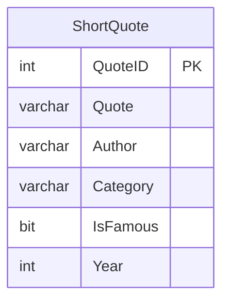

# A 2. ZH feladatai - 09:50

A feladatmegoldáshoz szükséges adatbázis itt érhető el: 

``` powershell
Scaffold-DbContext "Data Source=bit.uni-corvinus.hu;Initial Catalog=FunnyDatabase;User ID=vendeg;Password=12345;Encrypt=False" Microsoft.EntityFrameworkCore.SqlServer -OutputDir JokeModels
```

> [!IMPORTANT]
>
> A tábla amelyhez a feladatokat kell csinálni a `ShortQuote`, illetve a solution neve legyen ZH2A[neptun]!
>
> A munkaidő 80 perc!




## 1. API Controllerek létrehozása

Hozz létre API Controller-t, és valósítsd meg a következő végpontokat:

❶ `GET` metódussal hívható végpont, mely a tábla teljes tartalmát visszaadja

❷ `GET` metódussal hívható végpont, mely a tábla egyetlen rekordját adja vissza

❸ `POST` metódussal hívható végpont, melynek segítségével új rekord rögzíthető a táblába

❺ `DELETE` metódussal hívható végpont, melynek rekord törölhető a tábláblából

## 2. Statikus tartalom kiszolgálása

❻ Tedd alkalmassá alkalmazásodat statikus tartalom kiszolgálására a `wwwroot` mappából. Hozz létre egy `index.html` állományt minta tartalommal!

## 3. Kliens oldali logika

❼ Valósítsd meg a klines oldali logikát, mely az oldal betöltődésekor a teljes tábla tartalmát megjeleníti HTML `<table>`-ben!

❽ Valósítsd meg a klines oldali logikát, mely a lehetővé teszi új rekord rögzítését az adatbázisba! Minden mező szükséges, kivéve a kulcsot, amennyiben az automatikusan számozódik (IDENTITY). 

❾ Valósítsd meg a klines oldali logikát, mely a lehetővé teszi rekord törlését! Tetszőleges módszerrel! 

## 4 Forms projekt

❿ A meglévő *Soluion*-ben hozz létre Froms projektet, mely gombnyomásra Excel táblába menti  a tábla tartalmát.  

⓫  A mentés helye `SaveFileDialog`-ból legyen választható!