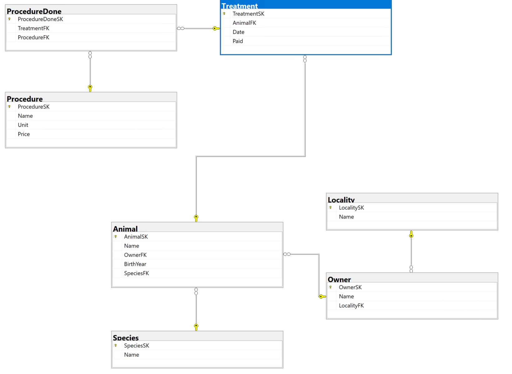
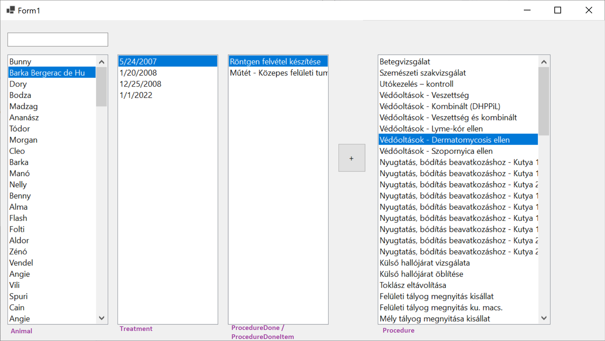

# ZH 3a — Állatkórház

## Adatbázis

```powershell
Install-Package Microsoft.EntityFrameworkCore.SqlServer
Install-Package Microsoft.EntityFrameworkCore.Tools
```

```powershell
Scaffold-DbContext "Data Source=bit.uni-corvinus.hu;Initial Catalog=se_pets;User ID=hallgato;Password=Password123;Encrypt=False;Trust Server Certificate=True" Microsoft.EntityFrameworkCore.SqlServer -OutputDir Models
```



## Szükséges táblák

#### `Animal` &rarr; `Treatment` &rarr; `ProcedureDone` &larr; `Procedure`




## Lépések

① Hozd létre a projektet, és a fenti adatok alapján készítsd el az adatkötött osztályokat!

② Készítsd el az ábrán látható felhasználói felületet!

③ A bal `ListBox`-ban jelenítsd meg szűrhető módon az `Animal`  tábla elemeit, a listában az `Name` mező értéke jelenjen meg!

④ A jobb`ListBox`-ban jelenítsd a `Procedure` tábla elemeit, a listában a `Name` mező értéke jelenjen meg! Itt már nincs szükség szűrésre. 

⑤ Ha a felhasználó kiválaszt egy `Animal`-t a bal listából, jelenjenek meg a második listában kezelései `Treatment` táblából! A megjelenített mező a dátum legyen!

⑥ Hozd létre az alábbi osztályt, mely a harmadik `ListBox` adatforrásául szolgál:

``` csharp
public class ProcedureDoneItem
    {
        public int ProcedureDoneSk { get; set; }
        public string Name { get; set; }

    }
```

⑦ A harmadik `ListBox` "fülén" keresztül vedd fel adatkötött adatforrásként az előbb létrehezott `ProcedureDoneItem` osztályt, majd állítsd be a `ListBox` adatforrásaként! A `ListBox` -ban megjelenő mező legyen a `Name`!

⑧ A második listára kattintva jelenjenek meg a kiválasztott `Treatment`-hez a hozzá tartozó elvégzett kezelések `ProcedureDoneItem`  formában. Az adatkötés a `BindingSource`-on keresztül történjen!

⑨  A `+` gombra kattintva lehessen új ` Models.ProcedureDone` típusú elemet felvenni a `context.ProcedureDones` gyűjteménybe! Az adatbázisban történő rögzítés után az elemek kerüljenek újraolvasásra a rácsba!

Ⓐ Helyezz el gombot vagy menüt az űrlapon, ami az állatokat tartalmazó tábla tartalmát XML állományba menti. A mentés helyét párbeszédablakból lehessen kiválasztani!

Ⓑ Jelenítsd meg az adatbázisban lévő állatok számát egy címkében!


