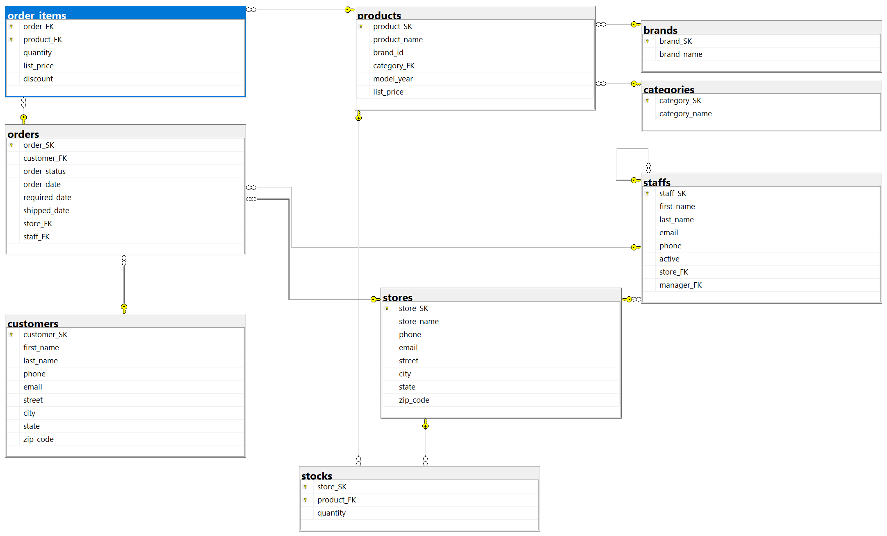
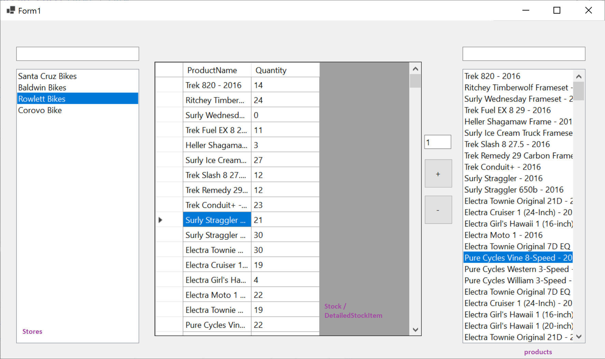

# ZH 2a — Bike Store

## Adatbázis

```powershell
Install-Package Microsoft.EntityFrameworkCore.SqlServer
Install-Package Microsoft.EntityFrameworkCore.Tools
```

```powershell
Scaffold-DbContext "Data Source=bit.uni-corvinus.hu;Initial Catalog=se_bikestore;User ID=hallgato;Password=Password123;Encrypt=False;Trust Server Certificate=True" Microsoft.EntityFrameworkCore.SqlServer -OutputDir Models
```



## Szükséges táblák

#### `stores`  &rarr; `stocks` &larr; `products`

Az áruházi készleteket kezeljük:



## Lépések

① Hozd létre a projektet, és a fenti adatok alapján készítsd el az adatkötött osztályokat!

② Készítsd el az ábrán látható felhasználói felületet!

③ A bal `ListBox`-ban jelenítsd meg szűrhető módon a `stores` tábla elemeit, a listában az `store_name` mező értéke jelenjen meg!

④ A jobb`ListBox`-ban jelenítsd a `products` tábla elemeit, a listában a `product_name` mező értéke jelenjen meg! Itt már nincs szükség szűrésre, de lehet. 

⑤ Hozd létre az alábbi osztályt, mely a rács adatforrásául szolgál:

``` csharp
public class DetailedStockItem
{
    public int StoreId { get; set; }
    public int ProductId { get; set; }
    public string? ProductName { get; set; }
    public int? Quantity { get; set; }
}
```

⑥ A rács "fülén" keresztül vedd fel adatkötött adatforrásként az előbb létrehezott `DetailedStockItem` osztályt, majd állítsd be a rács adatforrásaként!

⑦ A bal listára kattintva jelenjenek meg a kiválasztott `Models.Store`-hoz a hozzá tartozó `Stock`-ok `DetailedStockItemformában`. Az adatkötés a `BindingSource`-on keresztül történjen!

⑧ A `+` gombra kattintva lehessen új ` Models.Stock` típusú elemet felvenni a `context.Stocks` gyűjteménybe! A mennyiséget a szövegdomozból olvasd! Az adatbázisban történő rögzítés után az elemek kerüljenek újraolvasásra a rácsba! (Stock táblának összetett kulcsa van)

⑨  A `-` gombra kattintva lehessen elemet törölni!

Ⓐ Helyezz el gombot az űrlapon, ami egy másik űrlapot nyit meg, amelyen adatköthető rácson keresztül lehet kezelni a termékeket tartalmazó táblát! Legyen lehetőség mentésre is!

Ⓑ A márkát és a kategóriát (idegen kulcsok) legördülő dobozból lehessen kiválasztani!


