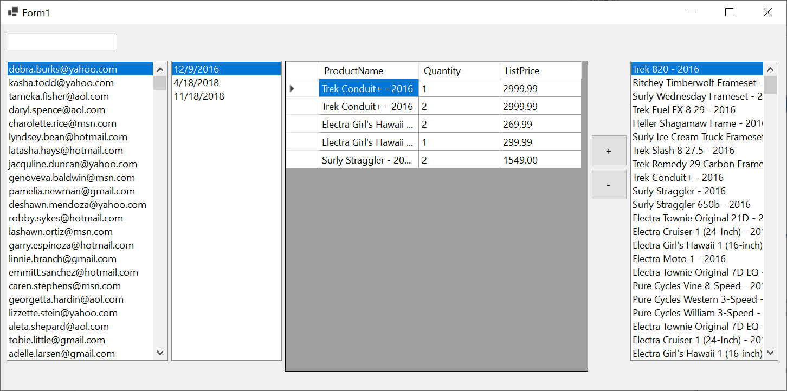

# ZH 4A — Bike Store

## Adatbázis

```powershell
Install-Package Microsoft.EntityFrameworkCore.SqlServer
Install-Package Microsoft.EntityFrameworkCore.Tools
```

```powershell
Scaffold-DbContext "Data Source=bit.uni-corvinus.hu;Initial Catalog=se_bikestore;User ID=hallgato;Password=Password123;Encrypt=False;Trust Server Certificate=True" Microsoft.EntityFrameworkCore.SqlServer -OutputDir Models
```


## Szükséges táblák

#### `customers` &rarr; `orders` &rarr; `oreder items` &larr; `products`




## Lépések

① Hozd létre a projektet, és a fenti adatok alapján készítsd el az adatkötött osztályokat!

② Készítsd el az ábrán látható felhasználói felületet!

③ A bal `ListBox`-ban jelenítsd meg szűrhető módon a `customers` tábla elemeit, a listában az `email` mező értéke jelenjen meg!

④ A jobb`ListBox`-ban jelenítsd a `products` tábla elemeit, a listában a `product_name` mező értéke jelenjen meg! Itt már nincs szükség szűrésre. 

⑤ Ha a felhasználó kiválaszt egy `customer`-t a bal listából, jelenjenek meg a második listában a hozzá tartozó megrendelések az `orders` táblából! A megjelenített mező az `order_date` legyen!

⑥ Hozd létre az alábbi osztályt, mely a rács adatforrásául szolgál:

``` csharp
public class DetailedOrderItem
{
    public int OrderFk { get; set; }
    public int ProductFk { get; set; }
    public string ProductName { get; set; } = null!;
    public int Quantity { get; set; }
    public decimal? ListPrice { get; set; }
}
```

⑦ A rács "fülén" keresztül vedd fel adatkötött adatforrásként az előbb létrehezott `DetailedOrderItem` osztályt, majd állítsd be a rács adatforrásaként!

⑧ A második listára kattintva jelenjenek meg a kiválasztott `Models.Order`-hez a hozzá tartozó `OrderItem`-ek `DetailedOrderItem`  formában. Az adatkötés a `BindingSource`-on keresztül történjen!

⑨  A `+` gombra kattintva lehessen új ` Models.OrderItem` típusú elemet felvenni a `context.OrderItems` gyűjteménybe! A mennyiség most minden esetben legyen `1`. Az adatbázisban történő rögzítés után az elemek kerüljenek újraolvasásra a rácsba!

Ⓐ Helyezz el gombot vagy menüt az űrlapon, ami a `Customers` táblából az e-mail címeket és a neveket XML állományba menti. A mentés helyét párbeszédablakból lehessen kiválasztani!

Ⓑ Jelenítsd meg a kiválasztott rendelés értékét egy címkében!


