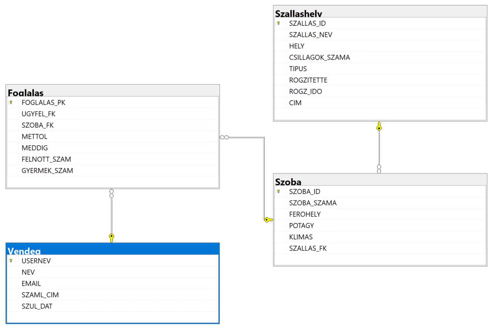
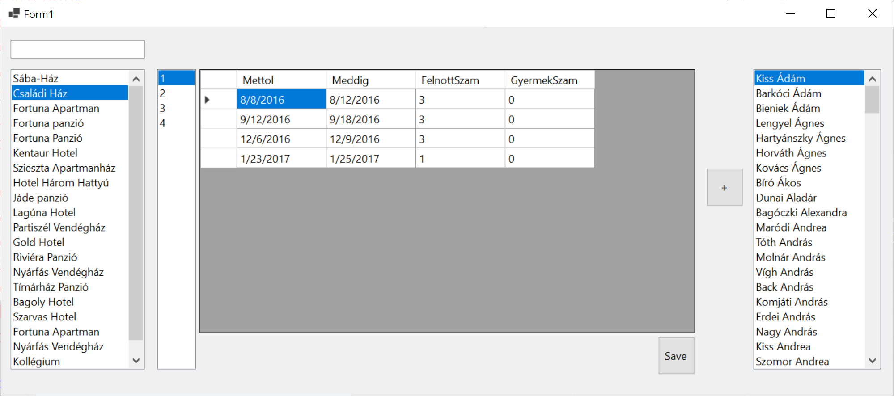

# ZH 4B — Szálláshely

## Adatbázis

```powershell
Install-Package Microsoft.EntityFrameworkCore.SqlServer
Install-Package Microsoft.EntityFrameworkCore.Tools
```

```powershell
Scaffold-DbContext "Data Source=bit.uni-corvinus.hu;Initial Catalog=se_szallashely;User ID=hallgato;Password=Password123;Encrypt=False;Trust Server Certificate=True" Microsoft.EntityFrameworkCore.SqlServer -OutputDir Models -NoPluralize
```



## Szükséges táblák

#### `Szallashely` &rarr; `Szoba` &rarr; `Foglalas` &larr; `Vendeg`




## Lépések

① Hozd létre a projektet, és a fenti adatok alapján készítsd el az adatkötött osztályokat!

② Készítsd el az ábrán látható felhasználói felületet!

③ A bal `ListBox`-ban jelenítsd meg szűrhető módon a `Szallashely`  tábla elemeit, a listában az `SZALLAS_NEV` mező értéke jelenjen meg!

④ A jobb`ListBox`-ban jelenítsd a `Vendeg` tábla elemeit, a listában a `NEV` mező értéke jelenjen meg! Itt már nincs szükség szűrésre. 

⑤ Ha a felhasználó kiválaszt egy `Szallashely`-et a bal listából, jelenjenek meg a második listában a hozzá tartozó szobaszámok a `SZOBA` táblából! A megjelenített mező az `SZOBA_SZAMA` legyen!

⑥ A rács "fülén" keresztül vedd fel adatkötött adatforrásként a `Foglalás` tábla alapján készült osztályt, majd állítsd be a rács adatforrásaként!

⑦ A második listára kattintva jelenjenek meg a kiválasztott `Models.Szoba`-hoz a hozzá tartozó foglalások. Az adatkötés a `BindingSource`-on keresztül történjen! 

⑧ A kulcs mezőket rejtsd el, de lehessen hozzáadni és törölni sorokat, de a cellák szerkesztését engedélyzd!

⑨ A `+` gombra kattintva lehessen új ` Models.Foglalas` típusú elemet felvenni a `context.Foglalas` gyűjteménybe! A szemályek száma most minden esetben legyen `1`. Az adatbázisban történő rögzítés után az elemek kerüljenek újraolvasásra a rácsba! A `Mettol` értéke legyen `DateTime.Now`,
`Meddig = DateTime.Now.AddDays(7)`. Ha így már működik, versenyen kívül betehetsz egy-egy `DateTimePicker`-t a dátumválasztáshoz.

⑩  A `Save` gombra kattintva lehessen menteni a változásokat, a személyek számát a rácsban beállítani! 

⑪ Készíts egy `-`  gombot is a rácsban kiválasztott foglalás törlésére! 

Ⓐ Helyezz el gombot vagy menüt az űrlapon, ami a szálláshelyek neveit XML állományba menti. A mentés helyét párbeszédablakból lehessen kiválasztani!

Ⓑ Jelenítsd meg a foglalást leadó vendég nevét egy címkében, amikor rákattintanak egy foglalásra!


