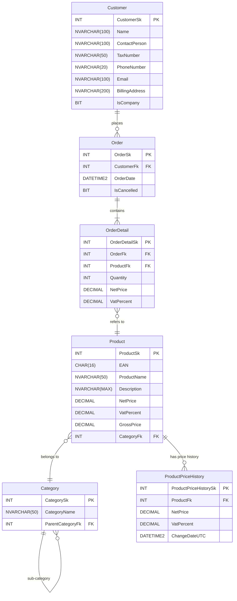
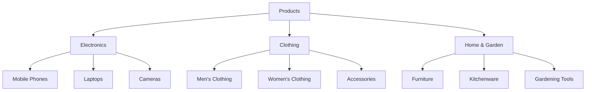

# 2. gyakorlat

A gyakorlat célja, hogy az előadáson közösen felépített logikai adatbázisterv alapján a saját SQL szervereden elkészüljön a működő SQL adatbázis mintaadatokkal feltöltve. A feladat megoldásáoz tetszőleges szoftver használható izéls szerint. A géptermekben ezek közül válogathattok:

- SSMS
- Azure Data Studio
- Visual Studio 2022 - Server Explorer panel
- Visual Studio Code + mssql bővítmény

Javasoljuk a géptermi gépek használatát, a ZH is ezeken lesz. Dolgozzatok össze!

> [!warning]
>
> A feladat megoldásáról készíts Markdown dokumentumot! Gyakorlat végén ez a dokumentum megőrzendő, következő gyakorlaton betesszük a projekt mellé a github repóba mint dokumentációt. Ez igazolja majd a gyakorlat sikeres teljesítését, azaz a jelenlétet. Nem ma kell leadni. 

## 1. Adatbázis felépítése

### 1.1 Új címkezelő funkció a Mermaid diagramba

Eddig jutottunk az előadáson:




Az oldal alján lévő "Edit this page" link ennek az oldalnak a GitHub-on őrzött Markdown forrására mutat, ahonnét leszedhető a Mermaid diagram szöveges forrása is. (`Raw` gomb) Ha megszerezted a diagram szövegét, bővítsd az alábbiak szerint: 

- Az adatbázis legyen képes címek hatékony kezelésére. Egy ügyfélhez több cím is tartozhat, mivel a terv szerint az ügyfél választhat, hogy melyik címére kéri a kiszállítást. 
- Minden megrendeléshez természetesen csak egy szállítási cím tartozik. (`DeliveryAddressFk`) 

**Tedd be a továbbfejlesztett Mermaid diagramot a Markdown dokumnetumodba!** (`DeliveryAddressFk`)

### 1.2 Adatbázis táblák létrehozása Mermaid diagram alapján

Használhatsz tetszőleges AI eszközt, hogy MS-SQL scriptet generálj, mely felépíti az adatbázis táblákat és az idegenkucs kényszereket.  **Az adatbázis objektumokat felépítő SQL mondatokat helyezd el a Markdown dokumnetumodban!**  


### 1.3 További kényszerek beállítása

Állítsd be az alábbi kényszereket az adatbázis táblák vonatkozó mezőjére. **A változtatásokkal módosítsd a Markdown dokumentumokat.**

- Minden tábla elsődleges kulcsa identitás mező legyen (automatikus számláló, IDENTITY).
- Minden százalékos érték (adó, kedvezmény) 0–100 közötti egész értéket vehet fel.
- Az **ügyfelek** neve, e-mailje, lakcíme nem lehet üres, az e-mail egyedi. Címekből nem hiányozhat semmi.
- A **termékek** neve, ára, készlete és kategóriája nem lehet üres. Az ár és a készlet nem lehet negatív szám. (CHECK (Ar >= 0))
- A **rendelések** dátuma nem lehet üres, és alapértelmezetten az aktuális nap (DEFAULT GetDate()). A kedvezmény mértéke nem lehet üres, alapértelmezetten 0. A végösszeg felvehet NULL értéket.
- A **rendelés tételek** esetén egy mező sem lehet üres, illetve a mezők többségében nem negatív értékeket vehetnek csak fel.

### 1.4 Adatbázis felépítése az SQL szerveren

Futtasd az SQL mondatokat a szervereden. Addig javítgasd amíg rendben nem fut 😊 

> [!tip]
>
> Ha VSCode-ban dolgozol, a kis háromszögre kattintva csak a kijelölt SQL kódrészlet fut. Ezt kihasználhatod, ha nem akarsz mindent futtatni, ami az ablakban van. 

## 2. Mintaadatok generálása

### 2.1 Termékkategóriák feltöltése

Az alábbi hierarchiát építsd fel a `Category` táblában. Ha szeretnél, használhatsz másik hierarchiát is. **A dokumentumodba szúrd be a kategóriákat létrehozó SQL mondatokat!**   



> [!tip]
>
> Előfordulhat, hogy a táblák mintaadatokkal történő feltöltése rosszul sikerül. Ilyenkor törölni kell az összes sort, viszont törlés után az automatikusan számozódó IDENTITY mezők számozása nem indul újra. Ezen segít az alábbi SQL parancs, ahol a tábla neve `ProductCategory`:
> ```sql
> DBCC CHECKIDENT ('ProductCategory', RESEED, 1);
> ```

> [!note]
>
> Minden táblában csak egy automatikusan számozott oszlop lehet. Az SQL szerver minden táblához tárolja az utoljára kiosztott automatikus sorszámot. A fenti parancs ezt állítja át. 

### 2.2 Mintatermékek generálása

1. AI segítségével generálj mintaadatokat a termék táblába! Meg kell oldani, hogy az LLM ismerje a termékkategóriák neveit és a kategóriaazonosítókat.
2. AI segítségével generálj mintaadatokat a cím és az ügyfél táblákba is. 

**Az SQL mondatokat dokumentáld!**

## 3. Trigger készítése

Az első előadáson bemutatott módszerrel hozz létre TRIGGER-t, mely a termékkategória táblában eszközölt ÁFA és ármódosításokat automatikusan átvezeti az ártörténet táblába. 

**Dokumentáld trigger kódját és az ellenőrzéshez használt kódot is!**