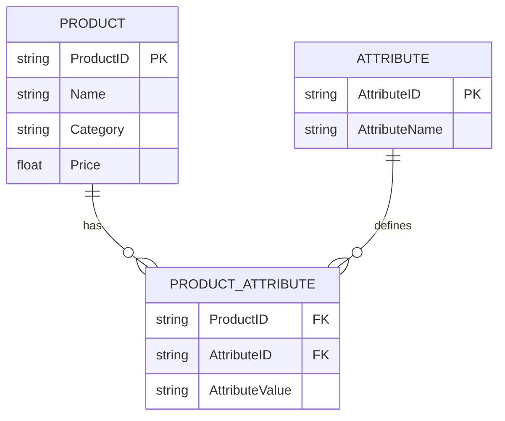
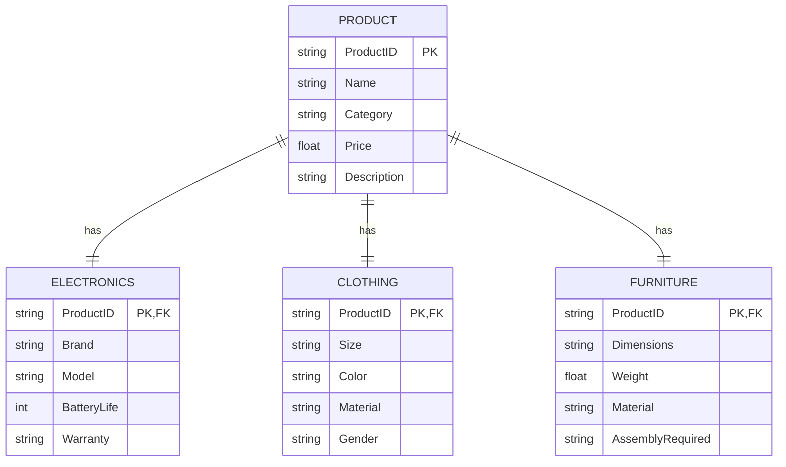

# Design pattern: key-value tables

Problem: different project have different properties. We want to make them comparable. 

Here's an example structure for a key-value table to describe properties of products in a webshop with different categories. I'll first suggest some product properties, then create a sparse table, and finally provide a key-value ER diagram using Mermaid's ER syntax.

### Product Properties and Examples

Here are some common properties for products, which vary based on category:

1. **General (Applies to All Products)**
   - **ProductID**: Unique identifier (e.g., `P001`)
   - **Name**: Product name (e.g., "Smartphone")
   - **Category**: Product category (e.g., "Electronics")
   - **Price**: Cost of the product (e.g., `$299.99`)
   - **Description**: Short description of the product (e.g., "High-resolution camera phone")
2. **Electronics**
   - **Brand**: Manufacturer (e.g., "Samsung")
   - **Model**: Model name/number (e.g., "Galaxy S21")
   - **BatteryLife**: Battery life in hours (e.g., `24`)
   - **Warranty**: Warranty period (e.g., "2 years")
3. **Clothing**
   - **Size**: Size of clothing (e.g., "M")
   - **Color**: Color options (e.g., "Red")
   - **Material**: Fabric material (e.g., "Cotton")
   - **Gender**: Intended gender (e.g., "Unisex")
4. **Furniture**
   - **Dimensions**: Size dimensions (e.g., "100x50x40 cm")
   - **Weight**: Product weight (e.g., "15 kg")
   - **Material**: Material used (e.g., "Wood")
   - **AssemblyRequired**: Whether assembly is required (e.g., "Yes")

### Solution #1: Sparse Table Including All Properties

| ProductID | Name         | Category    | Price   | Description                | Brand   | Model      | BatteryLife | Warranty | Size | Color | Material | Gender | Dimensions   | Weight | AssemblyRequired |
| --------- | ------------ | ----------- | ------- | -------------------------- | ------- | ---------- | ----------- | -------- | ---- | ----- | -------- | ------ | ------------ | ------ | ---------------- |
| P001      | Smartphone   | Electronics | $299.99 | High-resolution camera     | Samsung | Galaxy S21 | 24          | 2 years  |      |       |          |        |              |        |                  |
| P002      | T-Shirt      | Clothing    | $19.99  | Comfortable cotton shirt   |         |            |             |          | M    | Red   | Cotton   | Unisex |              |        |                  |
| P003      | Coffee Table | Furniture   | $120.00 | Modern wooden coffee table |         |            |             |          |      |       | Wood     |        | 100x50x40 cm | 15 kg  | Yes              |

Each row contains only the relevant properties for that product category, leaving other cells blank.

### Solution #2: Key-Value store

In a key-value database design, each product will have a list of attributes that vary by category. Here’s a Mermaid ER diagram representing this concept:

### Explanation

- **PRODUCT**: Contains general product information (e.g., `ProductID`, `Name`, `Category`, `Price`).

- **ATTRIBUTE**: Defines possible attributes for products (e.g., `Size`, `Color`, `Material`, etc.).

- PRODUCT_ATTRIBUTE

  : A join table to associate products with attribute values.

  - **ProductID** and **AttributeID** create the link between a product and an attribute.
  - **AttributeValue** holds the value for the attribute (e.g., `Color` = "Red", `BatteryLife` = "24 hours").

This design enables a flexible key-value system, where you can add new attributes or modify existing ones without changing the schema structure.

## Solution #3: 1:1 tables 

For a 1:1 relational model solution, we’ll structure separate tables for each product category, each containing specific attributes. This approach ensures that each product has a unique set of properties tied to its category through foreign key constraints.

