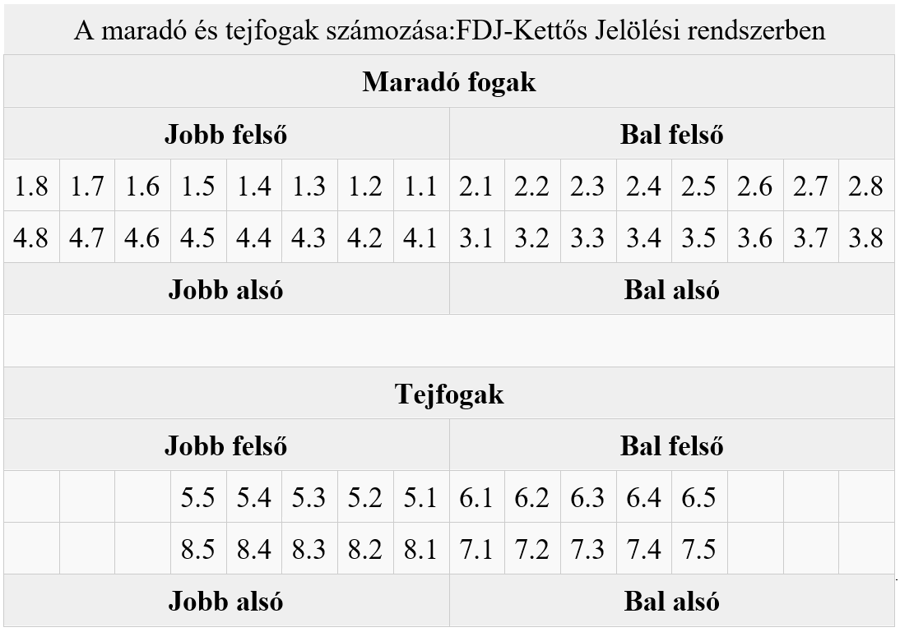

# Adatbázis tervezés mintafeladat

**Készítsd el egy fogászat nyilvántartó adatbázisát**!

 Egy fogász számítógépes nyilvántartást szeretne vezetni pácienseiről és az elvégzett beavatkozásokról. A fogászaton csak egy fogorvos dolgozik, így az orvosok között nem kell különbséget tenni. A **pácien**sekről nevüket, címüket, taj-számukat, születési dátumukat és telefonszámukat tároljuk. A páciensek **kezelések**en jelennek meg, melyek dátumát szintén rögzíteni kell. Egy páciens természetesen tetszőleges számú kezelésen megjelenhet. A kezeléseken az orvos **beavatkozások**at végez a fogakon. Minden kezelés alkalmával rögzítjük, hogy a páciens melyik **fog**án mikor milyen beavatkozást végeztek, és hogy a kezelés költségeit fizette-e már a páciens. Egy kezelés alkalmával több beavatkozás is végezhető. **Elvégezhető beavatkozás** pl. a fúrás, a tömés, a húzás, stb. Minden elvégezhető beavatkozásnak van egy kötött ára is. A fogak jelölésére két számjegyet használunk, melyeket pont választ el. Az első, a kvadránst jelzi, melyben a fog elhelyezkedik: 1 – a jobb felső, 2 – a bal felső, 3 – a bal alsó, 4 – a jobb alsó kvadráns. A második számjegy magát a fogat jelöli az alábbi táblázat szerint:

 

Hozd létre az adatbázis megvalósításához szükséges táblákat, a megfelelő mezőkkel és kulcsokkal! A táblák közt hozd létre a kapcsolatokat és állítsd be a   hivatkozási integritásokat! 

Figyelj oda arra, hogy egy kezelésen az orvos több beavatkozást is végezhet!

Mermaid diagrammot készíts! Használhatsz VS-Code-ot vagy online szerkesztőt, mint a https://mermaid.live/ vagy a https://stackedit.io/. 

