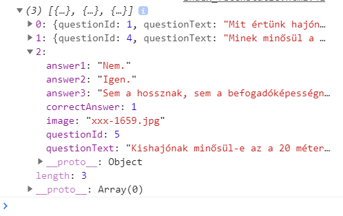

# Javascript: objektumok, tömbök
## A gyakorlat célja

Ezen a gyakorlaton egy statikus fájlból töltünk le egy kérdéslistát, melynek kérdéseit egy listában jelenítjük meg. 

## Elméleti összefoglaló
### Videó

[JS objektumok, tömbök, fetch](jsbasics2.m4v) -- a heti feladat megoldásához szükséges alapokat összefoglaló videó [37 perc]. 

A múlt héthez hasonlóan a JS-ben járatos kollégák ugorhatnak rögtön a feladatmegoldásra!

### Kódminták a videóból

Mindenek előtt: a konzol üzenetek színezhetők, így könnyebb lehet megkülönböztetni a különféle üzeneteket. 
``` js
console.log('%c Oh my heavens! ', 'background: #222; color: #bada55');
```
Objektum létrehozása és objektumon belül változók = tulajdonságok felvétele:
``` js
var o1 = new Object()
o1.kNév = "John"
o1.vNév = "Bull"
o1.teljesNév = function() {return this.kNév + " " + this.vNév;}
```
Példa a referenciaként kezelt objektumokra: `o1` és `o2` a memóriában ugyanarra az objektumra mutatnak:
``` js
var o1 =  new  Object()
o1.kNév = "John"
var o2 = o1
o2.kNév = "Jane"
> o1.knév
< "Jane"
```
Objektum másolása:
``` js
o3 = Object.assign({}, o1)
```
Tömb létrehozása és feltöltése:
``` js
var a1 = new Array() //Elemek számát nem kell megkötni
a1[0] = "nulladik"
a1[1] = "első"
a1[10] = "tizes" //lehet "sparse" is, nem muszáj folyamatosnak lennie
a1.push(o1) //Elem lehet objektum is, a push a végére szúr új elemet
a1.splice(0) //A splice elemet töröl
```
JSON stringek előállítása és feldolgozása
``` js
var s = JSON.stringify(o1)
var o4 = JSON.parse(s)
```
Tömbök illetve objektumok létrehozás JSON kóddal:
``` js
var o5 = {} //üres objektum
var a2 = [] //üres tömb
var o6 = { név : "John", age : 23 } //Tömb kulcsokkal és értékekkel
var o6 = { "név" : "John", "age" : 23 } //Így, idézőjelbe tett kulcsokkal is szabályos
a3 = ["a","b","c"] //Lista inicialializálása értékekkel
```

Példa a `fetch` használatára: 
``` html
<!DOCTYPE html>
<html>
<head>
    <meta charset="utf-8" />
    <title></title>
</head>
<body>
    <ol id="ide"></ol>
    <script>
        fetch("/questions.json")
            .then(r => r.json())
            .then(d => adatÉrkezett(d));

        function adatÉrkezett(adat) {
            let ide = document.getElementById("ide");
            console.log(`${adat.length} kérdés érketett`)

            for (var i = 0; i < adat.length; i++) {
                console.log(adat[i].questionText)
                let elem = document.createElement("li")
                elem.innerHTML = adat[i].questionText
                ide.appendChild(elem)
            }
        }
    </script>
</body>
</html>
```


## Feladatok

(+/-) Hozd létre a `wwwroot` mappát.

(+/-) Hozz létre egy `main.js` nevű fájlt a `wwwroot`ban -- ide fogunk dolgozni.

(+/-) Hozz létre egy `hajo.html` fáljt a `main.js` mellé.

hajo.html:
``` html
<!DOCTYPE html>
<html>
<head>
    <meta charset="utf-8" />
    <title>Hajós vizsgafelkészítő</title>
</head>
<body>
    <div id="külső">
        <div id="kérdés_szöveg">
            Kérdés szövege
        </div>

        <div id="középső">
            <div id="válaszok">
                <div id="válasz1" class="kerdes">Válasz 1</div>
                <div id="válasz2" class="kerdes">Válasz 2</div>
                <div id="válasz3" class="kerdes">Válasz 3</div>
            </div>
            <div id="kép">
                
            </div>
        </div>
        <div id="vezérlő">
            <div class="gomb kattintható">Vissza</div>
            <div class="gomb kattintható">Előre</div>
        </div>
    </div>
</body>
```

(+/-) Állítsd be, hogy statikus fájlokat is kiszolgáljon a webszerver, valamint, hogy a `hajo.html`-t nyissa meg alapértelmezetten.

(+/-) A `hajo.html`-be töltsd be a `main.js`-t

``` html
<!DOCTYPE html>
<html>
<head>
    <meta charset="utf-8" />
    <title>Hajós vizsgafelkészítő</title>
    <script src="/main.js"></script> //A solution explorer-ből be is húzható
</head>
...
```
(+/-) Csinálj egy `styles.css`-t rakd bele a `hajo.html`-be és töltsd fel szabályokkal:

styles.css:
```css
html, body {
    height: 100%;
}
div {
    margin: 10px;
    border: 1px solid fuchsia
}
#külső {
    height: 100%;
    display: flex;
    flex-direction: column;
}
#középső {
    display: flex;
    flex-direction: row;
    flex-grow: 1
}
#válaszok {
    flex-grow: 1;
    flex-shrink: 1;
}
#kép {
    overflow: hidden;
    //Felesleges, a kép túlnyúló részét rejtené el flex-shrink:0;
    flex-shrink: 0;
}
.gomb {
    padding: 20px;
    width: 80px;
}
.kattintható:hover {
    background-color: fuchsia;
    color: white;
}
```

(+/-) Hozz létre egy `questions.json` nevű fájlt is a `wwwroot`ban. Ebben tároljuk a kérdéslistát -- illetve most csak pár kérdést a teszteléshez. (A fájlnévnek nincs jelentősége, csak következetesen használjuk.)

``` json
[
  {
    "questionText": "Mit \u00E9rt\u00FCnk haj\u00F3n a Szab\u00E1lyzat I. r\u00E9sze alapj\u00E1n? Haj\u00F3",
    "answer1": "a nagyhaj\u00F3, a kishaj\u00F3, a v\u00EDzi sporteszk\u00F6z \u00E9s az \u00FAsz\u00F3m\u0171.",
    "answer2": "a belv\u00EDzi haj\u00F3, bele\u00E9rtve a kishaj\u00F3t \u00E9s kompot, tov\u00E1bb\u00E1 a tengeri haj\u00F3 \u00E9s az \u00FAsz\u00F3munkag\u00E9p.",
    "answer3": "minden v\u00EDzij\u00E1rm\u0171 \u00E9s \u00FAsz\u00F3munkag\u00E9p.",
    "correctAnswer": 2,
    "image": "teszt-0050.jpg"
  },
  {
    "questionText": "Minek min\u0151s\u00FCl a vitorla mellett saj\u00E1t g\u00E9pi hajt\u00F3berendez\u00E9s\u00E9t is haszn\u00E1l\u00F3 haj\u00F3?",
    "answer1": "G\u00E9phaj\u00F3nak.",
    "answer2": "Vitorl\u00E1s haj\u00F3nak.",
    "answer3": "Seg\u00E9dmotoros vitorl\u00E1snak.",
    "correctAnswer": 1,
    "image": "teszt-1235.jpg"
  },
  {
    "questionText": "Kishaj\u00F3nak min\u0151s\u00FCl-e az a 20 m\u00E9tern\u00E9l kisebb hossz\u00FAs\u00E1g\u00FA haj\u00F3, amelyen 12 f\u0151n\u00E9l t\u00F6bb utas sz\u00E1ll\u00EDt\u00E1s\u00E1t enged\u00E9lyezte a haj\u00F3z\u00E1si hat\u00F3s\u00E1g?",
    "answer1": "Nem.",
    "answer2": "Igen.",
    "answer3": "Sem a hossznak, sem a befogad\u00F3k\u00E9pess\u00E9gnek nincs jelent\u0151s\u00E9ge, a haj\u00F3 \u00FCzembe helyez\u00E9sekor a haj\u00F3z\u00E1si hat\u00F3s\u00E1g d\u00F6nt a min\u0151s\u00EDt\u00E9sr\u0151l.",
    "correctAnswer": 1,
    "image": "xxx-1659.jpg"
  }
]
```
> Érdemes megjegyezni, hogy az ékezetes karakterek UTF-16-ban vannak kódolva. 

(+/-) Hozz létre egy `kérdések` nevű változót az oldal scope-jában (js-ben). Ide kerül majd a kérdéseket tartalmazó lista. Nem is kell neki kezdőérték.

``` js
var kérdések;
```

(+/-) Készíts egy `letöltés()` függvényt! A letöltés függvény egy `fetch`-el töltse le a `questions.json` tartalmát:
	- A letöltés végén dolgozd fel a kapott JSON-t, majd
	- hívj meg egy `letöltésBefejeződött(k)`  nevű függvényt, ami eltárolja a `kérdések` nevű változóban a kérdéseket tartalmazó tömböt!

``` js
fetch('/questions.json')
    .then(response => response.json())
    .then(data => letöltésBefejeződött(data)
);

function letöltésBefejeződött(d) {
    console.log("Sikeres letöltés")
    console.log(d)
    kérdések = d;
}
```
Az eredményt érdemes a böngésző konzolában ellenőrizni:


> HEUREKA: az ékezetek rendben vannak :) 

(+/-) A  `letöltés()` függvény kerüljön meghívásra, amint az oldal betöltődött!   (`window.onload`)

(+/-) Ezután hozz létre egy `kérdésMegjelenítés(id)` nevű függvényt, mely a paraméterként kapott sorszámú kérdést megjeleníti a DOM-ban. Képpel együtt :)

A képek a https://szoft1.comeback.hu/hajo/ URL alól érhetők el, pl: https://szoft1.comeback.hu/hajo/teszt-0050.jpg

(+/-) Az oldal betöltődése (`window.onload`) után jelenítsd is meg az első kérdést rögtön! 
Ld: múlt gyakorlat anyaga.

(+/-) Az oldal betöltődése után kódból rendelj egy-egy eseménykiszolgálót a két gomb `click` eseményéhez!
Ld: múlt gyakorlat anyaga.

(+/-) A gombokkal lehessen lépkedni a kérdések között. A lista forogjon! (Utolsó után az első, első előtt az utolsó.)

Tippek: 
- Az oldal scope-jában érdemes létrehozni egy változót, melyben az éppen megjelenített kérdés sorszáma kerül tárolásra. Ezt bármelyik függvényed eléri. 
- Az `array` `length` tulajdonsága segítségével tudhatjuk meg, hogy hány kérdés volt a letöltött fájlban.

(+/-) Rendelj eseménykiszolgálókat a válaszlehetőségekhez is! Attól függően, hogy a felhasználó melyiket választotta, színezd a válaszlehetőségeket.

(+/-) Hívd elő a szépérzéked és egészítsd ki a css-t, hogy szebb legyen az oldal.
