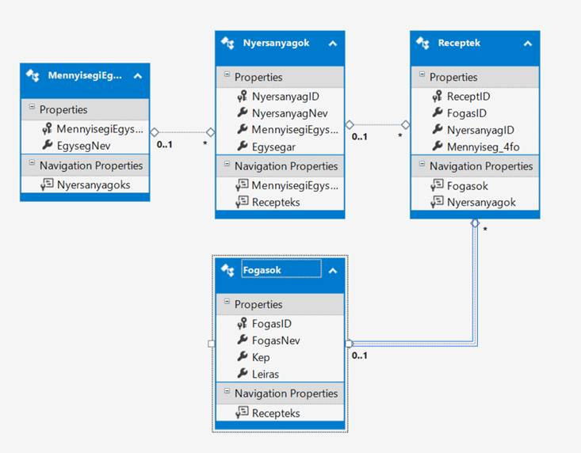
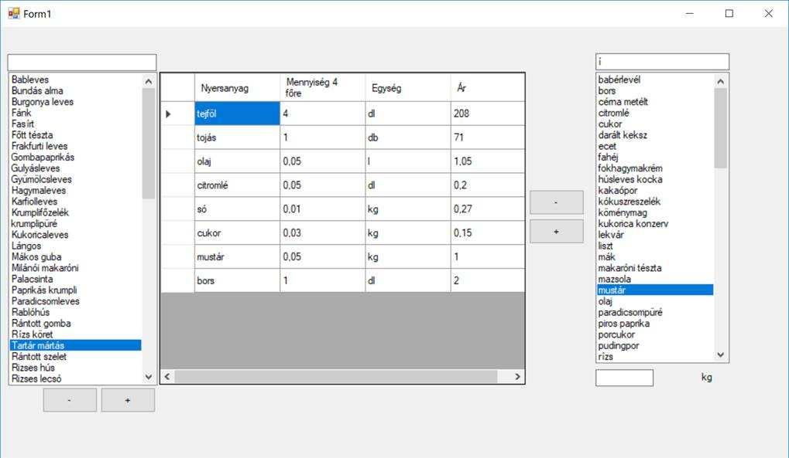
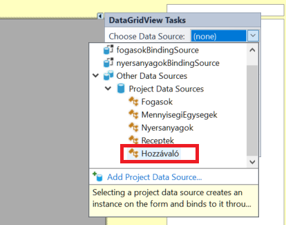

# Receptes adatbázis
A feladat valós adatokat tartalmaz, egy cserkésztábor szervezői kalkulálták segítségével az étkeztetés költségeit. A kiinduló adatbázisban szereplő elnevezések nem a legszerencsésebbek, de nem változtattuk meg őket, hogy látszon, milyen kényelmetlenségekkel jár a rossz elnevezési konvenció.  


## ORM osztályok létrehozása

(+/-)  Készítsd el az adatbázist leképező ORM osztályokat.

Az adatbázis sémáját az alábbi ábra mutatja:



> [!NOTE]
>
> Az adatbázistáblák nevei többesszámban vannak, magyarul. Mint látni fogjuk, ez kevésbé jól olvasható kódhoz vezet, de legalább tanulságos.

ZH-n -- és most is -- érdemes lehet a NuGet grafikus felülete helyett a PM Console segítségével hozzáadni a projekthez, sokkal gyorsabb:

```powershell
Install-Package Microsoft.EntityFrameworkCore.SqlServer
Install-Package Microsoft.EntityFrameworkCore.Tools
```

Az ORM osztályok elkészítéséhez használhatjuk a korábban megszokott módszert, de érdemes megjegyezni, hogy a táblanevek többesszámban vannak, magyarul. A táblaneveket a `Scaffold-DbContext`  alapértelmezésben az angol nyelv szabályai szertint többesszámba teszi, így lesz a `Fogasok`-ból `context.Fogasoks`. Érdemes megkeresni a [dokumentációban](https://learn.microsoft.com/en-us/ef/core/cli/powershell#scaffold-dbcontext) azt a kapcsolót, mely letiltja a többesszámba tételt. A _megszokott_ parancs emlékeztetőül itt:

```powershell
Scaffold-DbContext "[Conncection string]" Microsoft.EntityFrameworkCore.SqlServer -OutputDir [Mappa] -Context [Context osztály neve]
```

A `-NoPluralize` kapcsoló segít:

```powershell
Scaffold-DbContext "Data Source=bit.uni-corvinus.hu;Initial Catalog=Etkeztetes;User ID=hallgato;Password=Password123;Trust Server Certificate=True" Microsoft.EntityFrameworkCore.SqlServer -OutputDir Models -Context ReceptContext -NoPluralize
```

## UI tervezés

❶ Készítsd el a képen látható elrendezést **értelemszerűen elnevezett vezérlőkkel**. Segítségül a vezérlők elnevezéséhez: bal oldalon jelennek majd meg a fogások, jobb oldalon pedig a nyersanyagok. Egy fogást kiválasztva a táblázatban a fogáshoz szükséges hozzávalók jelenek majd meg, a `Receptek` tábla megfelelő sorai alapján.
> [!WARNING]
>
> A későbbi forráskód részletekben szereplő elnevezéseket várhatóan hozzá kell igazítani a saját elnevezésekhez!



## Fogások és nyersanyagok szűrése

❷ A jobboldali `ListBox`-ban jelenjenek meg a nyersanyagok, mégpedig szűrési lehetőséggel. A szűrés funkciót szervezd külön metódusba, amely az űrlap Load eseményéhez tartozó eseménykiszolgálóból és a szűréshez tartozó szövegdoboz `TextChanged` eseményéhez tartozó eseménykiszolgálóból is meghívható. 

Az adatkötéshez használj `BindingSource`-ot. Így a `ListBox` `DisplayMember` tulajdonságát a properties ablakban is be tudod állítani, nem kell gépelni:

```csharp
private void NyersanyagListazas()
{
    var hv = from x in context.Nyersanyagok
                where x.NyersanyagNev.Contains(textBoxNyersanyagKereső.Text)
                select x;

    nyersanyagokBindingSource.DataSource = hv.ToList();
}
```

❸ A baloldali `ListBox`-ban jelenjenek meg a fogások (szintén szűrhetően).

❹ Rendelj eseménykiszolgálót a jobboldali `ListBox` vezérlő `SelectedIndexChanged` eseményéhez. Ha a felhasználó választ egy nyersanyagot, a címkében meg kell jeleníteni a nyersanyaghoz tartozó mennyiségegységet, az alábbi mintához hasonlóan:

```csharp
private void listBoxNyersanyagok_SelectedIndexChanged(object sender, EventArgs e)
{
    var kiválasztottNyersanyag = (Nyersanyagok)listBoxNyersanyagok.SelectedItem;
    var megyseg = (from x in context.MennyisegiEgysegek
                    where x.MennyisegiEgysegId == kiválasztottNyersanyag.MennyisegiEgysegId
                    select x).FirstOrDefault();
    labelMEgység.Text = megyseg.EgysegNev;
}
```

> [!TIP]
>
> A zárójelben lévő LINQ kifejezés egy gyűjteményt ad vissza, amelyől tudjuk, hogy üres, vagy legfeljebb egy eleme van. A `FirstOrDefault()` nem üres gyűjtemény esetén a gyüjtemény első elemét adja vissza, üres gyűjtemény esetén viszont `null` értéket ad vissza. 

Oldd meg, hogy ne keletkezzen futásidejű kivétel, ha az éppen kiválasztott fogáshoz nincs megadva mennyiségi egység az adatbázisban!


## Kiválasztott fogáshoz tartozó hozzávalók megjelenítése

Sajnos a `Receptek` tábla a nyersanyagot idegen kulcsként tartalmazza. Így ebben a táblában nem áll rendelkezésre sem a nyersanyag neve, sem a mennyiségi egység, sem az egységár. Ezeket az adatokat több táblából kell összeszedni. 

❺ Ezért létrehozunk a projektben egy osztályt mondjuk `Hozzávaló` néven, ami egy receptbejegyzést képez le olyan formában, ahogy a rácsban látni szeretnénk. Az `Hozzávaló` osztály tulajdonságai közé felvesszük a `RecpetID`-t is, mert erre szükségünk lesz a rekord törlésénél a `Receptek` tábából. A típusokat úgy lehet a legegyszerűbben meghatározni, hogy megnyitod a Models mappában a vonatkozó osztályt:

``` csharp
public class Hozzávaló
{
    public int ReceptID { get; set; }
    public int? FogasID { get; set; }
    public string NyersanyagNev { get; set; }
    public double? Mennyiseg_4fo { get; set; }
    public string EgysegNev { get; set; }
    public double? Ár { get; set; }
}
```

❻ Vedd fel az új `Hozzávaló` osztályt az adatforrások közé!

❼ Ha már van `Hozzávaló`  osztály az adatforrások között, a `dataGridView` "fülében" beállítható az új típus: 



A művelet után megjelenik a `hozzávalóBindingSource` az űrlap alján, mint vizuális reprezentációval nem rendelkező vezérlő. A rács oszlopai ezután már tervezőből könnyedén testreszabhatóak.

❽ Rendelj eseménykiszolgálót a baloldali `ListBox` vezérlő `SelectedIndexChanged` eseményéhez! Ezután elkészíthető a `HozzávalóListázás()` metódus, melyet a baloldali `ListBox` vezérlő `SelectedIndexChanged` eseményéhez tartozó eseménykiszolgálóból érdemes hívni:

```csharp
private void HozzávalóListázás()
{
    var id = ((Fogasok)listBoxFogások.SelectedItem).FogasId;

    var hozzávalók = from x in context.Receptek
                        where x.FogasId == id
                        select new Hozzávaló
                        {
                            ReceptID = x.ReceptId, 
                            FogasID = x.FogasId, 
                            NyersanyagNev = x.Nyersanyag.NyersanyagNev,
                            Mennyiseg_4fo = x.Mennyiseg4fo,
                            EgysegNev = x.Nyersanyag.MennyisegiEgyseg.EgysegNev,
                            Ár = x.Mennyiseg4fo * (double?)x.Nyersanyag.Egysegar
                        };
    hozzávalóBindingSource.DataSource = hozzávalók.ToList();
}
```


## Új hozzávaló felvétele

❾ Ha a felhasználó a „+” gombra kattint, vegyük fel az új hozzávalót az adatbázisba:

```csharp
private void buttonHozzáadás_Click_1(object sender, EventArgs e)
{
    Receptek r = new Receptek();
    r.NyersanyagId = ((Nyersanyagok)listBoxNyersanyagok.SelectedItem).NyersanyagId;
    r.FogasId = ((Fogasok)listBoxFogások.SelectedItem).FogasId;
    double m;
    if (!double.TryParse(textBoxMennyiség.Text, out m)) return;
    r.Mennyiseg4fo = m;
    context.Receptek.Add(r);
    context.SaveChanges();
    HozzávalóListázás(); //Az középső rácsot kell újratölteni
}
```

> [!TIP]
>
> A rácsnál érdemes letiltani az új rekord hozzáadása és a szerkesztés lehetőségeket, mivel a rácson keresztül nem tudjuk az eredeti adatbázistábla tartalámát változtatni. 

## Hozzávaló törlése 

❿ Először ki kell keresni a `Receptek` gyűjteményből a törlendő objektumot, majd lehet törölni:

``` csharp
private void buttonRemove_Click(object sender, EventArgs e)
{
    var törlendő = (Hozzávaló)hozzávalóBindingSource.Current;

    var törlendő = (from x in context.Receptek
                    where x.ReceptID == törlendő.ReceptID
                    select x).FirstOrDefault();

    context.Receptek.Remove(törlendő);
    context.SaveChanges();
    HozzávalóListázás();
            
}
```

## Új hozzávaló felvétele az adatbázisba

⓫ Készíts űrlapot, melyen keresztül új hozzávalót lehet rögzíteni az adatbázisba. 

