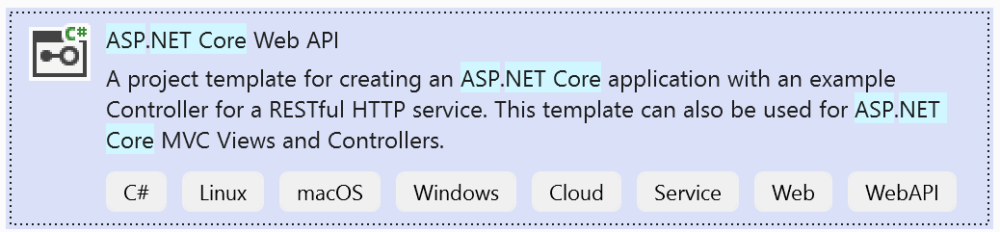
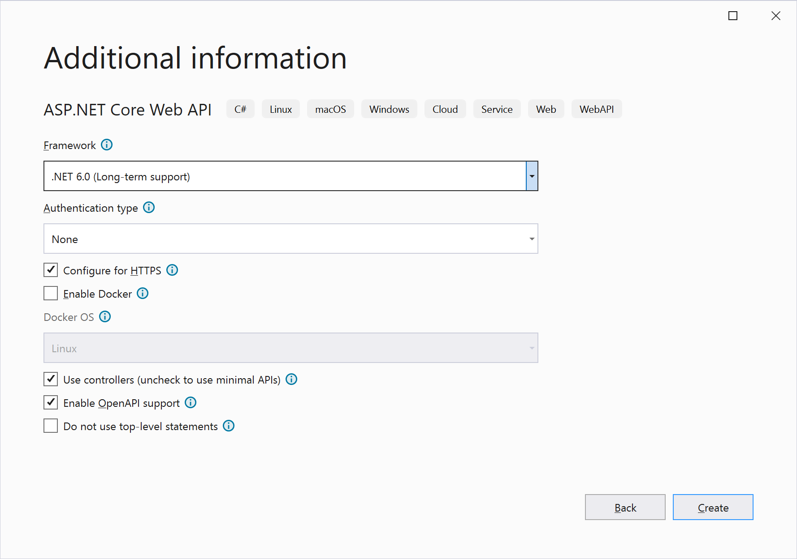
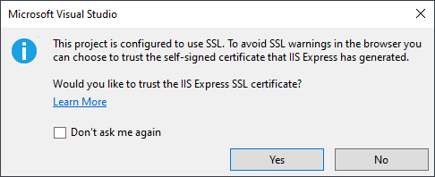
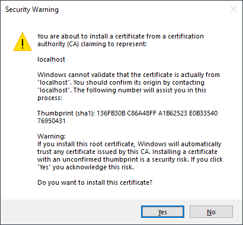
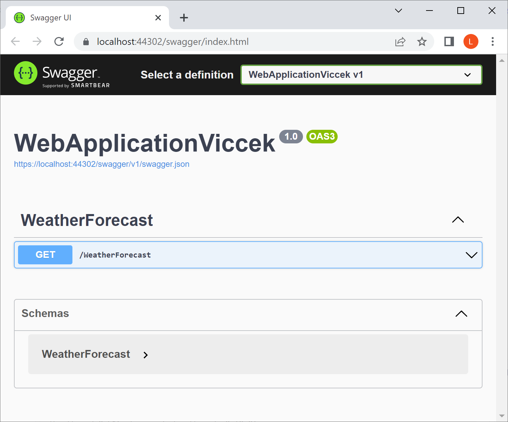
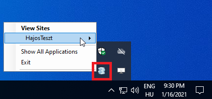
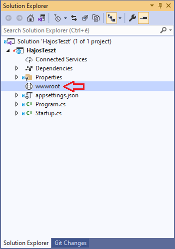
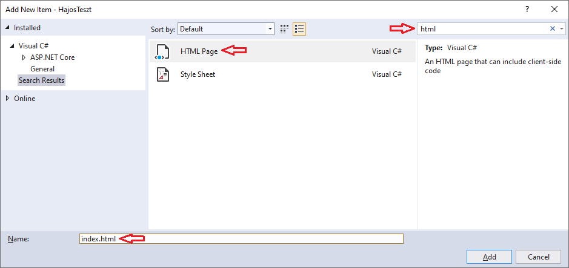
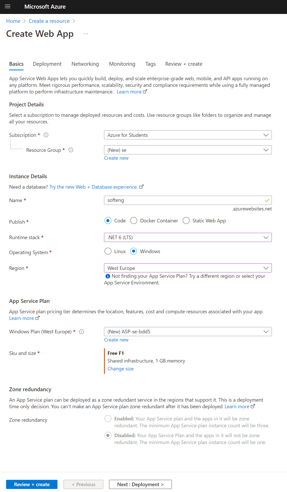
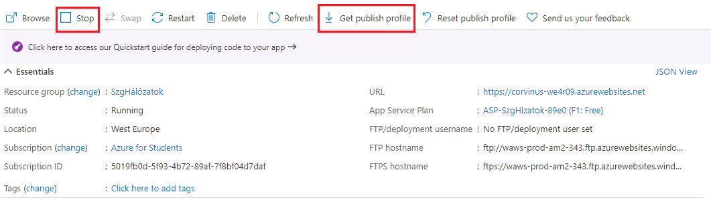

# Creating and Debugging an ASP .NET Project; Deployment to Azure Cloud

This guide covers the following topics:

- How to create an ASP .NET application
- How to run and test the web application on a local server
- How to configure the project to display static HTML content
- How to publish the web application on Azure
- How to commit changes made to the code in Git

------

## Creating a New ASP .NET Project

(+/-) Create a new project. It's important to use the correct template, as there are several with similar names.



You don't need to change much in the settings:



> [!NOTE]
>
> You can use .NET 7!

Enabling "OpenAPI support" provides a way to test API Controllers. This is the "Swagger" that you will encounter later.

------

## First Run

You can run the newly created web application locally using the button below. Even the default template displays some content, which we’ll go into later :)


The first time you run it, Visual Studio will ask if you want to test the web application over HTTPS instead of HTTP. This is important because a page opened over HTTP won't load HTTPS-referenced content in the browser. If you include external content, testing without HTTPS becomes virtually impossible. To use HTTPS, a security certificate must be installed on your machine, which IIS will accept as trusted. We’ll cover HTTPS and certificates more later. Allow it – Yes, Yes:





If all goes well, your web application will run and be accessible from the browser — although not exactly what you might expect:



It's worth noting that when you run the web application, Visual Studio starts IIS Express in the background — its own local web server for testing purposes. Occasionally it may get stuck (though rarely), but you can exit it by right-clicking the taskbar icon. It will restart on the next run.

> IIS (Internet Information Services) is Microsoft’s extensible web server available with Server and Professional editions. IIS Express is installed with Visual Studio and is meant for testing purposes only.



It’s a good idea to switch the default browser to Chrome, as all screenshots were made with it. Note that VS **does not** use the Windows default browser but the one selected in the dropdown next to the debug button.

------

## Creating Your Own Static Content

### Creating `index.html`

The project created from the template cannot share files yet.

To display static content, it’s advisable to create a folder named `wwwroot` in the project. The exact folder name is important — it even gets a special icon:



Right-click on the `wwwroot` folder, then use `Add` > `Add New Item` to create a new HTML page named `index.html`. It’s helpful to use the search bar here as there are many item types.



Now create the HTML file like this:

```html
htmlCopyEdit<!DOCTYPE html>
<html>
<head>
    <meta charset="utf-8" />
    <title></title>
</head>
<body>
    Hello World!
</body>
</html>
```

### Modifying `program.cs` to Enable Static File Serving

Here is the content of `program.cs`. You can remove everything else:

```c#
csharpCopyEditvar builder = WebApplication.CreateBuilder(args);

var app = builder.Build();

app.UseHttpsRedirection();

app.UseDefaultFiles();
app.UseStaticFiles();

app.Run();
```

- `app.UseHttpsRedirection();` — automatically redirects users from `http://` to the secure `https://`. As mentioned earlier, a page loaded over HTTP cannot load HTTPS content in the browser.
- `app.UseDefaultFiles();` — allows serving `https://site.com/index.html` directly as `https://site.com/`.
- `app.UseStaticFiles();` — enables serving static files placed in the `wwwroot` folder.

**The order is important!**


> [!TIP]
>
> Don’t stop and restart the project every time you modify HTML, CSS, or JS files. Just press `Ctrl+S` to save the file, then refresh the page in the browser with `F5`. In the browser, press `F12` (Developer tools) and disable the cache — this setting is only effective while DevTools are open.


------

## Publishing the Web Application to Azure

### Creating an Azure WebApp

Create a WebApp resource:



A few notes:

- .NET 7 is not selectable. Choose 6 for now — you can change it to 7 in the settings after the resource is created.
- During the setup steps, enable "basic authentication". Without it, the automated upload via "Publish Profile" (discussed next) won’t work, as there’s no way to use two-factor authentication here.

------

## Obtaining the Publish Profile

The Publish Profile is an XML document containing all the necessary information to upload (publish) the web application.

Locate the Publish Profile (`corvinus-neptun.PublishSettings`) that you downloaded after creating the Azure Web App, or open [portal.azure.com](https://portal.azure.com) and download it again! You can’t download it while the Web App is running, so stop it first. After downloading, restart it.



After opening the application you want to publish in Visual Studio, go to `Build` > `Publish`, then click the small blue `New` button. You can then choose `Import Profile`, and browse for the previously saved Publish Profile.

In practice, you usually have multiple publish profiles per project: before deploying to the "live" or "production" environment, it’s common to test in a "staging" or "testing" environment.

------

## Importing the Publish Profile

Under the Visual Studio `Build` / `Publish` menu, import the Publish Profile, then click `Publish` to deploy your web application to Azure.
