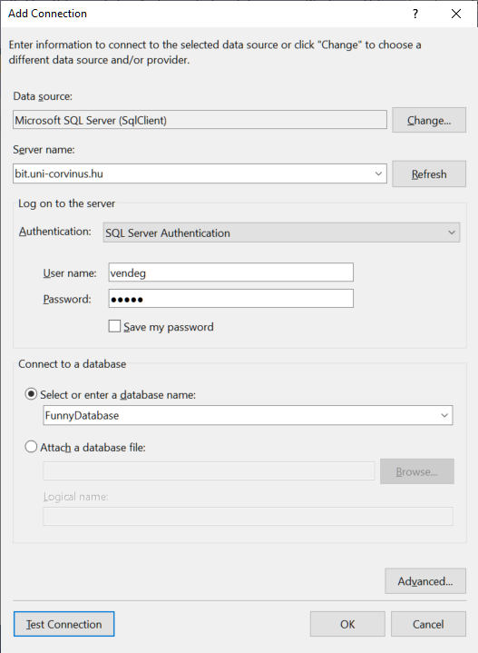
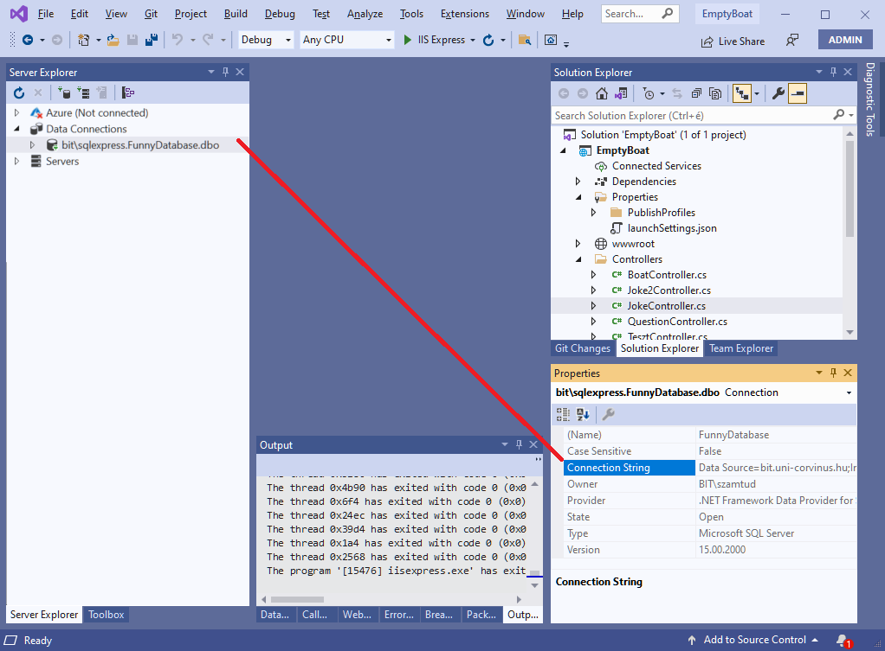
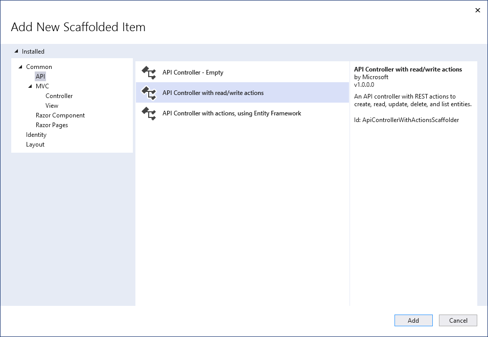

# CRUD Operations

The **CRUD(e)** acronym stands for the four basic database operations: **C**reate, **R**ead, **U**pdate, and **D**elete.

In this lab, we'll go through a simple example where data entered into a form on a web page can be written to a database. You’ll be able to insert jokes into a database table and list them via a web interface.

> [!TIP]
>  Continue from the previous application!

We’ll look at a simple example of a three-layer application:

- accessing an SQL data table,
- through API endpoints provided by ASP .NET Core as a middle layer,
- from JavaScript code running in a browser.

## New HTML Page

❶ Create a new HTML page, for example named `jokes.html`, in your existing project. In this lab, we won’t use a separate `.js` file; instead, place the `<script>` tag directly in the HTML. The page should include a `<div>` for the jokes and an `<input>` with a `<button>` to add new jokes:

```html
htmlCopyEdit<!DOCTYPE html>
<html>
<head>
    <meta charset="utf-8" />
    <title></title>
</head>
<body>
    <div>
        <div id="jokeList"></div>
        <div>
            <input id="jokeText" type="text" placeholder="PC jokes only" />
        </div>
        <button id="addButton">Add New Joke</button>
    </div>
    <script>
    </script>
</body>
</html>
```

This completes the HTML skeleton.

## Mapping the Database Schema

❷ Explore the database!

We are using a centralized database for fun and because many of you no longer have Azure credits. It’s recommended to explore the database using *SQL Server Management Studio*.

> [!WARNING]
>  The SQL database is only accessible via VPN. Therefore, if you deploy the project to Azure, the server-side code running there won’t be able to see it. **This setup is only for testing.**

|          |                     |
| -------- | ------------------- |
| Server   | bit.uni-corvinus.hu |
| Username | vendeg              |
| Password | 12345               |
| Database | FunnyDatabase       |




You can get the *connection string* from the *Properties* panel; just insert the password manually.



```
pgsql
Data Source=bit.uni-corvinus.hu;Initial Catalog=FunnyDatabase;User ID=vendeg;Password=***********
```

> [!TIP]
>
> You can skip using Server Explorer; it's not needed for the application to work, but it's useful for retrieving the connection string.

❸ Map the schema into C# classes

As discussed in an earlier lab (*Connecting to an SQL database*), .NET Core doesn’t provide a graphical tool or wizard for generating C# classes from the database schema. You have to do this via the *Package Manager Console* (Tools / NuGet Package Manager / Package Manager Console).

```
Microsoft.EntityFrameworkCore.SqlServer
Install-Package Microsoft.EntityFrameworkCore.Tools
```

In general:

```
Scaffold-DbContext "[Connection String]" Microsoft.EntityFrameworkCore.SqlServer -OutputDir [Folder]
```

In our case:

```powershell
Scaffold-DbContext "Data Source=bit.uni-corvinus.hu;Initial Catalog=FunnyDatabase;User ID=vendeg;Password=12345;Encrypt=False" Microsoft.EntityFrameworkCore.SqlServer -OutputDir JokeModels
```

As a result, a `JokeModels` folder will be created in *Solution Explorer*, containing a `Joke` class describing a joke and a `FunnyDatabaseContext` class for database access.

## Creating the API Controller

❹ Create an API Controller named `JokeController`. This time, take advantage of Visual Studio's built-in template for CRUD operations! Right-click the `Controllers` folder:



It's worth reviewing the generated code. There’s a method for each CRUD operation:

```c#
using Microsoft.AspNetCore.Mvc;
using System.Collections.Generic;

namespace EmptyBoat.Controllers
{
    [Route("api/[controller]")]
    [ApiController]
    public class JokeController : ControllerBase
    {
        [HttpGet]
        public IEnumerable<string> Get()
        {
            return new string[] { "value1", "value2" };
        }

        [HttpGet("{id}")]
        public string Get(int id)
        {
            return "value";
        }

        [HttpPost]
        public void Post([FromBody] string value) { }

        [HttpPut("{id}")]
        public void Put(int id, [FromBody] string value) { }

        [HttpDelete("{id}")]
        public void Delete(int id) { }
    }
}
```

❺ To make the sample code functional, replace the `[controller]` placeholder in the route with the actual route:

```c#
namespace EmptyBoat.Controllers
{
    [Route("api/jokes")]
    [ApiController]
    public class JokeController : ControllerBase
    {
    ...
```

❻ Then begin implementing the API endpoints in `program.cs`:

```c#
var builder = WebApplication.CreateBuilder(args);
builder.Services.AddControllers();
builder.Services.AddEndpointsApiExplorer();
builder.Services.AddSwaggerGen();

var app = builder.Build();

if (app.Environment.IsDevelopment())
{
    app.UseSwagger();
    app.UseSwaggerUI();
}

app.UseHttpsRedirection();
app.UseDefaultFiles();
app.MapControllers();
app.UseStaticFiles();

app.Run();
```

### Querying All Jokes

Instantiate `FunnyDatabaseContext` as usual.

Before:

```c#
[HttpGet]
public IEnumerable<string> Get()
{
    return new string[] { "value1", "value2" };
}
```

After:

```c#
[HttpGet]
public IActionResult Get()
{
    FunnyDatabaseContext context = new FunnyDatabaseContext();
    return Ok(context.Jokes.ToList());
}
```

You can test the `GET` endpoint using a browser, Swagger, or PostMan.

(+/-) The endpoint for retrieving all jokes works.

### Querying a Specific Joke

- Be sure to clearly comment the endpoint (e.g., `// GET api/jokes/5`)
- The return type is `Joke`—ASP.NET Core will handle the JSON conversion.
- The method name (e.g., `Get`) doesn’t matter.
- Query the database using standard LINQ.

Before:

```c#
[HttpGet("{id}")]
public string Get(int id)
{
    return "value";
}
```

After:

```c#
[HttpGet("{id}")]
public IActionResult Get(int id)
{
    FunnyDatabaseContext context = new FunnyDatabaseContext();
    var result = (from x in context.Jokes where x.JokeSk == id select x).FirstOrDefault();
    return Ok(result);
}
```

Or more elegantly:

```c#
[HttpGet("{id}")]
public IActionResult Get(int id)
{
    FunnyDatabaseContext context = new FunnyDatabaseContext();
    var result = context.Jokes.FirstOrDefault(x => x.JokeSk == id);
    if (result == null)
    {
        return NotFound($"No joke found with ID #{id}");
    }
    return Ok(result);
}
```

(+/-) The endpoint for retrieving a specific joke works.

### Adding a New Joke

Here, JavaScript sends a JSON object to the C# backend. To process it, there must be a matching C# class—in this case, we’ll use the `Joke` class generated earlier.

```c#
[HttpPost]
public void Post([FromBody] Joke newJoke)
{
    FunnyDatabaseContext context = new FunnyDatabaseContext();
    context.Jokes.Add(newJoke);
    context.SaveChanges();
}
```

(+/-) The `POST` API endpoint is ready!

You can test `POST` from Swagger, PostMan, or JavaScript—**not** from the browser address bar.

**Swagger:**

Make sure to remove the `jokeSk` field from the request—it’s auto-incremented. Only `jokeText` is required.

**PostMan:**

- Set the method to `POST`
- Use the appropriate endpoint URL
- Set header `Content-Type` to `application/json`
- Provide a JSON string in the body, using lowercase property names if coming from JavaScript (conversion is handled automatically)

(+/-) `POST` API endpoint is tested!

### Deleting a Joke

```c#
[HttpDelete("{id}")]
public void Delete(int id)
{
    FunnyDatabaseContext context = new FunnyDatabaseContext();
    var jokeToDelete = context.Jokes.FirstOrDefault(x => x.JokeSk == id);
    context.Remove(jokeToDelete);
    context.SaveChanges();
}
```

The `DELETE` method can also only be tested via Swagger, PostMan, or JavaScript. Try this once you’ve added some of your own jokes to the database.

## Adding a Joke via Browser

You can specify the HTTP method with `fetch`. To let the server know the request body contains JSON, set the `Content-Type` header.

```js
document.getElementById("addButton").addEventListener("click", () => {
    let data = {
        jokeText: document.getElementById("jokeText").value
    }

    fetch("api/jokes", {
        method: 'POST',
        headers: {
            'Content-Type': 'application/json'
        },
        body: JSON.stringify(data)
    }).then();
});
```

Check the result in the `.then()` block:

```js
fetch("api/jokes", {
    method: 'POST',
    headers: {
        'Content-Type': 'application/json'
    },
    body: JSON.stringify(data)
}).then(x => {
    if (x.ok) {
        alert("Success");
    } else {
        alert("Failure");
    }
});
```

