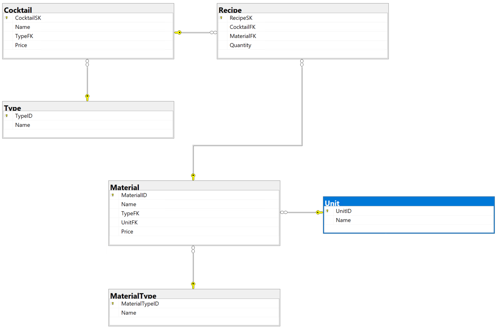
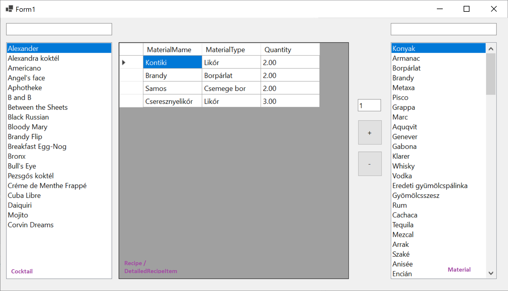

# ZH 2b — Cocktails

## Adatbázis

```powershell
Install-Package Microsoft.EntityFrameworkCore.SqlServer
Install-Package Microsoft.EntityFrameworkCore.Tools
```

```powershell
Scaffold-DbContext "Data Source=bit.uni-corvinus.hu;Initial Catalog=se_cocktails;User ID=hallgato;Password=Password123;Encrypt=False;Trust Server Certificate=True" Microsoft.EntityFrameworkCore.SqlServer -OutputDir Models
```



## Szükséges táblák

#### `Cocktail`  &rarr; `Recipe` &larr; `Material` (a recipe táblában vannak az alapanyagok a koktélhoz)



## Lépések

① Hozd létre a projektet, és a fenti adatok alapján készítsd el az adatkötött osztályokat!

② Készítsd el az ábrán látható felhasználói felületet!

③ A bal `ListBox`-ban jelenítsd meg szűrhető módon a `Cocktail` tábla elemeit, a listában az `Name` mező értéke jelenjen meg!

④ A jobb`ListBox`-ban jelenítsd a `Material` tábla elemeit! Itt már nincs szükség szűrésre, de lehet. 

⑤ Hozd létre az alábbi osztályt, mely a rács adatforrásául szolgál:

``` csharp
public class DetailedRecipeItem
{
    public int RecipeSk { get; set; }
    public string MaterialName { get; set; }
    public string MaterialType { get; set; }
    public decimal Quantity { get; set; }
    public string UnitName { get; set; }
}
```

⑥ A rács "fülén" keresztül vedd fel adatkötött adatforrásként az előbb létrehezott `DetailedRecipeItem` osztályt, majd állítsd be a rács adatforrásaként!

⑦ A bal listára kattintva jelenjenek meg a kiválasztott koktélhoz a hozzá tartozó `Recipe`-k `DetailedRecipeItem`. Az adatkötés a `BindingSource`-on keresztül történjen!

⑧ A `+` gombra kattintva lehessen új ` Models.Recipe` típusú elemet felvenni a `context.Recipes` gyűjteménybe! A mennyiséget a szövegdomozból olvasd! Az adatbázisban történő rögzítés után az elemek kerüljenek újraolvasásra a rácsba!

⑨ A `-` gombra kattintva lehessen elemet törölni!

Ⓐ Helyezz el gombot az űrlapon, ami egy másik űrlapot nyit meg, amelyen adatköthető rácson keresztül lehet kezelni a koktélokat tartalmazó táblát! Legyen lehetőség mentésre is!

Ⓑ A koktél típust (idegen kulcs) legördülő dobozból lehessen kiválasztani!


