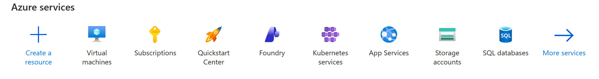
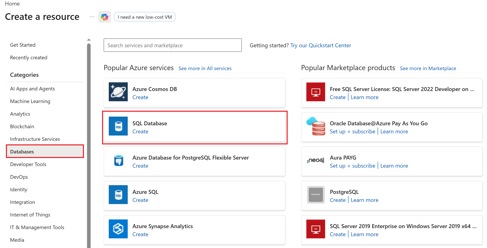
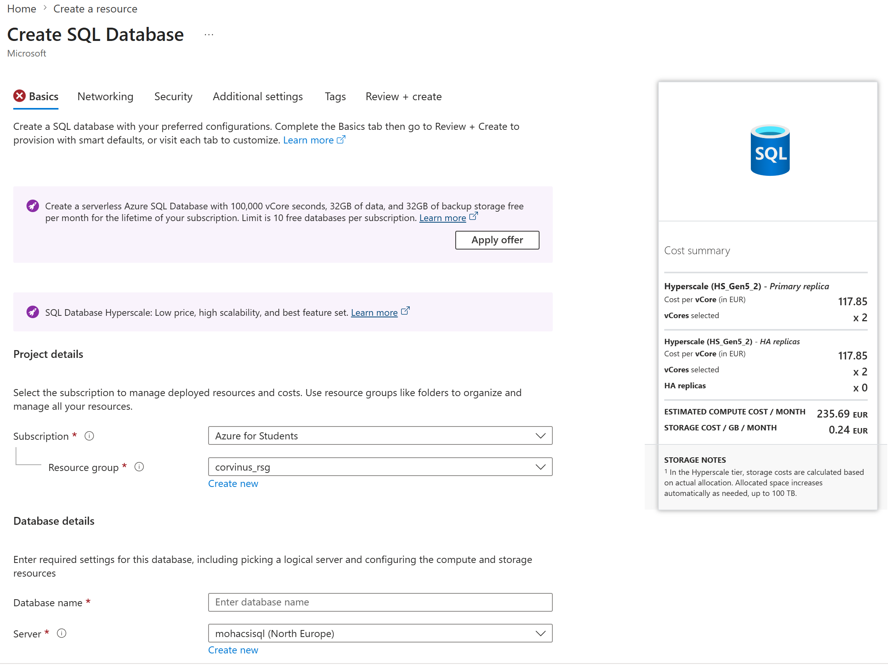
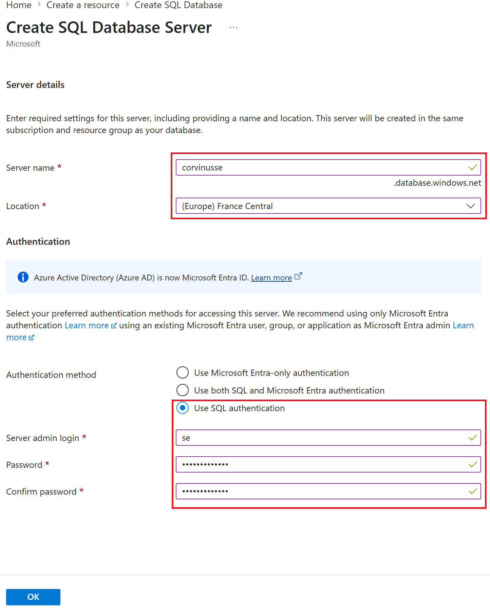
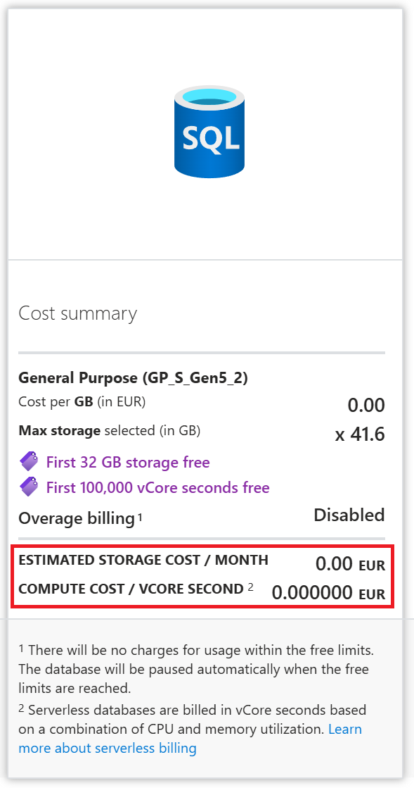
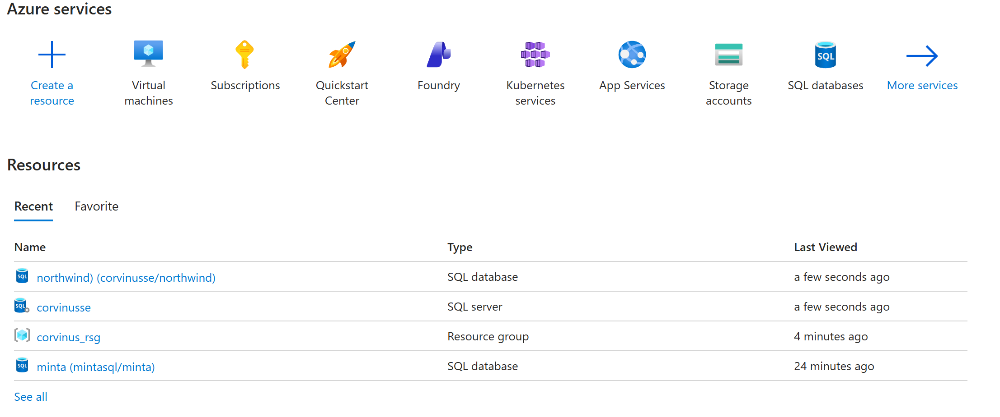
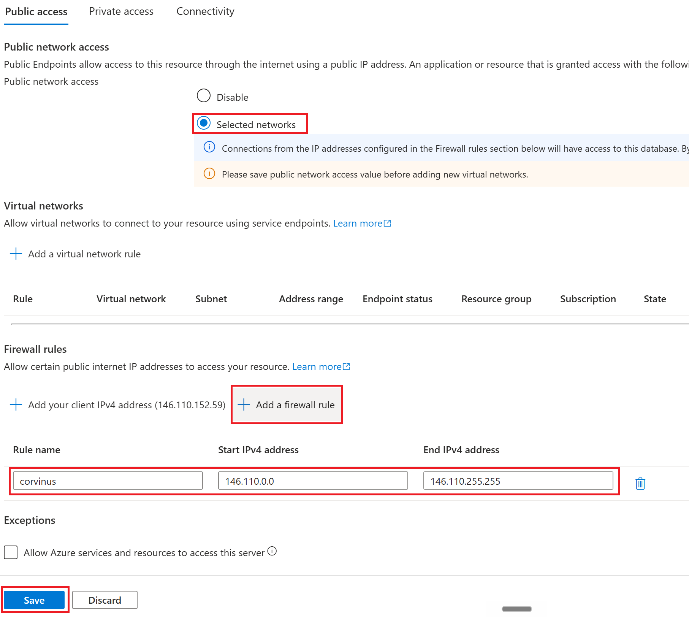

## Creating an Azure SQL Database

### Creating Resources

#### Step 1: Log in to the Azure Portal

Log in to the [Azure Portal](https://portal.azure.com/) using your university email address!

#### Step 2: Create a SQL Database

> The free subscription in principle allows the creation of up to 10 different databases. Multiple databases can be created on a single server, but in Azure you must start by creating the database, and if you don't have a server yet, you can create one during the process.

❶ Create a new SQL database resource!

#### Step 3: Enter Your Database Parameters

> [!IMPORTANT]
>
> It's essential to click the `Apply Offer` button! It resets the cost in the right panel to zero.Using the default settings, you create a dedicated database with a lot of CPU power aimed for Enterprise Use. It would drain all your credits in less than two weeks.

> [!WARNING]
>
> Once you have renewed your subscriptions, there is a chance for having two subscriptions in the drop down. Azure will not allow you to create new resources with the expired subscription so pick the other one.

❶ **Apply the offer.**

❷**Enter the name of your database!** In Azure you need to specify a database name first and if you don't have a server, you will need to create one in a later step. If you do have a server, you can create the database on an existing server. 

❸ **Create a new resource group** if you don't have any. The **Resource Group** simply helps organize your Azure servives and is not significant for our purposes (eg: `corvinus_rsg`).  Resource groups are very useful in practice if you want to allocate the costs generated in Azure to different cost centers within the company. 

❹ **Specify the database server.** (Multiple databases can exist on one server.) Since you most likely don't have a server yet, you need to create one by clicking the `Create new` link, as described below. You will later connect to this server to access your database:

- The server name must be unique and must comply with URL naming rules.
- The server administrator will be the user account through which you access your database server. It is also possible to create additional users with more limited permissions.
- The password you provide belongs to the database server administrator and is completely independent of your Azure account password. **Choose a password that you do not use anywhere else, as you will need to provide this password to your lab instructors during the assignment!**
- The nearest data center is West Europe, so it is advisable to select that location. The free subscription allows the creation of one server per location. The North Europe data center can also be used for personal experimentation.

> [!WARNING]
>
> Here is the translation:
>
> Microsoft has no direct revenue from databases created under Azure for Students Account, so it does not allow the creation of such resources in high-traffic data centers. Based on student feedback, France Central has been working recently. It also varies which regions allow database creation and from where. If our region is not permitted, we immediately receive an error message.
>
> However, it is also possible that the machine only indicates the failure during the database creation process. In that case, we have to start the whole thing over from the beginning. This can be quite frustrating. However, once it succeeds, no one can take it away from us anymore.

❺ Click `OK` and check once again whether the buffer is applied.And check the estimated cost. It must be zero.

❻ Click `Review + create`. 

If everything looks fine on the Summary screen just click `Create`. We will configure the network later, because there is a chance for a faild batabase creation attempt and we need to start all over. 

So once everything is configured, you can initiate the creation of the database and server. First click **Review + Create**, then click **Create**.

Creating the database and server takes some time, but the progress can be tracked in the notifications panel.

Once complete, the resources can be viewed by clicking on the dashboard.

#### Step 4: Configuration

**Changing the password**

By selecting your `server` on the dashboard, you can access various settings.  Changing the password does not require the old password, so if you have forgotten it, it can simply be overwritten. 

**Firewall Settings**

The created server is not accessible by default, as it uses a whitelist and does not allow any IP range.

> [!TIP]
>
> In Azure firewall settings can be managed by selecting the `SQL database` not the `SQL Server`.

In order for the database to be accessible remotely, you must modify the firewall settings via the `SQL database` resource. So open this resource!

Click `Set server firewall` 

Now you need to enable public access by clicking `Selected networks`.  

Click "Add firewall rule". The names assigned to rules in the list are for your own reference, so you can identify individual IP ranges in the future. It is advisable to restrict access to the university IP range (146.110.0.0 – 146.110.255.255), though in that case the server will only be accessible from campus or via VPN.

>  [!IMPORTANT]
>
> For the project exam it's extremely important to open the firewall and make your database accessible from the Corvinus IP address range. You can also click `Add your clien IPv4 address` to open the firewall towards your current IP, but Internet service providers are likely to change IP addresses on daily basis for consumer Internet subscriptions. Most service providers require an enterprise internet subscription and an extra fee for a fixed IP. But if you try to access your database through the faculty VPN, you can go with the IP range specified above. 

Trusted home IP addresses can be added as additional rules. How frequently your home IP address changes — even without restarting your router — varies depending on your internet service provider and service tier.

Don't forget to save any changes to the firewall settings!

## Connect to your server via SSMS.

Now you have everything in your hands:

- Server's domain name.

- Username

- Password

- Database name