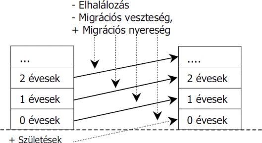

# **Microsimulation - Theoretical Background**

## **Introduction**

 The objective of this exercise is to implement a demographic microsimulation and acquire knowledge related to the methodology. Due to the scale of the simulation, testing the system's modules is crucial, as the full execution time may exceed one hour on an average personal computer. At the end of the exercise, the implemented project and the results of the complete simulation run must be submitted in a TXT file. The entire submission should be uploaded as a single ZIP archive to the Moodle system.

## **Demographic Forecasting**

For developed countries, population aging has been one of the most significant challenges in past decades and is expected to remain so in the future. Due to improving mortality rates and declining birth rates, the age composition of the population is changing. The population is continuously decreasing, and the number of retirees is increasing, leading to a decline in the proportion of active workers. As a result, production decreases, and the financial burden imposed by the pension system on society grows. Due to economic and sociological changes, governments face new challenges that arise from extremely slow-moving processes. The effects of responses to these challenges can only be estimated through long-term forecasts. There are three main methodologies for demographic forecasting.

**Cohort-Component Method**

The cohort-component method is the most widely used approach for demographic forecasting. It is primarily applied to project births, deaths, and migration trends. This method serves as the foundation for nearly all population forecasts in countries where the necessary data is available.

The method categorizes individuals within a population into groups (cohorts) based on selected attributes. These attributes are typically age and gender, but other factors such as educational attainment, marital status, or ethnicity are also commonly used (e.g., married women aged 23). Each cohort is characterized by the number of individuals within it, and since the groups are mutually exclusive, the sum of cohort sizes equals the total population size. The method iterates annually, advancing these groups through the forecast.

**Figure 1 - Schematic representation of the cohort-component model**

During each iteration, the number of individuals in a cohort is redistributed into the next age group, but first, the size is reduced based on the mortality rates specific to that cohort. In practice, this is done by multiplying the cohort sizes by a survival matrix (1 - mortality rate). For short-term forecasts (5-10 years), simple projection of population data suffices, with mortality rates derived from the death counts of the given year. Surviving individuals are then reassigned to new age cohorts based on a transition probability matrix. Most individuals remain in their original cohort, but some may change attributes (e.g., marriage, graduation). By correcting transition probabilities with mortality rates, a single matrix multiplication is sufficient to determine the new cohort sizes.

At the beginning of each iteration, the cohort of 0-year-olds is empty since all cohorts age by one year. Fertility probabilities are determined similarly to mortality rates. In most applications of the cohort-component method, the male population size is disregarded, meaning that the number of newborns depends solely on female statistics. The number of births per female cohort is calculated by multiplying the cohort size by its fertility rate. The 0-year-old cohort size is then the sum of births across all relevant female cohorts. Most attributes of newborns (e.g., age, education level, marital status) are predefined, leading to many empty 0-year-old cohorts—for instance, there are very few newborns with university degrees. Only the gender ratio of newborns needs to be determined, which remains relatively constant (approximately 51.6% male), although environmental factors may influence it. Historical data shows an increase in male births after wartime, but the underlying cause remains unclear. However, incorporating such rare events into forecasts is nearly impossible, so demographic models typically assume a fixed gender ratio.

Modeling migration presents challenges from the outset, as comprehensive data on emigrating and immigrating populations is often unavailable. In the European Union, where member states allow free movement, tracking population movements is nearly impossible. However, net migration (the difference between immigration and emigration) can be estimated from census data. By subtracting the number of births and adding the number of deaths to the difference between two consecutive years’ population counts, net migration can be inferred—assuming census data is accurate. A limitation of this approach is that censuses and micro-censuses typically occur at least five years apart, making migration estimates even less precise. If migration data is available, population movements can be integrated into the model.

Cohort-component forecasts are relatively easy to implement, as the necessary matrix operations can be performed in spreadsheet software. The main challenge lies in obtaining the required data. However, cohort-component models are difficult to expand. Introducing a new attribute increases the dimensions of the transition probability matrix, requiring recalculations for all elements. Additionally, as the number of attributes increases, cohort sizes decrease, making probability calculations less reliable due to small sample sizes. As a result, the cohort-component method is rarely used with more than four attributes—two of which are almost always age and gender.

**Multi-Agent Simulation**

Computer modeling is not yet widespread in sociology and economics, likely due to its complexity, lack of transparency, and perceived unreliability compared to analytical methods. However, when properly applied, these models can generate reliable forecasts and uncover relationships that analytical models cannot. While scientific simulations often rely on mathematical equations (e.g., fluid dynamics), social and economic processes have not yet been formally described mathematically, necessitating alternative approaches.

Agent-Based Modeling (ABM) simulates systems through interactions between autonomous objects known as agents. An agent can represent a country, company, group, or individual. Agent behavior and interactions are defined by decision rules, simple functions, or empirical data-based algorithms. Agent-based models can be classified based on their rule structures:

- **Physical models** assume agents react to past and present events.
- **Economic models** assume agents act based on future expectations and make selfish decisions.
- **Sociological models** assume agents act based on their own and their peers' expectations (and possibly past and present experiences).

Demographic forecasts focus on long-term decision-making rather than short-term utility maximization. Therefore, a sociological model is most suitable for impact analysis. This approach enables the integration of interdependent factors that are impractical to incorporate into cohort-component models. For example, parental education level strongly influences children's future education.

In agent-based demographic models, agent properties evolve according to predefined rules during each iteration. Unlike cohort models, agents are characterized by an unlimited number of attributes. Expanding the model only requires implementing new rules and interactions without recalculating previous parameters, thus avoiding the fragmentation of transition probabilities that occurs in cohort-component models. Multi-agent simulations are well-suited for hypothesis testing and uncovering hidden relationships within a system. However, they are complex to implement, even with specialized software (e.g., Repast, NetLogo), often requiring advanced programming skills and significant computational resources.

**Microsimulation**

Demographic microsimulation represents an extreme case of agent-based modeling, where each agent corresponds to an individual. Instead of categorizing groups, microsimulation tracks the life course of each entity. Iterative steps occur at the entity level, and attributes evolve based on predefined rules, statistical probabilities, and empirical algorithms. Using a bottom-up approach, complex systems emerge from individual behaviors and interactions without top-down regulation, aiming to explain demographic phenomena through observed parallels with real-world societies.

Microsimulation is based on the Monte Carlo method, meaning accurate results require a sufficiently large sample size—often involving millions of entities, unlike the smaller groups in representative-agent models.

Unlike traditional forecasting methods focused on prediction, microsimulation is a projection tool that advances current states according to predefined rules. The fundamental difference is that projections are always "correct," assuming the underlying assumptions are valid and there are no implementation errors.