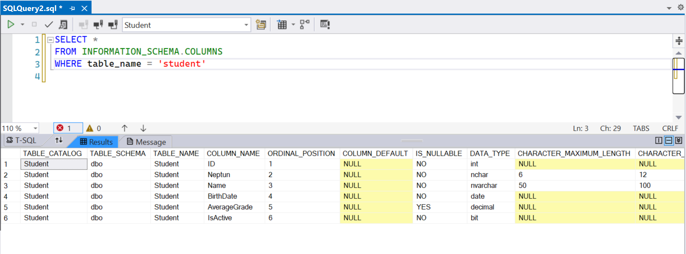
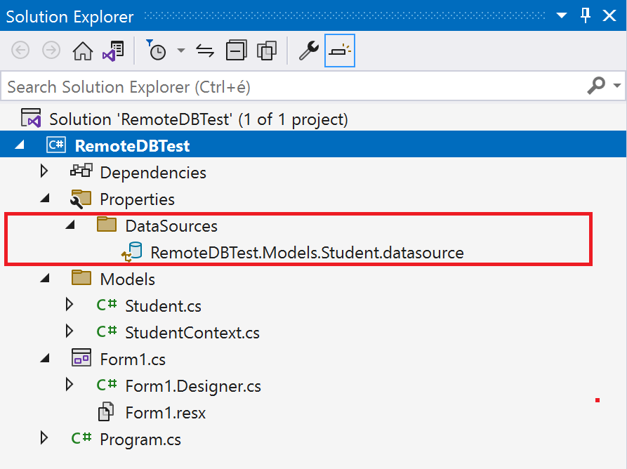

# Accessing a Remote Database from a C# Application

## Introduction

### Purpose of the Exercise

In this exercise, we will build an application that can:

- Connect to a database stored on a remote SQL server,
- Retrieve data from a table, and
- Display the data in a grid on a form.

Throughout the semester, data movement between the client and the SQL server will be carried out in this manner.

### Requirements

To complete this exercise, you need **Visual Studio 2022** and the **.NET 6 SDK** or newer.

### SQL Database Information

|          |                     |
| -------- | ------------------- |
| Server   | bit.uni-corvinus.hu |
| Username | hallgato            |
| Password | Password123         |
| Database | Student             |

> [!WARNING]
>
> The bit.uni-corvinus.hu SQL server is only accessible via VPN!

## 1. Creating a Windows Forms App in .NET 6

(+/-) Create a `Windows Forms App` project in Visual Studio. The **Solution** and **Project** names are optional; in this example, we use `RemoteDbTest`.


> [!WARNING]
>
> The `Windows Forms App (.NET Framework)` template uses the legacy .NET Framework (4.7 or 4.8), not .NET 6.0! Don't confuse them! In .NET 6, Windows Forms has been entirely rewritten, including the editor. A common mistake is accidentally creating a **Visual Basic** project instead of **C#**.

If done correctly, your screen should look like this:


## 2. Managing the Database in Server Explorer

### 2.1 Connecting to the Database in Server Explorer

> [!NOTE]
>
> **The *Server Explorer* is not related to the currently open project in any way.** Visual Studio is an **integrated development environment (IDE)** that includes built-in tools for basic database operations. This allows developers to interact with databases without leaving VS or installing additional software.

(+/-) In *Server Explorer*, add a new database connection using the credentials provided earlier.

- If *Server Explorer* is not visible, open it using **Ctrl+Alt+S** or via the **View** → **Server Explorer** menu.
- Click the **Connect To Database** icon to create a new connection.


Fileds to fill in:

- The **server name** is self-explanatory.

- **Windows Authentication** means the client will use the Windows login credentials to authenticate against the SQL Server, which is useful for Active Directory integration. However, this is not the case here.

- We use **SQL Server Authentication**, where authentication is done using a username/password stored on the SQL Server. The **Windows Authentication** method uses the same credentials for user authentication that the usrer used to log into Windows. 

- It's advisable to check the `Save password` box during development.

- The **database name** should be entered manually since it may not always be available in the dropdown. 

- If the `Test Connection` fails, check your VPN connection.


### 2.2 Extracting the Connection String

Since *Server Explorer* is not linked to the project in any way, we need the **connection string** to allow a C# program to connect to the remote database.

A connection string contains `;` separated key-value pairs required for authentication and database access. We will use this **connection string** in the next step to generate the necessary C# classes for database access.

To find the **connection string**, click on the database in *Server Explorer*, and check the *Properties* window:

```
Data Source=bit.uni-corvinus.hu;Initial Catalog=Student;Persist Security Info=True;User ID=hallgato;Password=***********
```

(+/-)  **Remember where to find the connection string!** You'll need it later. Or copy it to Notepad...


## 3. "Reverse Engineering" the Database

In Microsoft's terminology, **Reverse Engineering** refers to generating C# classes from an existing database schema. This allows us to model the database tables and relationships in C# code.

There are two main approaches:

- **Database First**: Generate C# classes from an existing SQL database schema.
- **Code First**: Write C# classes first, then generate the corresponding SQL schema.

This course follows the **Database First** approach.


### 3.1 Adding NuGet Packages to the Project

(+/-) Open the NuGet Package Manager and install the following packages:


 

Alternatively, use these PowerShell commands:
``` powershell
Install-Package Microsoft.EntityFrameworkCore.SqlServer
Install-Package Microsoft.EntityFrameworkCore.Tools
```

### 3.2 Generating C# Classes

Unfortunately, .NET Core does not yet provide a built-in GUI tool for generating C# classes from a database schema. Instead, we use the **Package Manager Console**.

To generate the classes, use:

``` powershell
Scaffold-DbContext "[Connection String]" Microsoft.EntityFrameworkCore.SqlServer -OutputDir [folder]
```

For our example:

```powershell
Scaffold-DbContext "Data Source=bit.uni-corvinus.hu;Initial Catalog=Student;Persist Security Info=True;User ID=hallgato;Password=Password123" Microsoft.EntityFrameworkCore.SqlServer -OutputDir Models
```

> [!WARNING]
>
> The password had to be entered again since for safety reasons it is replaced by `*` characters when copied to clipboard. 

``` powershell

```

> [!WARNING]
>
> If Scaffold-DbContext fails to build the new classes, you might see the error **"Build Failed."** If this happens, try using the `-Verbose` flag for more details. 

(+/-) **Run the `Scaffold-DbContext` command with your connection string.**

After running the command, a new `Models` folder appears in **Solution Explorer**, containing the generated files:


#### The `Student` Class

Check out `Student.cs`, which represents the `Student` table in the SQL database:

``` csharp
using System;
using System.Collections.Generic;

namespace RemoteDBTest.Models
{
    public partial class Student
    {
        public int Id { get; set; }
        public string Neptun { get; set; } = null!;
        public string Name { get; set; } = null!;
        public DateTime BirthDate { get; set; }
        public decimal? AverageGrade { get; set; }
        public bool IsActive { get; set; }
    }
}
```

#### The `StudentContext` Class

By default, the generated context class is named `[DatabaseName] + Context`.

You can compare the properties of the `Sudent` class with the database schema:




## 4. Creating a Forms-Based UI

### 4.1 Creating a DataGridView

(+/-) Add a `DataGridView` named `dataGridView1` to `Form1`.
 (+/-) Set its `Anchor` properties so that it resizes with the window.

### 4.2 Retrieving Data from SQL Server

(+/-) Declare a `StudentContext` instance at the class level.

- Remember: According to naming conventions, class names should start with an uppercase letter, while instance names should start with a lowercase letter.

- We perform instantiation at the class level because we want to access `context` from multiple methods within the class. 

- The name `context` appears in all Microsoft documentation and example programs, so we adhere to this convention—it could be anything.

``` csharp	
namespace RemoteDBTest
{
    public partial class Form1 : Form
    {
        // Through the "studentContext" object, the remote database elements can be accessed.
        Models.StudentContext studentContext =  new Models.StudentContext();
        public Form1()
        {
            InitializeComponent();
        }
    }
}
```

Then use 

``` csharp
namespace RemoteDBTest
{
    public partial class Form1 : Form
    {
        Models.StudentContext studentContext =  new Models.StudentContext();
        public Form1()
        {
            InitializeComponent();
            dataGridView1.DataSource = studentContext.Students.ToList();
        }
    }
}
```

**Why is the table named `Students` instead of `Student`?**

Entity Framework automatically pluralizes table names when generating context classes. You can disable this with the `-NoPluralize` flag in `Scaffold-DbContext`. The A `Scaffold-DbContext`  docs. can be checked [here](https://docs.microsoft.com/en-us/ef/core/cli/powershell#scaffold-dbcontext).

### 4.3 Using Data-Bound Controls

(+/-) In the `DataGridView` properties panel, click the dropdown, then select *Add Object Data Source*.
(+/-) Select the `Student` class as the data source.

Now:

- A `BindingSource` named `studentBindingSource` is created.
- The `studentBindingSource` is linked to the `Student` class.
- The `DataGridView` uses `studentBindingSource`, so it displays the `Student` class properties.


**What happened?**

- This sequence of steps created a `BindingSource` named `studentBindingSource`, which appears under the form in the designer because it has no visual representation.
- The `studentBindingSource` already has the `Student` class set as its data source in the designer.
- The `DataGridView` uses `studentBindingSource` as its data source. Since `studentBindingSource` "knows" that it will display a list of `Student` objects, the properties of the `Student` class appear in the grid.
- In the *Solution Explorer*, an item named `DataSources` was created, which contains the `Student` class registered as a data source. If something was added by mistake, it can be deleted from there.



(+/-) Bind data to `studentBindingSource` instead of `dataGridView1`:

Replace:

``` csharp
dataGridView1.DataSource = studentContext.Students.ToList();
```

With:

``` csharp
studentBindingSource.DataSource = studentContext.Students.ToList();
```

### 4.4 Saving Changes to the Database

(+/-) Add a **Save** button (`saveButton`).
(+/-) Handle its click event:

``` csharp
private void saveButton_Click(object sender, EventArgs e)
{
    studentContext.SaveChanges();
}
```

### 4.7 Exception Handling

Handle runtime exceptions:

``` csharp
private void saveButton_Click(object sender, EventArgs e)
{
    try
    {
        studentContext.SaveChanges();
    }
    catch (Exception ex)
    {
        MessageBox.Show(ex.InnerException.Message);
    }            
}
```

Now, if an invalid input (e.g., a 7-digit Neptun code) is entered, users will receive an error message when `studentContext.SaveChanges();` is invoked.


