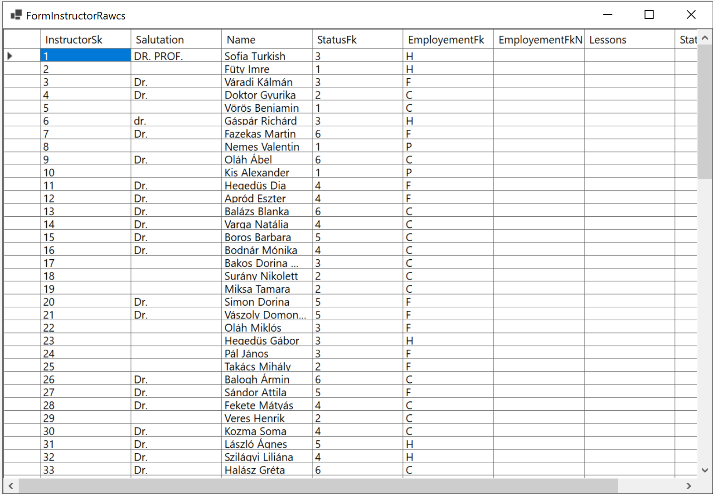
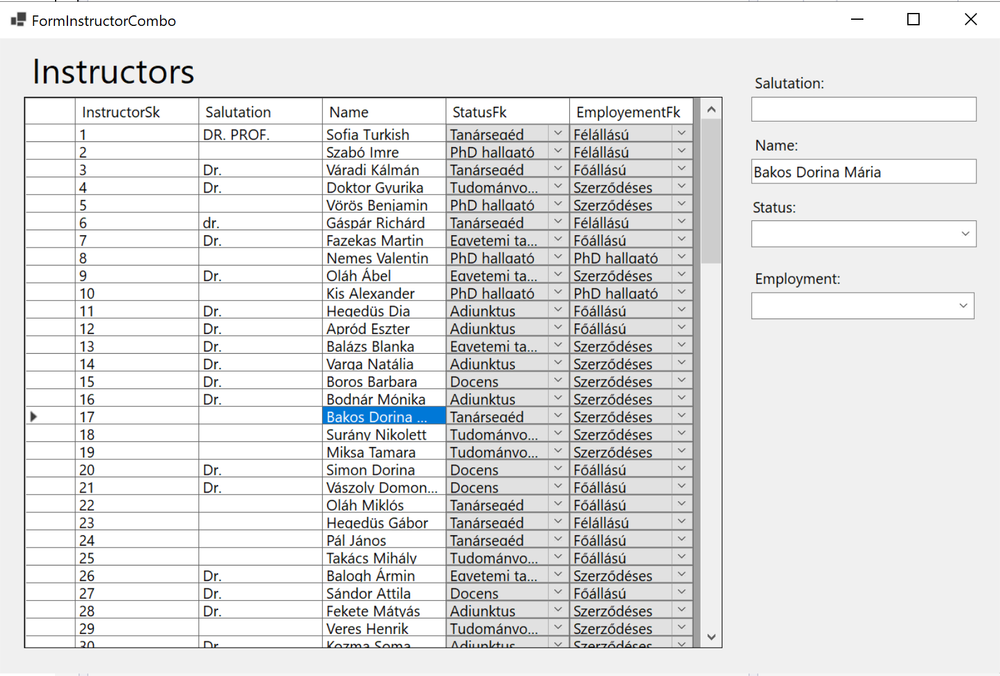
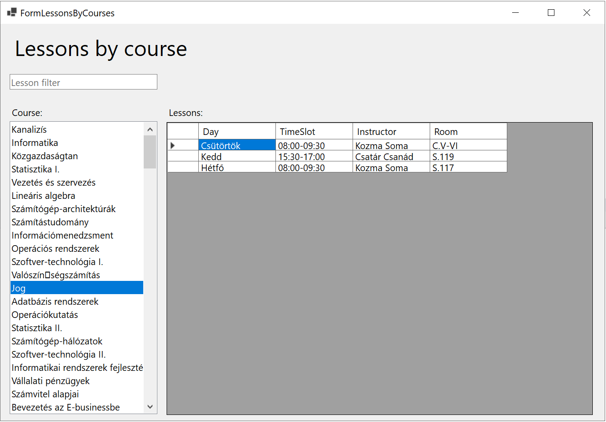

# Code Samples for Lab #8

### FormInstructorRawcs

This form simply displays the content of the instructor table without handling the foreign keys:



``` csharp
namespace Study_Example
{
    public partial class FormInstructorRawcs : Form
    {
        public FormInstructorRawcs()
        {
            InitializeComponent();
        }
        private void FormInstructorRawcs_Load(object sender, EventArgs e)
        {
            DbModels.StudiesContext context = new();
            dataGridView1.DataSource = context.Instructors.ToList();
        }
    }
}
```


### FormInstructorLINQ


``` csharp
private void FormInstructorLINQcs_Load(object sender, EventArgs e)
{
    DbModels.StudiesContext context = new();

    var instructors = from x in context.Instructors
                        select new
                        {
                            FullNameXXX = (x.Salutation + " " + x.Name.ToUpper()).Trim(),
                            EmploymentXXX = x.EmployementFkNavigation.Name,
                            StatusXXX = x.StatusFkNavigation.Name
                        };

    var instructorsOrdered = from x in instructors
                                orderby x.FullNameXXX
                                select x;

    dataGridView1.DataSource = instructorsOrdered.ToList();
}
```

### FormInstructorCombo

In this form `DataGridViewComboBox`es are used to retrieve values from the foreign keys. 



```c#
private void FormInstructorCombo_Load(object sender, EventArgs e)
{
    DbModels.StudiesContext context = new();

    instructorBindingSource.DataSource = context.Instructors.ToList();

    statusBindingSource.DataSource = context.Statuses.ToList();

    employementBindingSource.DataSource = context.Employements.ToList();
}
```

### FormLessonsByCourses




```c#
public partial class FormLessonsByCourses : Form
{
    DbModels.StudiesContext context = new();
    public FormLessonsByCourses()
    {
        InitializeComponent();
    }

    private void FormLessonsByCourses_Load(object sender, EventArgs e)
    {
        DbModels.StudiesContext context = new();

        //listBox1.DataSource = context.Courses.ToList();
        //
        //This is wrong
        //It overwrites the listBox1.DataSource


        courseBindingSource.DataSource = context.Courses.ToList();
    }

    private void courseBindingSource_CurrentItemChanged(object sender, EventArgs e)
    {
        if (courseBindingSource.Current == null) return;
        var c = (Course)courseBindingSource.Current as Course;

        var c2 = from y in context.Lessons
                    where y.CourseFk == c.CourseSk
                    select new LessonMyOwnClass
                    {
                        Day = y.DayFkNavigation.Name,
                        Instructor = y.InstructorFkNavigation.Name,
                        TimeSlot = y.TimeFkNavigation.Name,
                        Room = y.RoomFkNavigation.Name
                    };

        //dataGridView1.DataSource = c2.ToList();
        lessonXXXBindingSource.DataSource = c2.ToList();
    }

    private void textBox1_TextChanged(object sender, EventArgs e)
    {
        courseBindingSource.DataSource =
            (from y in context.Courses
            where y.Name.Contains(textBox1.Text)
            select y).ToList();
    }
}
```


```csharp
public class LessonMyOwnClass
{
    public string Day { get; set; }

    public string TimeSlot { get; set; }

    public string Instructor { get; set; }

    public string Room { get; set; }
}
```


