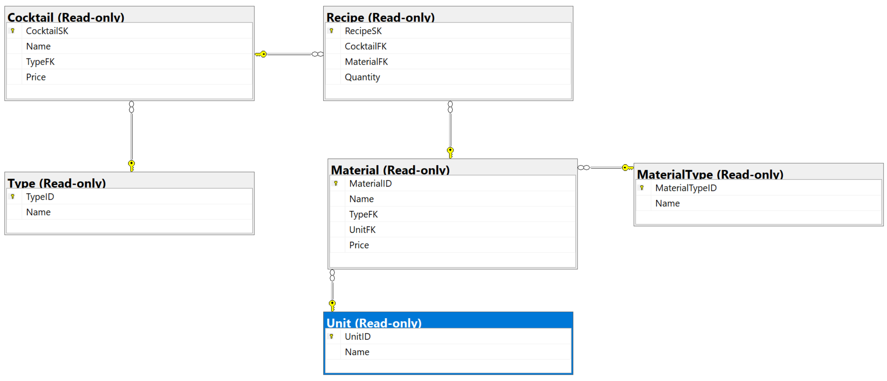

# Bikestore DB

``` powershell
Scaffold-DbContext "Data Source=bit.uni-corvinus.hu;Initial Catalog=se_bikestore;Persist Security Info=True;User ID=hallgato;Password=Password123;TrustServerCertificate=true" Microsoft.EntityFrameworkCore.SqlServer -OutputDir BikestoreModels
```


# Cocktails DB

``` powershell
Scaffold-DbContext "Data Source=bit.uni-corvinus.hu;Initial Catalog=se_cocktails;Persist Security Info=True;User ID=hallgato;Password=Password123;TrustServerCertificate=true" Microsoft.EntityFrameworkCore.SqlServer -OutputDir CocktailModels
```


