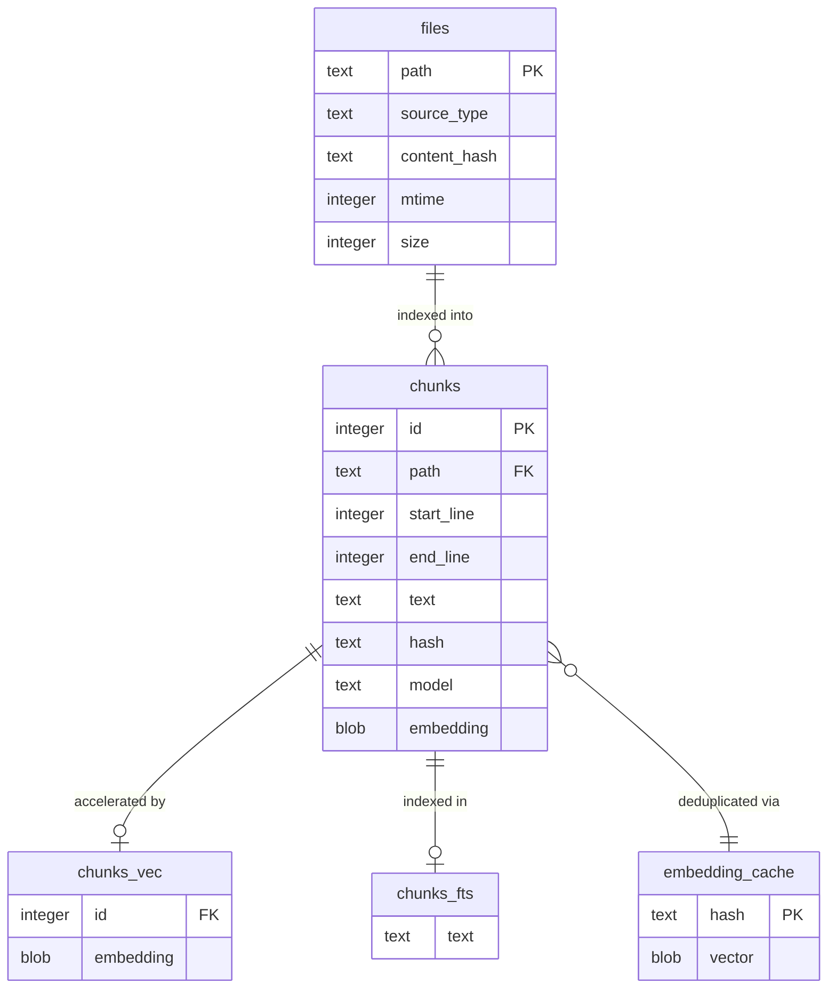

# Under the hood

## Important commands

``` powershell
openclaw.cmd gateway run
openclaw.cmd dashboard
```


## OpenClaw SQLite Database Schema

The diagram shows all five tables and their relationships:

- `files` is the root — every indexed file gets a row here, and all chunks reference back to it
- `chunks` is the central table, linked to the three supporting tables: `chunks_fts` (keyword search), `chunks_vec` (vector search), and `embedding_cache` (deduplication)
- The two virtual tables (`chunks_fts` and `chunks_vec`) mirror `chunks` rows but store different internal representations — FTS5's inverted index and sqlite-vec's binary float arrays respectively




### Core Tables

**`files`** Tracks file paths, source type, content hash, and update timestamps for delta-based indexing. This is what lets OpenClaw skip re-indexing files that haven't changed. [Medium](https://medium.com/@shivam.agarwal.in/agentic-ai-openclaw-moltbot-clawdbots-memory-architecture-explained-61c3b9697488)

**`chunks`** Stores each text segment with columns for `id`, `path`, `start_line`, `end_line`, `text`, and `hash`. It also includes the embedding model information. This is the core source of truth for all indexed content. [Substack](https://gaodalie.substack.com/p/i-studied-openclaw-memory-system)[Medium](https://medium.com/@shivam.agarwal.in/agentic-ai-openclaw-moltbot-clawdbots-memory-architecture-explained-61c3b9697488)

**`embedding_cache`** Cross-file deduplication using SHA-256 hashes to prevent re-embedding identical content. This is a significant optimization — if the same text appears in multiple files, it only gets embedded once. [Medium](https://medium.com/@shivam.agarwal.in/agentic-ai-openclaw-moltbot-clawdbots-memory-architecture-explained-61c3b9697488)

### Virtual Tables (optional, but important)

**`chunks_fts`** An FTS5 virtual table enabling fast lexical (keyword) search. Used for BM25 ranking of exact token matches — great for error codes, function names, and identifiers. [Substack](https://gaodalie.substack.com/p/i-studied-openclaw-memory-system)

**`chunks_vec`** (also called `vec_chunks`) A sqlite-vec virtual table that stores binary float vector embeddings per chunk, used for vector similarity search. If the extension fails to load (e.g. due to a SQLite ABI version mismatch), chunks are written without vector embeddings and this table won't be updated. [Substack](https://gaodalie.substack.com/p/i-studied-openclaw-memory-system)[GitHub](https://github.com/openclaw/openclaw/issues/65156)

## How it's used

The system chunks Markdown files into ~400 token segments with 80-token overlap, generates vector embeddings for each chunk, and retrieves the most similar chunks to inject into the current context window. [A-bots](https://a-bots.com/blog/openclaw)

Vector search uses cosine similarity (default 70% weight) via the sqlite-vec extension, while BM25 keyword search (default 30% weight) uses the FTS5 virtual table. OpenClaw uses union, not intersection — results from either search contribute to the final ranking. 