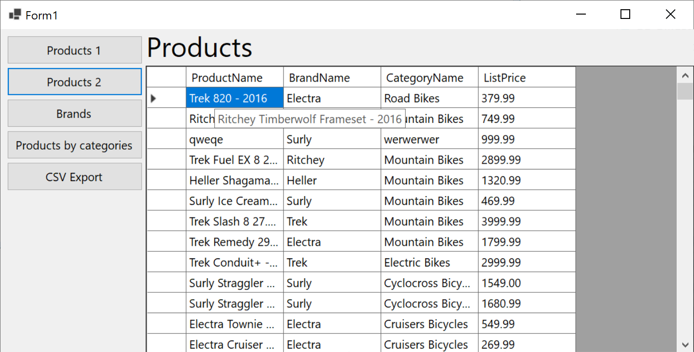

## Bikestore minta ZH

A `Microsoft.EntityFrameworkCore.Tools` és a `Microsoft.EntityFrameworkCore.SqlServer` a NuGet konzolán keresztül ezzel a két paranccsal is hozzáadható a projekthez:

```powershell
Install-Package Microsoft.EntityFrameworkCore.SqlServer -Version 7.0.20
Install-Package Microsoft.EntityFrameworkCore.Tools -Version 7.0.20
```


A Scaffold parancsot a ZH-n is készen kapjátok:

```powershell
Scaffold-DbContext "Data Source=bit.uni-corvinus.hu;Initial Catalog=se_bikestore;Persist Security Info=True;User ID=hallgato;Password=Password123;TrustServerCertificate=true" Microsoft.EntityFrameworkCore.SqlServer -OutputDir BikestoreModels
```

 

❶ **Create a User Control that displays the contents of the ```Product``` table with dorpdowns**

​	Ⓐ Load data to grid

​	Ⓑ Apply DataGridViewComboBox culumns on foreign keys 

​	Ⓒ Make filtering possible via. a TextBox


❷ **Create a User Control that displays the contents of the Product table** 

​	Ⓐ Load data to grid using NavigationPorperties to display data from related tables

❸ **Create a UserControl to append the Brand table**

​	Ⓐ Fill grid with the content of the Brand table

​	Ⓑ Create a new record on button click

​	Ⓒ Call SaveChanges 

​	Ⓓ Refresh gid content as in step Ⓐ

❹ **Display the Products by Categories**

​	Ⓐ Fill List with the content of the Caregory table

​	Ⓑ Display the products of the selected category as shown on the screenshot

❺ **Save the content of a table of your choice to a CSV file.** 

​	Ⓐ File location can be picked from an SaveFileDialog

​	Ⓑ Save data to file

## Megoldások 

(!Vid) 1. videó

> [!Video https://storage.altinum.hu/bike/bike_1.m4v]

(!Vid) 2. videó

> [!Video https://storage.altinum.hu/bike/bike_2.m4v]

(!Vid) 3. videó

> [!Video https://storage.altinum.hu/bike/bike_3.m4v]

(!Vid) 4. videó

> [!Video https://storage.altinum.hu/bike/bike_4.m4v]

(!Vid) 5. videó

> [!Video https://storage.altinum.hu/bike/bike_5.m4v]

(!Vid) 6. videó

> [!Video https://storage.altinum.hu/bike/bike_6.m4v]

(!Vid) 7. videó

> [!Video https://storage.altinum.hu/bike/bike_7.m4v]

(!Vid) 7. videó

> [!Video https://storage.altinum.hu/bike/bike_8.m4v]

(!Vid) 7. videó

> [!Video https://storage.altinum.hu/bike/bike_9.m4v]