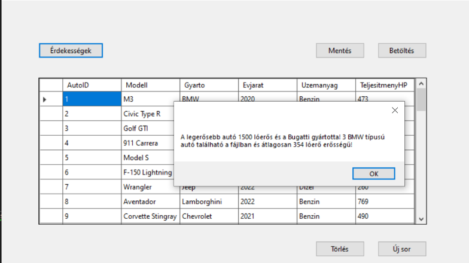
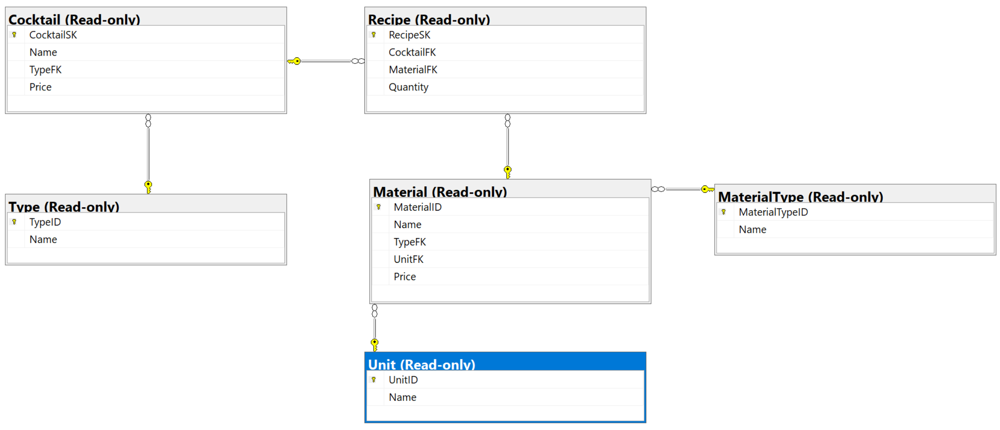

# 2. ZH - alfa

> [!NOTE]
>
> A **Solution neve kezdődjön a ZH2A_ karaktersorozattal**, majd folytatódjon a NEPTUN kóddal. A teljes projekt könyvtárat Moodle-rendszeren keresztül kell beadni ZIP állományban. Javasoljuk, hogy a projektet a C:/Temp könyvtárba hozd létre és ne az S: meghajtóra. A leadás egyben a jelenléti ív. Pontot csak olyan kódrészletre lehet kapni, ami megfelelően lefordul és a program futtatása során ellátja a szerepét. **A munkaidő 90 perc**.

## 🅐 UI keret létrehozása 

❶ Hozz létre egy "Windows Forms App" alapú alkalmazást. Az induláskor megjelenő űrlap bal oldalán helyezz el négy gombot, és egy panelt! 

❷ A Panel kerete legyen vékony vonal. 

❸ A Panel az űrlap átméretezésekor kövesse az űrlap méretét! 

❹ Adj négy `UserControl`-t is a projekthez, elnevezésük tetszőleges! A következő feladatblokkokat ezekre a vezérlőkre kell majd megvalósítani. 

❺ A gombok megnyomására töröld a panel tartalmát, és helyezd el a gombhoz tartozó `UserControl`-t úgy, hogy kitöltse a panel teljes területét átméretezéskor is. 

## 🅑 UserControl1 : CSV állomány beolvasása

A [autok.txt](autok.txt) fájlban található adatokat kell egy `DataGridView`-ben megjeleníteni. 

A fájl felépítése:

|                   |                                        |      |
| ----------------- | -------------------------------------- | ---- |
| `AutoID`          | az autó azonosítója                    |      |
| `Modell`          | az autó modellje, pl: X7               |      |
| `Gyarto `         | az autót gyártó cég, pl: BMW           |      |
| `Evjarat `        | az autó gyártási éve                   |      |
| `Uzemanyag  `     | milyen típusú üzemanyag való az autóba |      |
| `TeljesitmenyHP ` | az autó teljesítménye lóerőben         |      |

❶ A csv állományt tedd be a projektbe, és másoltasd a futtatható állomány mellé **-=VAGY=-** a fálj legyen `OpenFileDialog` segítségével kitallózható!

❷ Adj a projekthez egy osztályt, amely leképezi az állomány egy sorát!

❸ A program legyen képes megnyitni az állományt, és a  ❸ sorait felolvasni egy `BindingList` típusú, `UserControl1` osztály szintjén létrehozott listába, majd ❹ ezeket megjeleníteni `BindingSource`-on keresztül egy `DataGridView`-ban. 

❺ A lehetséges hibákat kezeld! 


## 🅒 UserControl1 : új rekord rögzítése

❶ Felugró ablakon keresztül legyen lehetőség új sor rögzítésére!


## 🅓 UserControl1 : LINQ lekérdezések

Hozz létre egy 'Érekességek' gombot, amelyre felugrik egy MessageBox, ami a következő kérdésekre ad nekünk választ:

- A felsorolt autók közül ❶ **melyik gyártónak van a legerősebb autója** lóerők szempontjából, és ❷ **hány lóerős** az adott autó?

- A listában több BMW típusú jármű is található.  ❸ **Hány darab** van és ❹**átlagosan milyen erősek** (lóerő) a listában szereplő BMW autók?



## 🅔 ORM osztályok készítése

❶ Telepítsd a NuGet csomagokat a projektbe: 

```powershell
Install-Package Microsoft.EntityFrameworkCore.SqlServer -Version 7.0.20
Install-Package Microsoft.EntityFrameworkCore.Tools -Version 7.0.20
```

❷ Készítsd el a Scaffold parancs segítségével az adatbázist leképező osztályokat:

```powershell
Scaffold-DbContext "Data Source=bit.uni-corvinus.hu;Initial Catalog=se_cocktails;Persist Security Info=True;User ID=hallgato;Password=Password123;TrustServerCertificate=true" Microsoft.EntityFrameworkCore.SqlServer -OutputDir CocktailModels
```

Segíségül az adatbázis sémája:



## 🅕 UserControl2 : `Material` tábla tartalmának megjelenítése

❶ Jelenítsd meg a tábla tartalmát DataGridView-ban úgy, hogy az idegen kulcsok helyén (`TypeFK` és `UnitFK`) a vonatkozó típus illetve mennyiségi egység neve jelenjen meg. 

## 🅖 UserControl3: Koktélok típusonként

Helyezz el a UserControl-on egy `ListBox`-ot és egy `DataGridView`-t!

❶ A ListBox-ban jelenjenek meg a `Type` táblából a `Name` mező értékei!

❷ A ListBox felett legyen egy TextBox, amellyel szűrni lehet a ListBox tartalmát. (Ezt a feladatrészt LINQ segítségével old meg!) 

❸ A rácsban jelenjenek meg a ListBox-ban kiválasztott típushoz tartozó koktélok!

## 🅔🅧🅣🅡🅐 UserControl4 : CSV Export 

❶ A `UserControl4`-on jelenítsd meg a `Type` tábla tartalmát.

❷ Gombnyomásra felugró `SaveFileDialog`-on keresztül mentsd a `Type` tábla tartalmát CSV állományba tetszőleges módszerrel!
