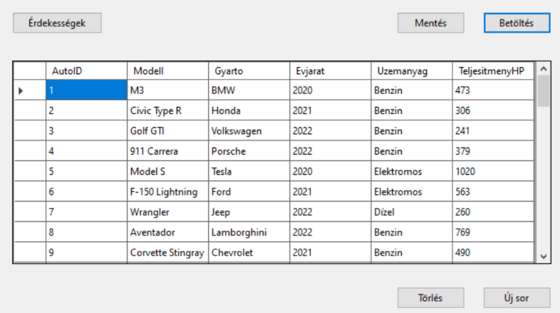
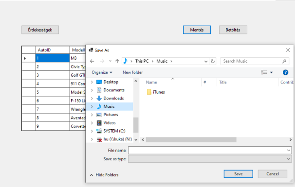
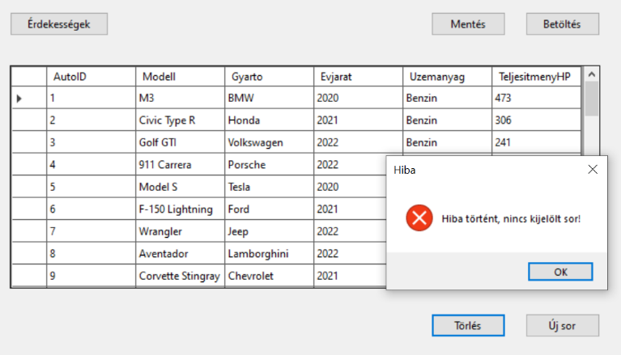
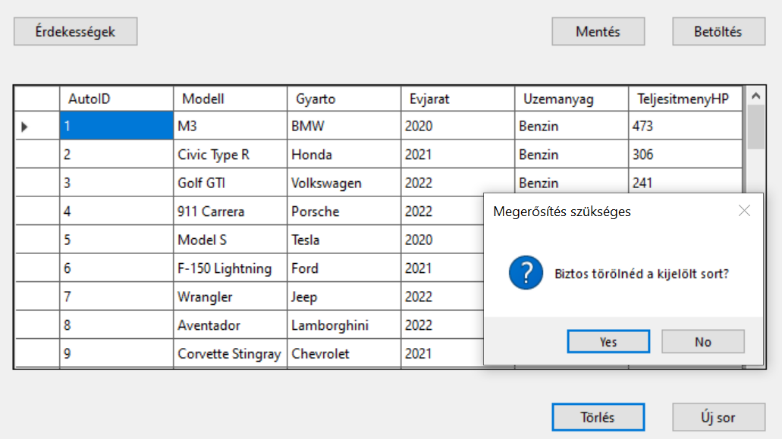
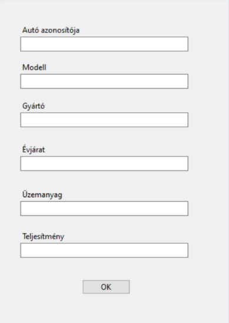
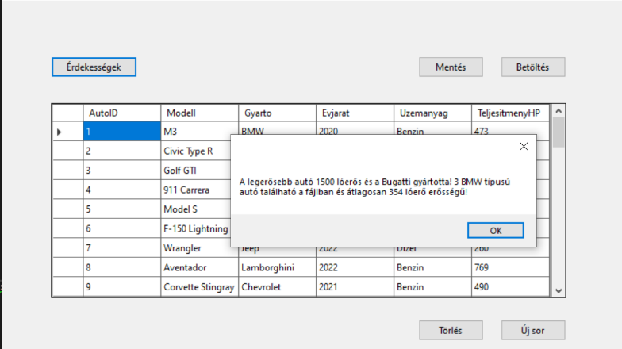

# 2. ZH - alfa

> [!NOTE]
>
> A **Solution neve kezdődjön a STA2 karaktersorozattal**, majd folytatódjon a NEPTUN kóddal. A teljes projekt könyvtárat Moodle-rendszeren keresztül kell beadni ZIP állományban. Javasoljuk, hogy a projektet lokális meghajtón hozd létre és ne az S: meghajtóra. A leadás egyben a jelenléti ív. Pontot csak olyan kódrészletre lehet kapni, ami megfelelően lefordul és a program futtatása során ellátja a szerepét. **A munkaidő 60 perc**.

## Feldolgozandó adatok

A [autok.txt](autok.txt) fájlban található adatok alapján kell egy alkalmazást felépíteni. 

A fájl felépítése:

|                   |                                        |      |
| ----------------- | -------------------------------------- | ---- |
| `autoID`          | az autó azonosítója                    |      |
| `Modell`          | az autó modellje, pl: X7               |      |
| `Gyarto `         | az autót gyártó cég, pl: BMW           |      |
| `Evjarat `        | az autó gyártási éve                   |      |
| `Uzemanyag  `     | milyen típusú üzemanyag való az autóba |      |
| `TeljesitmenyHP ` | az autó teljesítménye lóerőben         |      |

> [!NOTE]
>
> Az alkalmazás felépítésekor célszerű követni a feladat mellé rakott képernyőképeket, melyek segítségül és kiindulási alapként szolgálnak!

## Készíts alkalmazást alábbi instrukciók szerint

❶ Hozz létre projektet az alábbi névvel: `STA2[neptun kód]`

> [!IMPORTANT]
>
> Másképp elnevezett projekteket nem fogadunk el!

❷ A csv állományt tedd be a projektbe, és másoltasd a futtatható állomány mellé!

❸ Adj a projekthez egy osztályt, amely leképezi az állomány egy sorát!

❹ A program legyen képes megnyitni az állományt, és a sorait felolvasni egy `BindingList` típusú, `Form1` osztály szintjén létrehozott listába, majd ezeket megjeleníteni `BindingSource`-on keresztül egy `DataGridView`-ban. A lehetséges hibákat kezeld! A betöltés művelet történjen gombnyomásra! Használhatod a CSV Helper csomagot, de megoldhatod másképp is.

❺ Az alkalmzás legyen képes csv fájlba menteni a `Form1` osztályban lévő listát. A mentés helye SaveFileDialog-ban legyen kiválasztható!

❻ Mentés közben kezeld a hibákat (try-catch)! 

❼ Hozz létre egy gombot, melynek segítségével a rácsban az éppen kiválasztott sor törölhető. A törlés csak megerősítő kérdés után történjen meg.
Ellenőrizd, hogy van-e kiválasztott sor!

❽ Felugró ablakon keresztül legyen lehetőség új sor rögzítésére!

Hozz létre egy gombot, amelyre felugrik egy MessageBox, ami a következő kérdésekre ad nekünk választ:

🅐 A felsorolt autók közül melyik gyártónak van a legerősebb autója lóerők szempontjából, és 

🅑 hány lóerős az adott autó?

A listában több BMW típusú jármű is található. 

🅒 Hány darab van és 

🅓 átlagosan milyen erősek (lóerő) a listában szereplő BMW autók?

> [!IMPORTANT]
>
> Hibásan feltöltött feladatot tanszéki állásfoglalás alapján utólag nem javítunk. Ellenőrizd a feltöltést, ha bizonytalan vagy!
