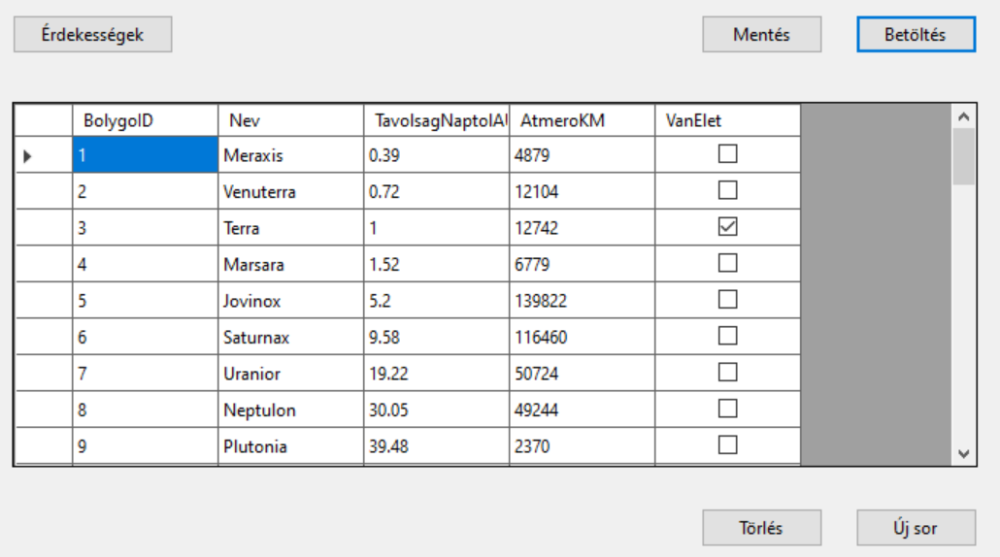
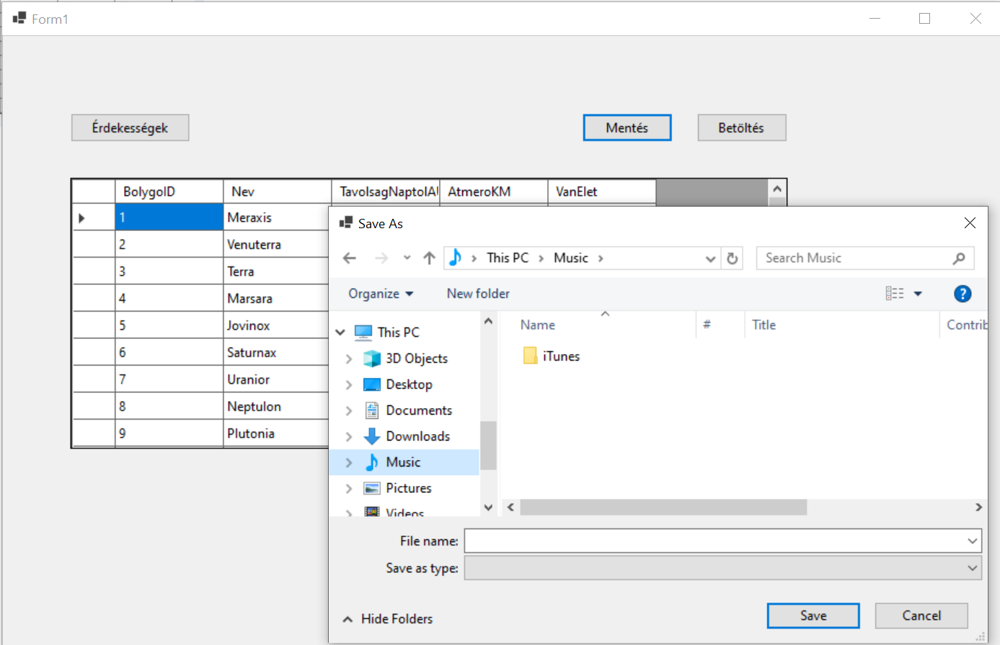
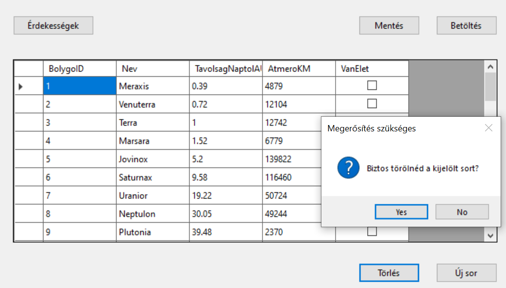
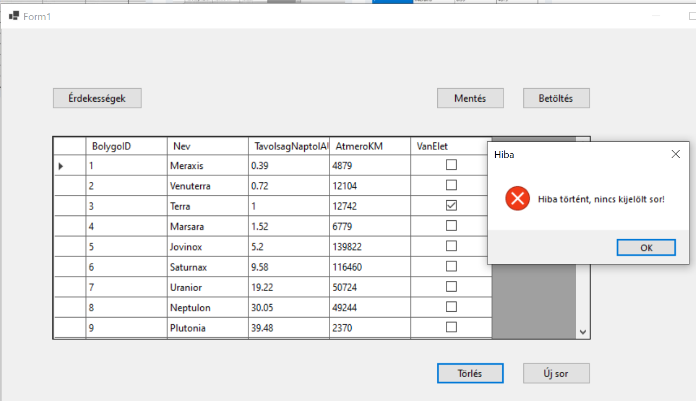
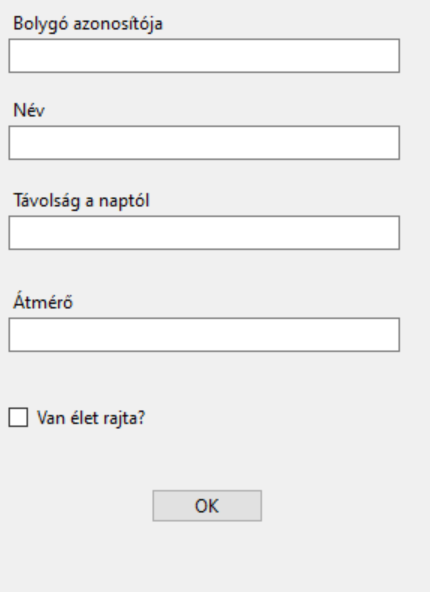
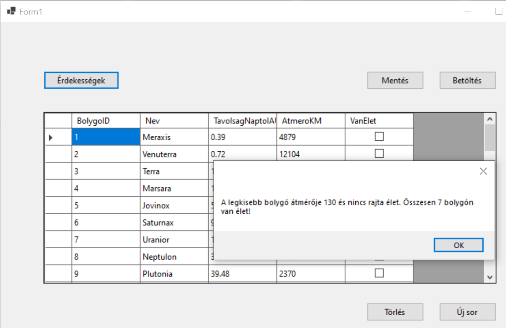

# 2. ZH - bravo

> [!NOTE]
>
> A **Solution neve kezdődjön a STB2 karaktersorozattal**, majd folytatódjon a NEPTUN kóddal. A teljes projekt könyvtárat Moodle-rendszeren keresztül kell beadni ZIP állományban. Javasoljuk, hogy a projektet lokális meghajtón hozd létre és ne az S: meghajtóra. A leadás egyben a jelenléti ív. Pontot csak olyan kódrészletre lehet kapni, ami megfelelően lefordul és a program futtatása során ellátja a szerepét. **A munkaidő 60 perc**.

## Feldolgozandó adatok

A [bolygo.txt ](bolygo.txt) fájlban található adatok alapján kell egy alkalmazást felépíteni. 

A fájl felépítése:

|                    |                                             |      |
| ------------------ | ------------------------------------------- | ---- |
| `BolygoID`         | a bolygó azonosítója                        |      |
| `Nev `             | a bolygó neve                               |      |
| `TavolsagNaptolAU` | a bolygó távolsága a taptól fényévben mérve |      |
| `AtmeroKM`         | a bolygó átmérője                           |      |
| `VanElet `         | boolean típus, 1-van élet 0-nincs élet      |      |

> [!NOTE]
>
> Az alkalmazás felépítésekor célszerű követni a feladat mellé rakott képernyőképeket, melyek segítségül és kiindulási alapként szolgálnak!

## Készíts alkalmazást alábbi instrukciók szerint:

➊ Hozz létre projektet az alábbi névvel: `STB2[neptun kód]`

➋ A csv állományt tedd be a projektbe, és másoltasd a futtatható állomány mellé!

➌ Adj a projekthez egy osztályt, amely leképezi az állomány egy sorát!

➍ A program legyen képes megnyitni az állományt, és a sorait felolvasni egy `BindingList` típusú, `Form1` osztály szintjén létrehozott listába, majd ezeket megjeleníteni `BindingSource`-on keresztül egy `DataGridView`-ban. A lehetséges hibákat kezeld! A betöltés művelet történjen gombnyomásra! Használhatod a CSV Helper csomagot, de megoldhatod másképp is.

➎ Az alkalmzás legyen képes csv állományba menteni a `Form1` osztályban lévő listát. A mentés helye SaveFileDialog-ban legyen kiválasztható

Mentés közben kezeld a hibákat (try-catch)! 

➏ Hozz létre egy gombot, melynek segítségével a rácsban az éppen kiválasztott sor törölhető. A törlés csak megerősítő kérdés után történjen meg.
Ellenőrizd, hogy van-e kiválasztott sor!

➐ Felugró ablakon keresztül legyen lehetőség új sor rögzítésére!

Hozz létre egy gombot, amelyre felugrik egy MessageBox, ami a következő kérdésekre ad nekünk választ:

🅐 Melyik bolygó átmérője a legkisebb? 🅑 Van rajta élet?

🅒 Összesen hány bolygón van élet?

🅓 Mekkora az átlagos átmérő?

> [!IMPORTANT]
>
> Hibásan feltöltött feladatot tanszéki állásfoglalás alapján utólag nem javítunk. Ellenőrizd a feltöltést, ha bizonytalan vagy!
