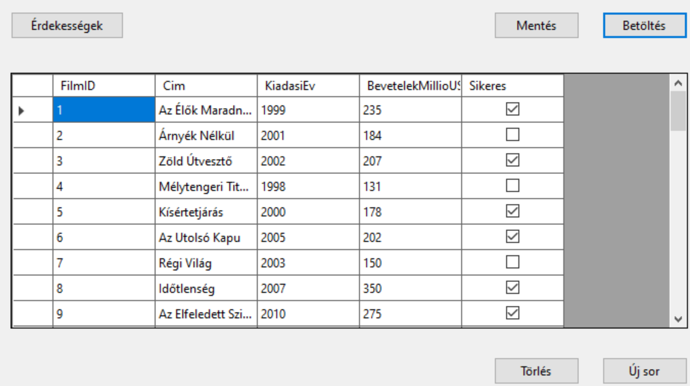
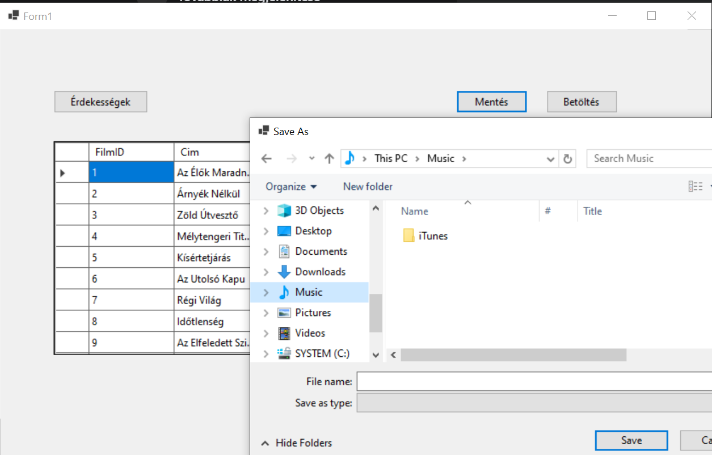
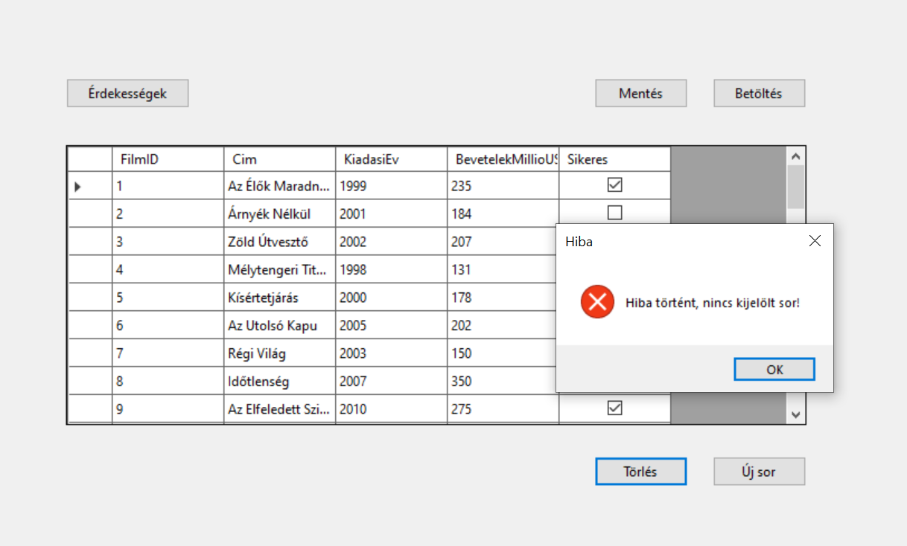
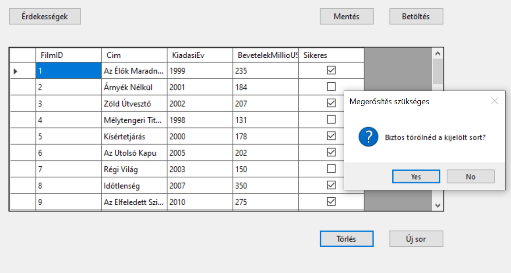
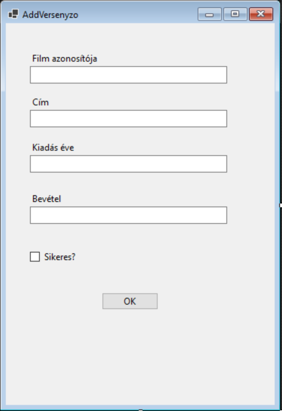
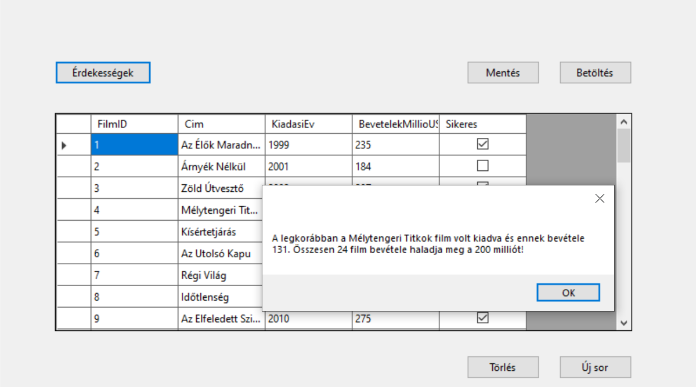

# 2. ZH - Charlie

A [filmek.txt ](filmek.txt) fájlban található adatok alapján kell egy alkalmazást felépíteni. 

A fájl felépítése:

|                       |                                                  |      |
| --------------------- | ------------------------------------------------ | ---- |
| `FilmID`              | a film azonosítója                               |      |
| `Cim  `               | a film címe                                      |      |
| `KiadasiEv `          | a film kiadásának éve                            |      |
| `BevetelekMillioUSD ` | a film bevétele millió dollárban                 |      |
| `Sikeres  `           | boolean típus, 1-sikeres film 0-nem sikeres film |      |

> [!NOTE]
>
> Az alkalmazás felépítésekor célszerű követni a feladat mellé rakott képernyőképeket, melyek segítségül és kiindulási alapként szolgálnak!

## Készíts alkalmazást alábbi instrukciók szerint:

❶ Hozz létre projektet az alábbi névvel: `STC2[neptun kód]`

❷ A csv állományt tedd be a projektbe, és másoltasd a futtatható állomány mellé!

❸ Adj a projekthez egy osztályt, amely leképezi az állomány egy sorát!

❹ A program legyen képes megnyitni az állományt, és a sorait felolvasni egy `BindingList` típusú, `Form1` osztály szintjén létrehozott listába, majd ezeket megjeleníteni `BindingSource`-on keresztül egy `DataGridView`-ban. A lehetséges hibákat kezeld! A betöltés művelet történjen gombnyomásra!

❺ Az alkalmzás legyen képes menteni a `Form1` osztályban lévő listát. A mentés helye SaveFileDialog-ban legyen kiválasztható

❻ Mentés közben kezeld a hibákat (try-catch)! 

❼ Hozz létre egy gombot, melynek segítségével a rácsban az éppen kiválasztott sor törölhető. A törlés csak megerősítő kérdés után történjen meg.
Ellenőrizd, hogy van-e kiválasztott sor!

❽ Felugró ablakon keresztül legyen lehetőség új sor rögzítésére!

(+/-) Hozz létre egy gombot, amelyre felugrik egy MessageBox, ami a következő kérdésekre ad nekünk választ:

🅐 Melyik film volt legkorábban kiadva, és 

🅑 mennyi volt a bevétele?

🅒 Hány filmnek haladja meg a bevétele a 200 millió dollárt?

🅔 Hány sikeres film van a listában? 

> [!IMPORTANT]
>
> Hibásan feltöltött feladatot tanszéki állásfoglalás alapján utólag nem javítunk. Ellenőrizd a feltöltést, ha bizonytalan vagy!
