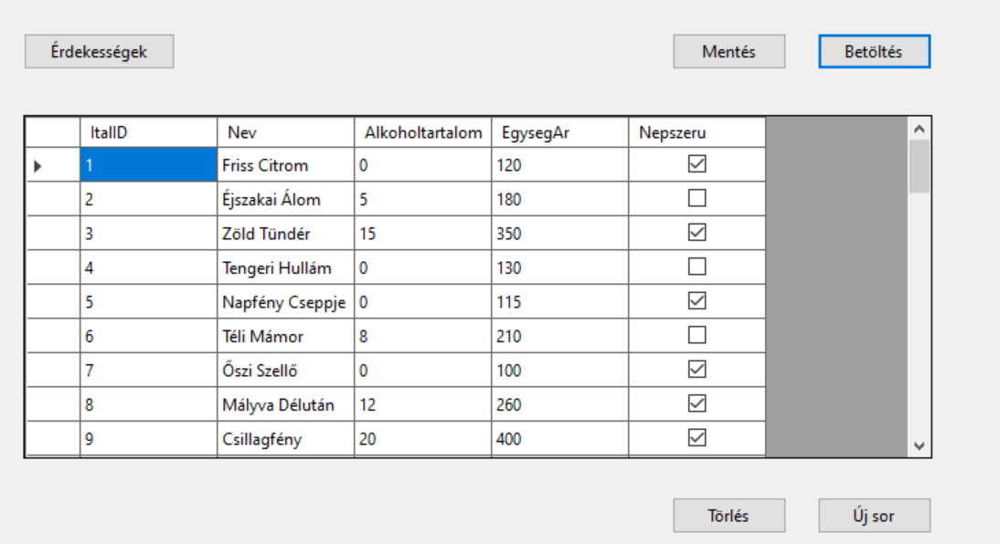
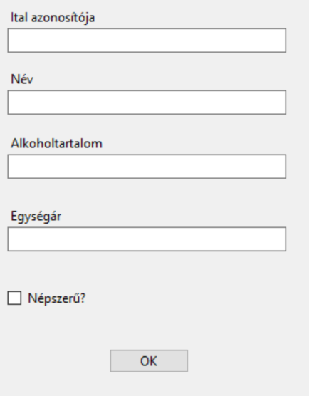
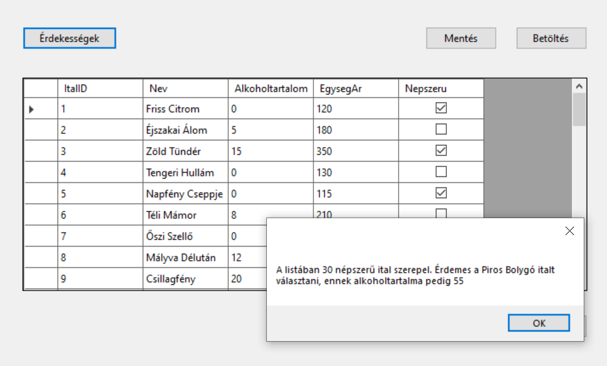

# 2. ZH - delta

> [!NOTE]
>
> A **Solution neve kezdődjön a STD2 karaktersorozattal**, majd folytatódjon a NEPTUN kóddal. A teljes projekt könyvtárat Moodle-rendszeren keresztül kell beadni ZIP állományban. Javasoljuk, hogy a projektet lokális meghajtón hozd létre és ne az S: meghajtóra. A leadás egyben a jelenléti ív. Pontot csak olyan kódrészletre lehet kapni, ami megfelelően lefordul és a program futtatása során ellátja a szerepét. **A munkaidő 60 perc**.

## Feldolgozandó adatok

A [italok.txt](italok.txt) fájlban található adatokat kell egy `DataGridView`-ben megjeleníteni. 

A fájl felépítése:

|                    |                                                            |      |
| ------------------ | ---------------------------------------------------------- | ---- |
| `ItalID `          | az ital azonosítója                                        |      |
| `Nev   `           | az ital neve                                               |      |
| `Alkoholtartalom ` | az ital alkoholtartalma, 0-100, százalékban értendő        |      |
| `EgysegAr `        | az ital egységára                                          |      |
| `Nepszeru   `      | boolean típus, 1- az ital népszerű 0- az ital nem népszerű |      |

## Készíts alkalmazást alábbi instrukciók szerint

❶ A csv állományt tedd be a projektbe, és másoltasd a futtatható állomány mellé **-=VAGY=-** a fálj legyen `OpenFileDialog` segítségével kitallózható!

❷ Adj a projekthez egy osztályt, amely leképezi az állomány egy sorát!

❸ A program legyen képes megnyitni az állományt, és a  sorait felolvasni egy `BindingList` típusú, `Form1` osztály szintjén létrehozott listába, majd ezeket megjeleníteni `BindingSource`-on keresztül egy `DataGridView`-ban. A lehetséges hibákat kezeld! Használhatod a CSV Helper csomagot, de megoldhatod másképp is.

❺ Az alkalmzás legyen képes menteni a `Form1` osztályban lévő listát. A mentés helye SaveFileDialog-ban legyen kiválasztható!

❻ Mentés közben kezeld a hibákat (try-catch)! 

❼ Hozz létre egy gombot, melynek segítségével a rácsban az éppen kiválasztott sor törölhető. A törlés csak megerősítő kérdés után történjen meg.
Ellenőrizd, hogy van-e kiválasztott sor!

❽ Felugró ablakon keresztül legyen lehetőség új sor rögzítésére!

Hozz létre egy 'Érekességek' gombot, amelyre felugrik egy MessageBox, ami a következő kérdésekre ad nekünk választ:

🅐 Hány népszerű ital szerepel a listában? 

🅑 Összesen hány ital van? 

🅒 Melyik italt kell választanom ha igazán be akarok rúgni ma este és nem akarom a véletlenre bízni? 

🅓 Mennyi az előző feladatban választott ital alkoholtartalma?

> [!IMPORTANT]
>
> Hibásan feltöltött feladatot tanszéki állásfoglalás alapján utólag nem javítunk. Ellenőrizd a feltöltést, ha bizonytalan vagy!
