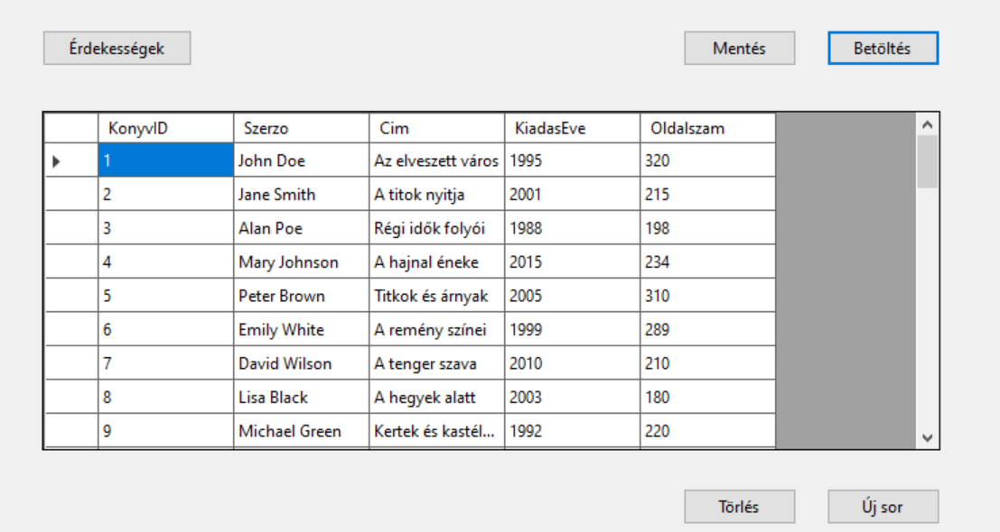
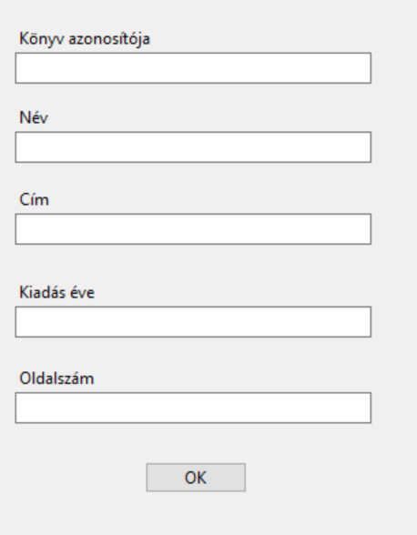
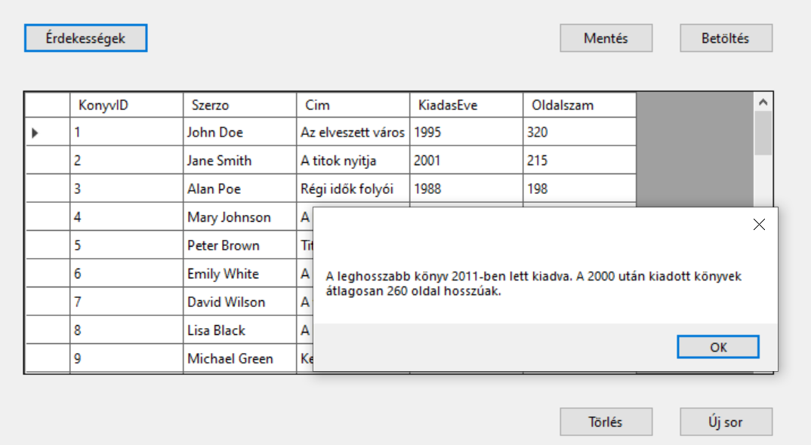

# 2. ZH - foxtrot

> [!NOTE]
>
> A **Solution neve kezdődjön a STF2 karaktersorozattal**, majd folytatódjon a NEPTUN kóddal. A teljes projekt könyvtárat Moodle-rendszeren keresztül kell beadni ZIP állományban. Javasoljuk, hogy a projektet lokális meghajtón hozd létre és ne az S: meghajtóra. A leadás egyben a jelenléti ív. Pontot csak olyan kódrészletre lehet kapni, ami megfelelően lefordul és a program futtatása során ellátja a szerepét. **A munkaidő 60 perc**.

## Feldolgozandó adatok

A [konyv.txt](konyv.txt) fájlban található adatokat kell egy `DataGridView`-benmegjeleníteni. 

A fájl felépítése:

|                |                                 |      |
| -------------- | ------------------------------- | ---- |
| `KonyvID `     | a könyv azonosítója             |      |
| `Szerzo    `   | a köny szerzője                 |      |
| `Cim `         | a könyv címe                    |      |
| `KiadasEve `   | az év, amikor kiadták a könyvet |      |
| `Oldalszam   ` | az oldalak száma a könyvben     |      |

## Készíts alkalmazást alábbi instrukciók szerint:

❶ Hozz létre projektet az alábbi névvel: `STF2[neptun kód]`

> [!IMPORTANT]
>
> Másképp elnevezett projekteket nem fogadunk el!

❷ A csv állományt tedd be a projektbe, és másoltasd a futtatható állomány mellé!

❸ Adj a projekthez egy osztályt, amely leképezi az állomány egy sorát!

❹ A program legyen képes megnyitni az állományt, és a sorait felolvasni egy `BindingList` típusú, `Form1` osztály szintjén létrehozott listába, majd ezeket megjeleníteni `BindingSource`-on keresztül egy `DataGridView`-ban. A lehetséges hibákat kezeld! A betöltés művelet történjen gombnyomásra! Használhatod a CSV Helper csomagot, de megoldhatod másképp is.

❺ Az alkalmzás legyen képes menteni a `Form1` osztályban lévő listát. A mentés helye SaveFileDialog-ban legyen kiválasztható!

❻ Mentés közben kezeld a hibákat (try-catch)! 

❼ Hozz létre egy gombot, melynek segítségével a rácsban az éppen kiválasztott sor törölhető. A törlés csak megerősítő kérdés után történjen meg.
Ellenőrizd, hogy van-e kiválasztott sor!

❽ Felugró ablakon keresztül legyen lehetőség új sor rögzítésére!

Hozz létre egy gombot, amelyre felugrik egy MessageBox, ami a következő kérdésekre ad nekünk választ:

🅐 Melyik évben lett kiadva a leghosszabb könyv?

🅑 Átlagosan milyen hosszúak a 2000 után kiadott könyvek?

🅒 Összesen hány könyv van?

🅓 Hány oldalas a leghosszabb könyv?

> [!IMPORTANT]
>
> Hibásan feltöltött feladatot tanszéki állásfoglalás alapján utólag nem javítunk. Ellenőrizd a feltöltést, ha bizonytalan vagy!
