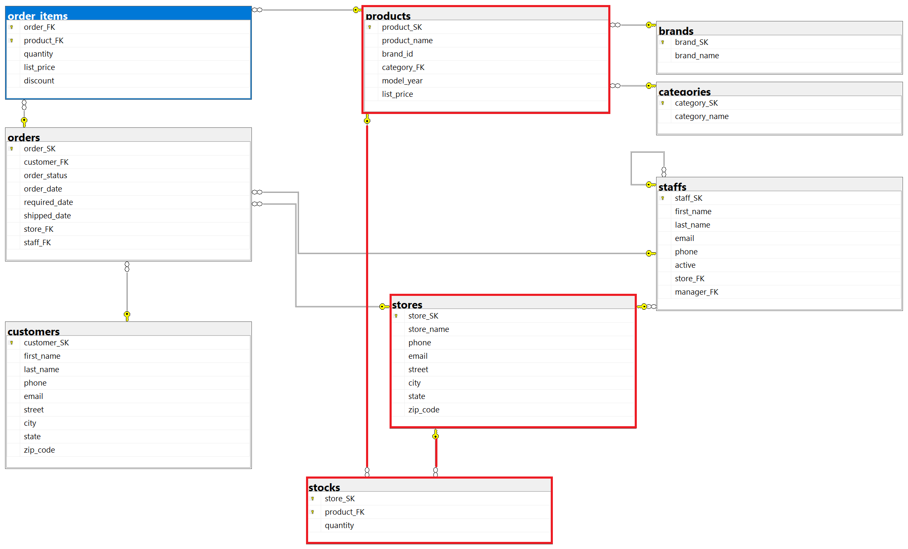
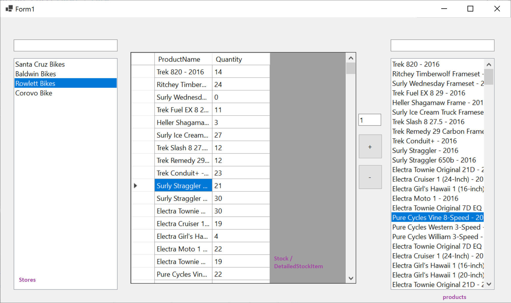

# 1. ZH pót — Bike Store

## Adatbázis

```powershell
Install-Package Microsoft.EntityFrameworkCore.SqlServer
Install-Package Microsoft.EntityFrameworkCore.Tools
```

```powershell
Scaffold-DbContext "Data Source=bit.uni-corvinus.hu;Initial Catalog=se_bikestore;User ID=hallgato;Password=Password123;Encrypt=False" Microsoft.EntityFrameworkCore.SqlServer -OutputDir Models
```



## Szükséges táblák

#### `stores`  &rarr; `stocks` &larr; `products`

Az áruházi készleteket kezeljük:



## Lépések

➊ Hozd létre a projektet, és a fenti adatok alapján készítsd el az adatkötött osztályokat!

➋ Készítsd el az ábrán látható felhasználói felületet!

➌ A bal `ListBox`-ban jelenítsd meg szűrhető módon a `stores` tábla elemeit, a listában az `store_name` mező értéke jelenjen meg!

➍ A jobb`ListBox`-ban jelenítsd a `products` tábla elemeit, a listában a `product_name` mező értéke jelenjen meg! Ez is legyen szűrhető!

➎ Hozdd létre az alábbi osztályt, mely a rács adatforrásául szolgál:

``` csharp
public class DetailedStockItem
{
    public int StoreId { get; set; }
    public int ProductId { get; set; }
    public string? ProductName { get; set; }
    public int? Quantity { get; set; }
}
```

➏ A rács "fülén" keresztül vedd fel adatkötött adatforrásként az előbb létrehezott `DetailedStockItem` osztályt, majd állítsd be a rács adatforrásaként!

➐ A bal listára kattintva jelenjenek meg a kiválasztott `Models.Store`-hoz a hozzá tartozó `Stock`-ok `DetailedStockItemformában`. Az adatkötés a `BindingSource`-on keresztül történjen!

➑ A `+` gombra kattintva lehessen új ` Models.Stock` típusú elemet felvenni a `context.Stocks` gyűjteménybe! A mennyiséget a szövegdomozból olvasd! Az adatbázisban történő rögzítés után az elemek kerüljenek újraolvasásra a rácsba! (Stock táblának összetett kulcsa van)

➒  A `-` gombra kattintva lehessen elemet törölni!

❿ Helyezz el gombot vagy menüt az űrlapon, ami a `Products` tábla tartalmát XML állományba menti. Az XML állományban a terméknévnek és a  listaárnak elég megjelennie, de mehet a többi mező is.

⓫ Jelenítsd meg a kiválasztott boltban lévő termékek átlagárát egy címkében!


